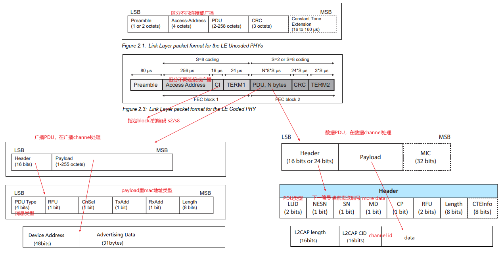

# 介绍

## 蓝牙发展历史

> 目前已经到了 5.4 版本, 可以在官网下载协议标准: https://www.bluetooth.com/zh-cn/specifications/specs/core-specification-5-4

## 蓝牙分类

蓝牙用于短距离交换资料，形成个人局域网 PAN. 使用短波特高频 UHF 无线电波. 分为两种:

- BR/EDR: 基础率/增强数据率, 以**点对点**拓扑结构创建一对一的设备通信
- BLE: 低耗能, 使用**点对点**(一对一)、**广播**(一对多)和**网格**(多对多)等多种拓扑结构

# 物理层

## 频段和信道划分

BLE**在 2.4 ~ 2.485GHz 的 ISM 频段上通信**, 占用 40 个射频信道，信道间隔 2MHz，中心频率为`2402+k*2MHz`。k=0,1,…,39.分为两类:

- 广播信道: 37, 38, 39
- 数据信道: 其他

由于上面频段内有 wifi 等各种设备的干扰, 蓝牙采用了**自适应跳频技术**, 避开干扰频段. 自适应跳频技术基本原理是根据信道状态的好坏，选择蓝牙通信信道。通常可以根据接收信号的 RSSI 和 BER 来判断。

## 4 种工作模式

- LE 1M sym/s：非编码模式，S=2 映射编码模式，S=8 映射编码模式。
- LE 2M sym/s：非编码模式。

# 链路层帧格式

- Access Address 用来标示接收者 ID 或者空中包身份
  - 广播包 Access Address 固定为 **0x8E89BED6**，广播包只能在广播信道（channel）上传输
  - 数据包 Access Address 为一个 **32bit 的随机值**，由 Initiator 生成。数据包只在数据信道上传输. 每建立一次连接，重新生成一次 Access address
- 无论是广播包还是数据包, payload 部分各不相同, 需要根据 PDU 类型解析

## 广播包

广播包 header:

- PDU type: 广播包的类型, 在**协议 core.pdf 的 Table 2.3: Advertising physical channel PDU header’s PDU Type field encoding 中定义**.
- ChSel: 是否支持 LE channel 选择算法
- TxAdd: 广播设备的地址是否是随机的
- RxAdd: 目标设备的地址是否是随机的

有效数据部分：包含 N 个 AD Structure，每个 AD Structure 由 Length，AD Type 和 AD Data 组成:

- Length：AD Type 和 AD Data 的长度
- AD Type：指示 AD Data 数据的含义, **在协议 Assigned_Number.pdf Common Data Types 定义**
- AD Data: 数据部分

广播包解析示例:

## 数据包

数据包分为 l2cap header(length + cid)和 data 两部分, 其中 data 部分的内容根据 LLID 的不同含义不同:

- 数据包: 注意: 上层功能(比如 SMP)都是通过数据包传输, 再根据具体的要求填充和解析内容. 但在 LL 层看来都是数据包
  - `LLID = 0b01`: LL data PDU, 空数据, 或非首个分片的 l2cap 包
  - `LLID = 0b10`: LL data PDU, 不分片的 l2cap 包, 或首个分片的 l2cap 包
- `LLID = 0b11`: LL control PDU, 控制 link layer 的连接, **opcode 在协议 core.pdf Table 2.20: LL Control PDU opcodes 中定义**, 格式如下:
  
