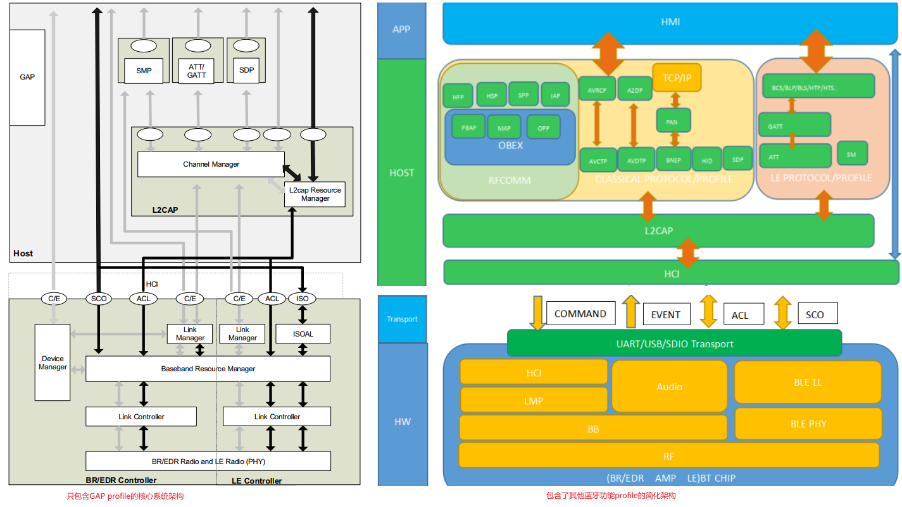
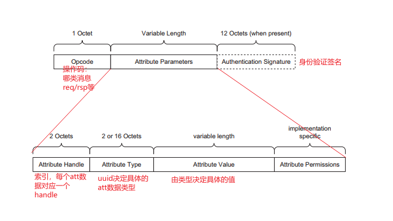
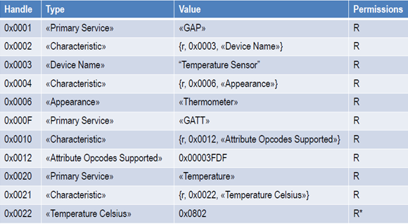
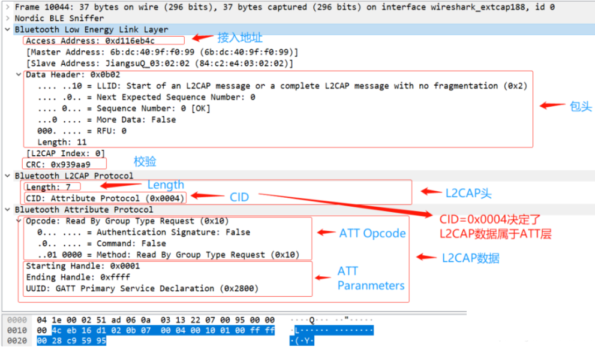
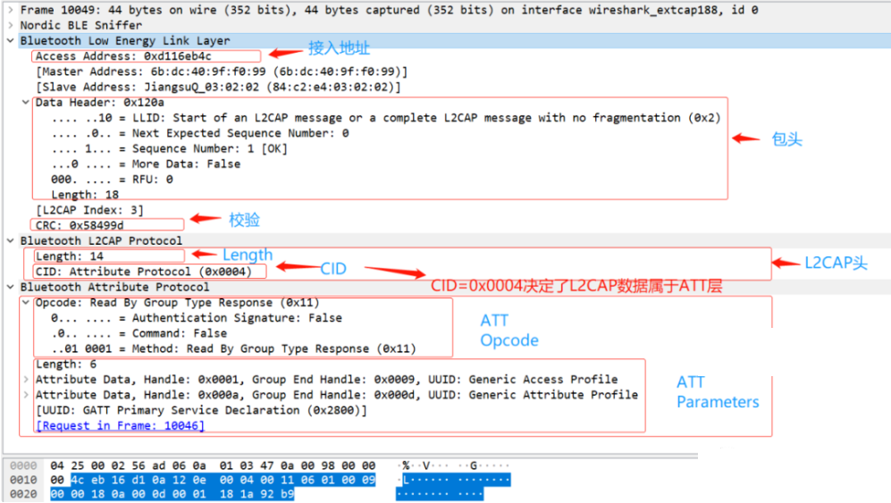
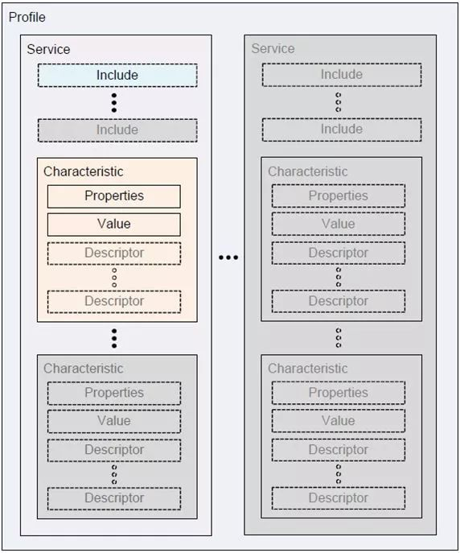
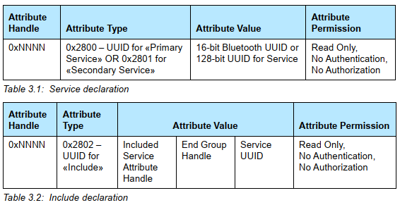
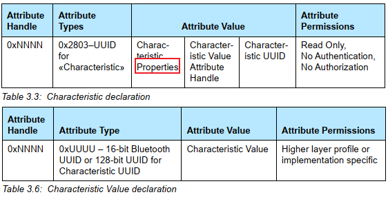
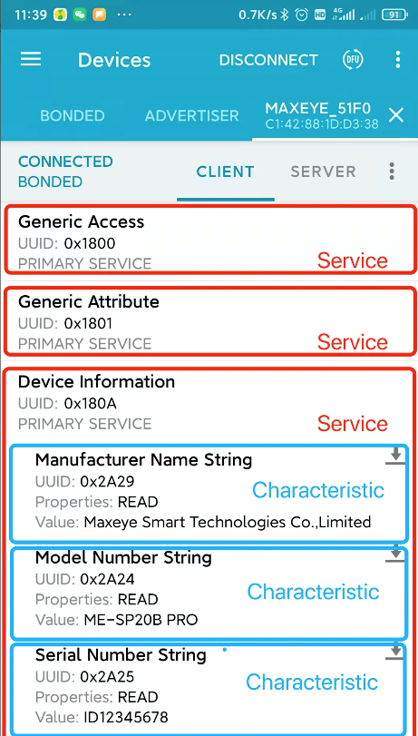

# 蓝牙协议栈

蓝牙协议栈由**Host+ HCI(可选) + Controller**三大块组成:

## Controller 层

也叫硬件芯片层, 通常包含以下部分:

- Device Manager: 控制蓝牙设备的通用行为，负责与蓝牙通信过程中，所有的与数据无关的操作，如查询设备，连接设备
- Link Manager: 链路管理，主要负责创建，修改，释放逻辑链路
- Baseband Resource Manager: 基带资源管理，进行**射频信号与数字信号或语音信号的相互转化**
- Link Controller: 链路控制，主要负责编码和解码蓝牙数据包
- PHY: 物理层，主要负责发送，接收物理通道的信息包

## HCI 层

为 Host 访问 Controller 提供一组标准的接口(**单芯片直连就不需要 HCI 了**), 可以传输下面几种类型的数据:

- command: host 发给芯片的命令
- event: 芯片上报给 host 的事件
- ACL: 分组数据传输, 有重传机制, 传输对实时性要求不高的场景, 比如听歌, 发送文件等
- SCO: 同步话音传输, 主要用来传输对时间要求很高的数据通信, 比如通话和重发被损坏的部分数据
- ISO: 5.2 加入的 LE Audio 数据

## Host 层

蓝牙协议层, 其中 L2CAP 是公用的, GAP 是核心规范用于设备间连接和配对. 除此之外, 我们可以通过 profile 定义其他蓝牙功能以支持图里其他的协议.

- L2CAP: 链路控制和适配协议
  - Channel Manager: 通道管理，主要用于创建、管理、关闭 L2CAP 通道，用于服务协议和应用数据的传输。
  - L2CAP Resource Manager: L2CAP 资源管理，主要负责报文分片和重组、流控、重传、报文完整性校验
- GAP 核心规范: 定义了蓝牙设备的基本功能, 设备间**发现、连接、配对绑定**的流程
  - Security Manager Protocol: SMP 安全管理协议，定义了**蓝牙设备配对、认证、解密**等行为的安全操作
  - Attribute Protocol: ATT，属性协议
  - Generic Attribute Profile: GATT，位于 ATT 之上，定义了属性组合构成的服务
  - SDP: 服务发现协议, 让 app 查询哪些服务可用
- 其他协议
  - RFCOMM: 串口仿真协议, 用于蓝牙电话/透传 SPP
  - OBEX: 对象交换协议, 用于电话本/短信/文件传输
    - PBAP: 电话本访问协议
    - MAP: 短信访问协议
    - OPP: 对象推送协议
  - HFP: 蓝牙免提协议
  - HSP: 蓝牙耳机协议, 已弃用
  - SPP: 蓝牙串口协议
  - IAP: 苹果特有协议, 用于 carplay
  - AVRCP: 蓝牙音乐控制协议
  - AVCTP: 音视频控制传输协议
  - A2DP: 蓝牙音乐协议, 替换 HSP 的
  - AVDTP: 音视频分布传输协议
  - BNEP: 蓝牙网络封装协议, 用于个人局域网收发 IP 数据
  - HID: 人机接口协议, 用于鼠标/键盘等

# ATT

属性是 BLE 数据提供单元，也是蓝牙空中传播数据的最上层. 定义了 Host 端属性报文格式和报文类型, 一个属性就是一条数据. **BLE 开发过程中接触最多的就是这一层**.

## 报文结构

ATT 在数据 channel 传输, 位于 L2CAP 数据格式中的 data 部分, **CID=0x0004 标识 ATT 协议**:

- Opcode: 定义操作类型, 在协议 core.pdf Table 3.43: Attribute Protocol summary 中定义
- handle: 指向属性实体的指针，Client 要访问 Server 的 Attribute 都是通过这个句柄来访问的，它是一个 2 字节长度的十六进制码.
  - 用户在代码添加 characteristic 的时候，系统会自动按顺序地为相关 attribute 生成句柄, 起始于 0x0001
- type: 一般是由 service 和 characteristic 来定义, 使用 UUID 来定义数据的类型
  - **UUID 的前 16bits 标识不同的服务/特征/描述符的类型, 可以在标准文件 Assigned Numbers.pdf 中查找**.

一个应用所有的 attribute 组成一个 database，也称为 attribute table:

## 报文示例

如下是 group read 的 ATT 报文的示例:

# GATT

> 具体格式参考： https://www.cnblogs.com/iini/p/12334646.html > https://blog.csdn.net/tilblackout/article/details/127944589

**GATT 自己本身不提供数据，而是将 ATT 层提供的属性组合起来构成的服务**。

- 通过 ATT 层可以读写对端设备的属性值
- 各个属性之间有什么联系各个属性之间怎么组合起来的，是由 GATT 层负责
- 服务是 GATT 层的关键字，服务由属性组成.

在两个 BLE 设备建立连接之后，双方的数据交互是基于 GATT 规范，根据该规范可以定义出一个个配置文件 (Profile)，描述该蓝牙设备提供的服务 (Service)。

在 BLE 通信过程中，几个主要概念的关系：

## Profile

Profile 是被蓝牙标准预先定义的一些 Service 的集合，并不真实存在于蓝牙设备中。

- **如果蓝牙设备之间要相互兼容，它们只要支持相同的 Profile 即可**
- 一个蓝牙设备可以支持多个 Profile。

## Service

Service 是蓝牙设备对外提供的服务，一个设备可以提供多个服务，比如电量信息服务、系统信息服务等。

- **每个服务由一个 UUID 唯一标识**。
- 分为 primary, second 和 include 三种类型
  - 一个 primary 服务可以包含多个 second 服务
  - 被包含的 second 服务用 include 标识, 跟在服务声明后面

## Characteristic

每个 Service 包含 0 至 n 个 Characteristic, **Characteristic 是一个基本的存储单元**。比如，电量信息服务就会有个 Characteristic 表示电量数据。

- **每个 Characteristic 由一个 UUID 唯一标识**。
- **在与蓝牙设备通信时，主要就是通过读写 Characteristic 的 value 完成**。
- Characteristic 包含一个值 (value)和 0 至 n 个描述符 (Descriptor) 组成。

一个示例:

## Descriptor

Characteristic 的额外信息。比如温度的单位是什么，数据是用小数表示还是百分比表示等之类的数据描述信息。**每个 Descriptor 由一个 UUID 唯一标识**。

主要的描述类型有:

- Extended Properties: Characteristic 的扩展属性
- Characteristic User Description: 描述信息
- Client Characteristic Configuration Descriptor: 客户端特征配置描述符, **用于开启和关闭通知信息**。 如果开启了, 每当该 Characteristic value 发生改变时, client 就会收到通知.
