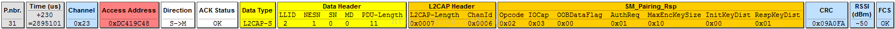

# 设备接入流程

一般来讲，**主动连接的设备称之为 central/master/client，被连接的设备称之为 peripheral/slaver/server**。 一旦两端连接关系确定下来，则基本不会变化。

## 广播

设备主动广播自己的 BLE 信息, 默认往三个广播 channel 发送, 并在一定 interval 之后再次发送:

## 扫描

扫描分为主动和被动两种方式:

- 被动扫描: 监听收到的 adv 广播包
- 主动扫描: 发送**scan request**并等待设备回复

## 连接

主设备发送 CONNECT_IND 告诉从设备, 我将在 第一个 Connection Interval 后发送第一个同步包 P1 给你, 请从设备打开接收窗口. 从设备收到 P1 之后, 会回复数据包 P2. 一旦主设备收到 P2 就认为连接成功.
当然，主设备有可能收不到P2，这个时候主设备将持续发送同步包直到超时时间(supervision timeout)，在此期间只要从设备回过一次ACK包，连接即算成功.

CONNECT_IND 中包含如下主要信息:

- Connection Interval：连接的间隔时间
- Peripheral Latency：指定 Peripheral 可以忽略多少的连接事件
- Channel Map：指定将使用 37 个数据传输通道中的哪一个进行传输

后续的数据包用来同步时钟和传输数据.

## 配对

> 参考: https://blog.csdn.net/chengbaojin/article/details/103691046

**区别于传统蓝牙, BLE 配对过程是在连接过程之后**, 通过数据 channel 传输 SMP 报文.

- Phase 1: 配对特征交换, 交换双方 IO 能力(会决定第二阶段用什么方式)
- Phase 2: **通过 SMP 协议进行配对操作**用于身份确认, 并生成密钥
  - LE legacy pairing: 生成短期密钥 STK
  - LE Secure Connections: 生成长期密钥 LTK
- Phase 3(可选): 传输特定密钥 SK.

### 阶段 1

- 主设备发送 Pairing Request:
  
- 从设备回复 Pairing Response:
  

根据 IO 能力可以选择配对阶段的方法:

- Just works: 直接进行第二阶段, 配过过程没有保护
- Passkey Entry: 本段需要输入远端随机生成的 6 位数字 TK 进行配对
- Out of Band: 通过 BLE 之外的方式获取 OOB data

### 阶段 2

- 主设备本地生成随机数 Mrand, 计算 Mconfirm 值并通过 Pairing Comfirm 发给从设备:
  
- 从设备本地生成随机数 Srand, 计算 Sconfirm 也通过 Pairing Confirm 发送给主设备:
  
- 主设备收到 Sconfirm 后, 将 Mrand 通过 Paring Random 发给从设备:
  
- 从设备收到 Mrand 后计算 Mconfirm, 并于前面发来的 Mconfigm 比较. 相同则表示配对成功, 然后将 Srand 发给主设备:
  
- 主设备收到 Srand 之后计算 Sconfirm, 与前面发来的 Sconfirm 比较, 确认配对成功
- 主从设备计算 STK, 作为第三阶段临时加密使用

### 阶段 3

- 主设备计算出 STK 后, 通过链路层发起加密请求 LL_ENC_REQ, 并把计算 SK/LTK 的参数传递过去
- 从设备通过 LL_ENC_RSP 将计算 SK/LTK 的参数也发给主设备
- 两边计算 SK 和 LTK, 并从 LL_START_ENC_REQ 开始发送加密数据, 进行 3 次加密握手.
  - SK 用于链路层通信加密, 由 LTK 计算而来
  - LTK 用于保存后下次直接连接

## 绑定

将配对阶段产生的 LTK 和主从设备信息保存到 flash 中, 便于下次直接配对.
