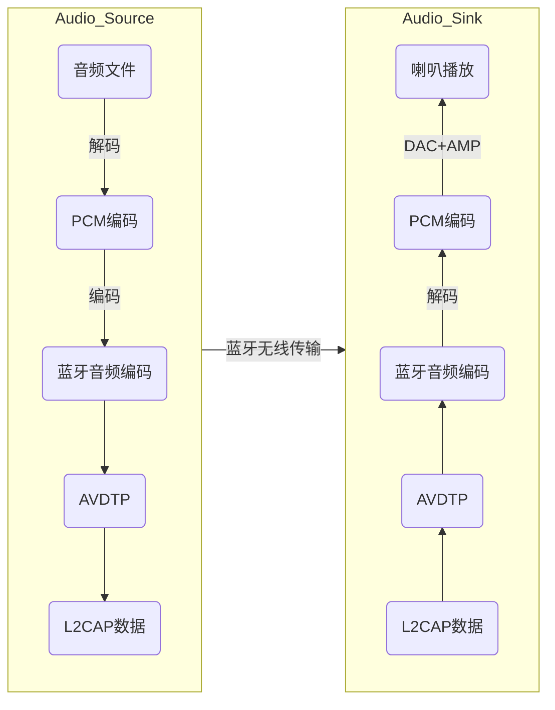
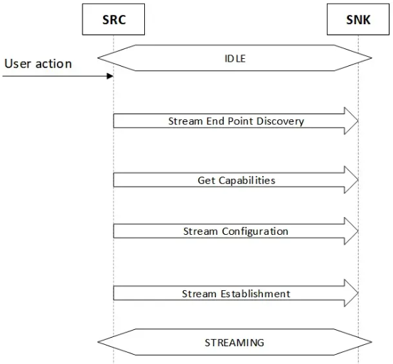
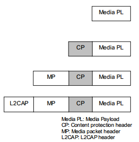
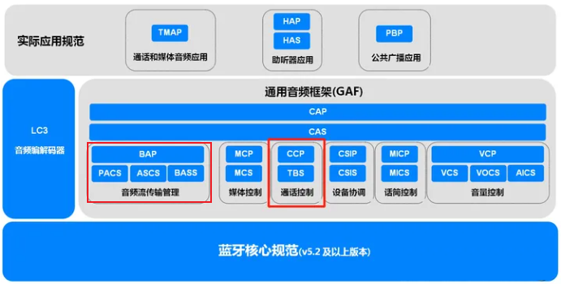

# HFP

接打电话的声音是在 SCO 链路上传输, 属于普通音频, 使用 HFP 协议控制.

# A2DP

音乐等声音是 ACL 链路上传输, 属于高质量音频. 在 LE Audio 之前, 高质量音频是基于 A2DP 的.

A2DP： Advance Audio Distribution Profile，高级音频分发协议的缩写. 一个完整的蓝牙音乐不但包含 A2DP 音频流，还包含 AVRCP 控制流.

## 基本原理

mp3/flac 等音频编码都是在 PCM 音频编码基础上二次编码得到的，其目的是减小文件体积。在音频播放时，就需要把 mp3/flac 等编码格式的数据还原为 PCM 编码格式的数据。然后经过数字-模拟转换（DAC）变成模拟信号，最后经过放大电路驱动喇叭(本机喇叭或有线耳机的喇叭)，将声音播放出来.

在蓝牙系统中，发射端要**将被音乐软件解码的 PCM 编码二次编码为蓝牙支持的编码**，通过 L2CAP 数据包进行传输. 接受端收到后，再将其解码为 PCM 编码:

## 蓝牙音频编码

| 编码格式 | 简介                       | 是否支持      |
| -------- | -------------------------- | ------------- |
| SBC      | 子带编码                   | A2DP 强制支持 |
| AAC      | 高级音频编码, 苹果独有格式 | 可选支持      |
| aptX     | 高通专利编码               | 可选支持      |
| aptX-HD  | 高质量 aptX, 高通专利      | 可选支持      |
| LDAC     | 索尼专利编码               | 可选支持      |

## AVDTP 传输流程

进行数据传输之前发送端与接收端需进行一系列 **AVDTP 的信令交互**以确认双方传输数据的参数之后才能开始数据传输，其信令交互流程如下:

流连接建立之后, 就可以开始传输 media packet, 基本格式如下:

# LE Audio

从 BLE 5.2 开始增加了 ISO 链路用于传输高质量音频和通话控制, 使用 LE Audio 和全新的 LC3 编解码格式.

