> https://blog.csdn.net/qq_40537092/article/details/118896759

# mesh 简介

Bluetooth mesh profile 规范是由 Bluetooth SIG 开发和发布的，它允许一对一、一对多和多对多通信。它**使用 BLE 协议**在网络节点之间交换消息。这些节点可以相互通信，只要它们在彼此的直接无线电范围内，或者有足够的设备能够侦听和转发这些消息。

## 通讯方式

ble mesh 使用**发布-订阅**消息系统:
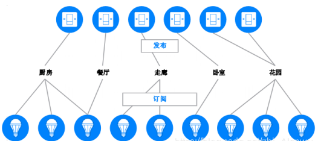

- 发布: 设备向特定地址发送消息
- 订阅: 配置设备可以接收由其他设备发送到特定地址的消息

举例: 花园中的一组户外灯, 每个灯都已配置为订阅“花园灯”消息。然后一个 BLE MESH 灯开关向“花园灯”地址发送“ON”消息。花园中的所有灯都会收到“ON”消息并打开.

ble mash 使用一种称为**泛洪**的方法来发布和中继消息, 范围内的所有设备都会接收消息，而那些**充当中继的设备会将消息重新传输到范围内的所有其他设备**. 这样就能够与不在最初发布消息的设备的无线电范围内的设备进行通信.
所有数据包都包含一个称为 TTL 的字段, 这可用于限制消息在中继时采用的跳数. 设备每隔一段时间传输的心跳消息, 携带允许网络了解其拓扑结构和跳数的信息.

## 协议栈模型

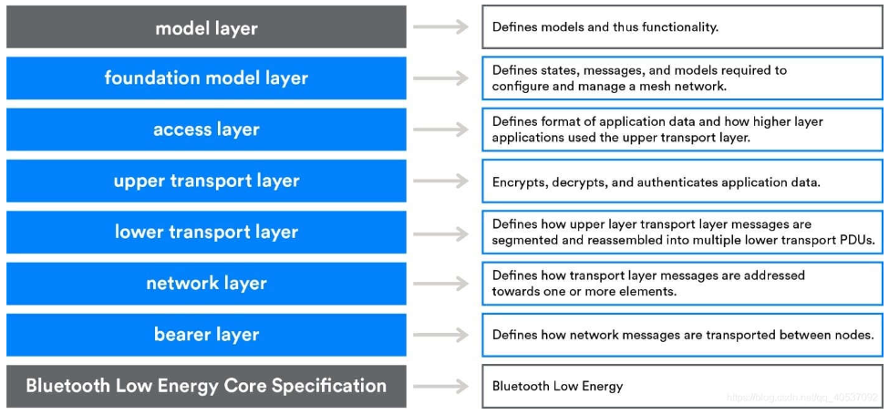

## 节点和拓扑结构

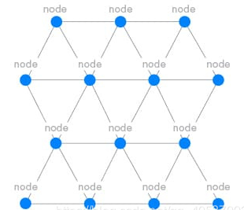

### 节点分类

节点功能分为如下几种, :

- **低功率节点**(LPN): 可以使用低功率特性来减少无线电开启时间并节省功率. 与朋友节点协同工作
- **朋友节点**: 存储发往 LPN 的传入消息和安全更新；当 LPN 请求这些消息时，朋友节点将存储的信息传递给 LPN
- **中继节点**: 接收和重新传输消息
- **代理节点**: 与不支持 mesh 的设备，以 GATT 的方式进行连接通信，使得设备可与网络进行通信
  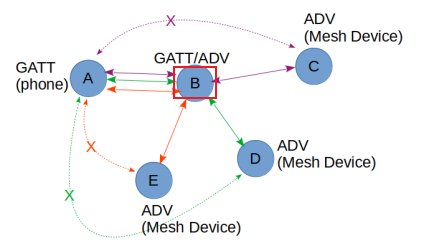

**一个节点至少有一个功能, 节点内的每个功能元素都有一个唯一的地址，称为单播地址，使每个元素都可以寻址**
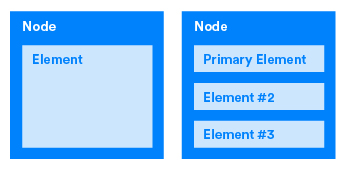

### 模型和状态

节点的基本功能都是由模型定义和实现的。模型位于元素内部，元素必须具有一个或多个模型。**模型定义和实现节点的功能和行为，而状态定义元素的条件, 每个模型都有一个唯一的标识符(32bit)**:
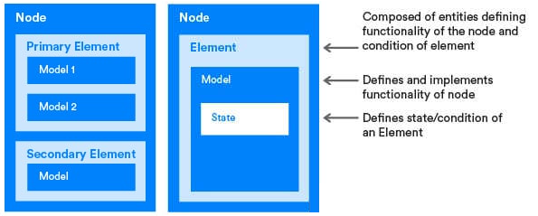

例如灯泡有如下模型和状态:

- 模型: 开关
  - 状态: 开或关
- 模型: 亮度
  - 状态: 0 ~ 10

## 网络安全

| 方法           | 说明                                                                 |
| -------------- | -------------------------------------------------------------------- |
| 加密和认证     | 所有蓝牙 MESH 网络消息都经过加密和验证                               |
| 关注点分离     | 网络安全、应用程序安全和设备安全是独立解决的                         |
| 区域隔离       | 蓝牙 MESH 网络可以划分为子网，每个子网在密码上是不同的，并且彼此安全 |
| 按键刷新       | 在蓝牙 MESH 网络的生命周期内，可以通过密钥刷新程序更改安全密钥       |
| 消息混淆       | 消息混淆使跟踪网络内发送的消息变得困难                               |
| 重放攻击保护   | 蓝牙 MESH 网络安全保护网络免受重放攻击                               |
| 垃圾桶攻击防护 | 节点可以安全地从网络中删除，以防止垃圾箱攻击                         |
| 安全设备配置   | 将设备添加到 MESH 网络以成为节点的过程是一个安全的过程               |

# 组网配置过程

启动配置是设备加入 mesh 网络并成为节点的过程，它会生成各种安全密钥，并且本身也是是一个安全的过程。可使用平板电脑等设备上的应用进行配置，用于配置设备入网的设备称为**启动配置设备**.

基本过程如下:

- 发起 mesh beacon 广播: 用户启动要加入网络的设备广播, 比如同时按下几个按钮、或长按某个按钮
- 邀请: 启动配置设备向广播设备发送 provisioning invite 消息, 广播设备返回 provisioning capabilities 描述自身信息
- 交换公共密钥: 启动配置设备和要进行配置的设备可以直接或者通过带外（OOB）方式交换他们的公共密钥
  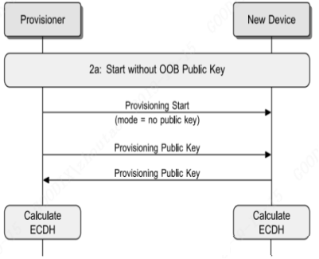
- 认证: 要进行启动配置的设备会通过一定的形式给用户输出一个随机的数字, 用户将随机数字输入到启动配置设备中. 两台设备之间进行这一随机数的加密交换，以完成两个设备彼此之间的认证.
  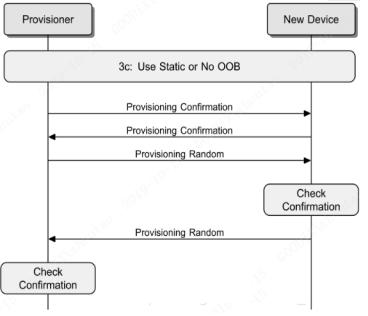
- 配置数据分发:
  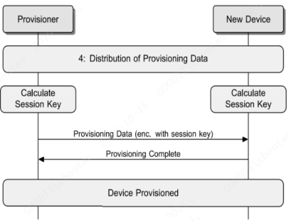
  - 通过两台设备的私有密钥和交换的对称公共密钥生成会话密钥, 会话密钥随后用于保护完成配置过程所需数据的后续分发.
  - 启动配置设备配置完成后，会为配置的设备分配网络密钥 net-key, iv index 和单播地址，之后设备就可以作为 mesh 网络的节点了

wireshark 抓包示例:
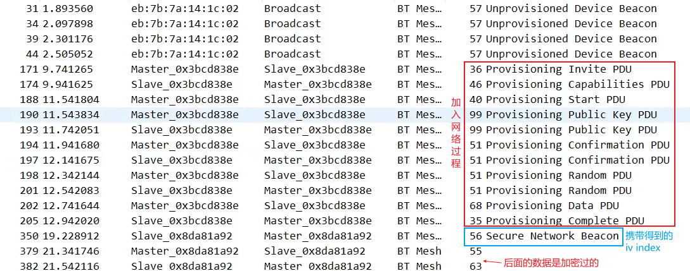

# Friend 和 LPN

## 建立关系

- LPN 发布好友请求消息。此消息不会被中继，因此只有直接无线电范围内的朋友节点才能处理它。没有好友功能的节点会丢弃它。
  - 好友请求消息包括 LPN 所需的 ReceiveDelay、ReceiveWindow 和 PollTimeout 参数。
- 附近的每个可以支持好友请求消息中指定的要求的好友节点准备并向 LPN 发送回 Offer 消息。
  - 该消息包含各种参数，包括支持的 ReceiveWindow 大小、可用的消息队列大小、可用的订阅列表大小以及 Friend 节点测量的 RSSI 值。
- 在接收到 Friend Offer 消息时，LPN 通过应用特定于实现的算法来选择合适的 Friend 节点。
- 选择一个 Friend 节点后，LPN 向该 Friend 节点发送 Friend Poll 消息。
- Friend 节点收到 LPN 发来的 Friend Poll 消息后，回复 Friend Update 消息，结束好友建立流程并提供安全参数。至此，友谊已经建立。

## 获取消息

友谊建立后，当 Friend 节点接收到寻址到 Friend 节点的 LPN 的消息时，Friend 节点会缓存该消息，并将其存储在称为 **Friend Queue** 的区域中.
LPN 定期启用其收发器并向 Friend 节点发送 Friend Poll，请求为其存储的任何缓冲消息.

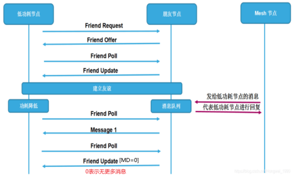

## 友谊终止

- 如果 在 PollTimeout 定时器超时之前，Friend 节点没有收到 Friend Poll、Friend Subscription List Add 或 Friend Subscription List Remove 消息，则友谊终止。
- LPN 可以通过向其 Friend 节点发送 Friend Clear 消息来发起友谊终止程序，从而导致 Friend 节点终止友谊。

# mesh 消息格式

mesh 消息在 bearer layer 可以以广播包或 gatt 数据包(需要 proxy)两种方式传输, 然后在 mesh 模型的每一层都有相应的封装:
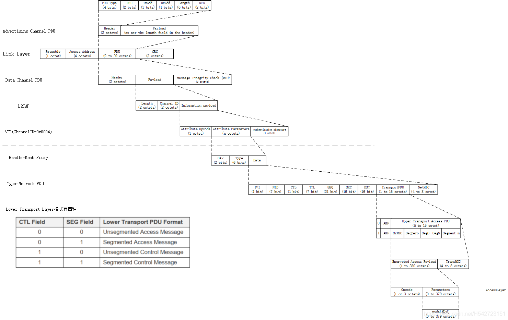
