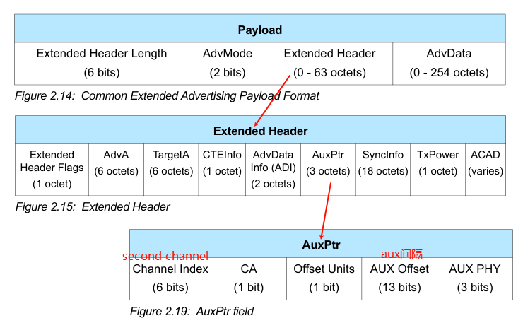
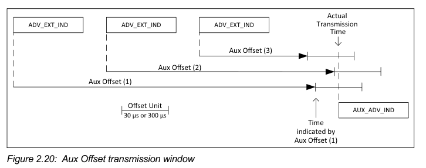

# 相关问题

## 蓝牙广播长度为什么是 31 字节

蓝牙规范规定链路层（Link Layer）的广播信道 PDU 最大为 37 字节。其中：

- 6 字节被用于广播设备地址（MAC Address）。
- 剩下的 31 字节 完全留给了 广播数据（ADV Data） 本身

**同理，scan response data 也是 31 字节长度。**

## 如何突破广播 31 字节限制

1. 使用扫描回应数据 (Scan Response Data) - 最常用、兼容性最好
   - 设备在主广播包（31 字节）中放置最核心、最紧急的信息（例如，设备 ID、UUID 等）。
   - 扫描设备（如手机）如果想知道更多信息，可以向广播设备发送一个 Scan Request。
   - 广播设备收到请求后，回复一个 Scan Response 包，其中包含附加数据（例如，完整的设备名称、自定义服务数据、传感器读数等）
1. 使用蓝牙 5 的扩展广播 (Extended Advertising) - 不支持蓝牙 5 之前版本
   - 设备在主广播信道发送一个非常短的“公告”，指示有扩展广播数据可用以及其在哪个信道（频率）上。
   - 扫描设备接收到这个公告后，如果在乎这些数据，会跳转到指定的次广播信道去监听一个或多个包含大量数据的扩展广播包

**扩展广播**允许在**次广播信道上使用更长的数据单元**(PDU)广播数据的大小不再局限于 31 字节，理论上最大可达到 1650 字节。

## BLE 广播间隔

广播间隔的单位是**0.625ms**(**扫描的间隔单位也是此值**)，在创建 adv activity 时要指定参数：

- `adv_intv_min`：表示每个信道上的最小广告间隔时间。最小值不能小于 20ms。它决定了设备在开始新的广告周期之前需要等待的最短时间
- `adv_intv_max`：表示每个信道上的最大广告间隔时间。最大值不能小于 20ms。它决定了设备在开始新的广告周期之前可以等待的最长时间

这两个参数共同决定了设备进行广告活动的时间间隔，从而影响设备发现和连接的效率。
首先在 primary channels 上使用 **ADV_EXT_IND**类型的广播，该类型的广播 PDU（具体参考 Vol 6, Part B）中就包括了如下信息：

- 接下来会使用哪个 secondary advertising channel 传输 AUX_ADV_IND
- 何时开始发送 AUX_ADV_IND 类型的广播

## BLE 连接间隔

连接间隔的单位是**1.25ms**，在创建 con activity 时要指定参数：

- fullcode：一个参数`con_interval`
- armino: 两个参数, 指定最大最小值
  - `intv_min`: ble 的最小通讯周期, 连续收发数据包时主机会选择此值, 不能小于 7.5ms
  - `intv_max`: ble 的最大通讯周期, 一般用于空闲状态, 不能小于 7.5ms

## 连接参数对功耗的影响

1. 连接间隔:
   1. Connection Interval 缩短，Master 和 Slave 通信更加频繁，提高了数据吞吐速度，缩短了数据发送时间，但也提高了功耗。
   1. Connection Interval 加长，通信频率降低，数据吞吐速度降低，数据发送等待的时间更长，但这种设置降低了功耗。
1. 从设备延迟：
   1.Slave Latency 减少或者设置为 0，那么每次连接事件中都需要回复 Master 的包，功耗会上升，但数据发送速度也会提高。
   1.Slave Latency 加长，功耗下降，数据发送速度降低。
