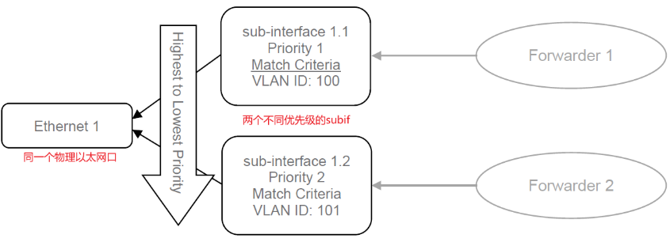
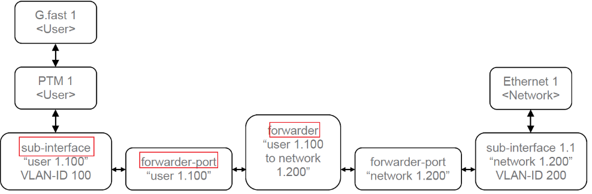

## L2 Forwarding模型
### sub interface
**vlan-sub-interface**作为转发决策的源或目的接口:
* 每个vlan-sub-interface**将来自特定底层接口(subif-lower-layer)的流量分类到一个forwarder上**.
* 每个vlan-sub-interface可以**关联多个rule**(不同优先级), 用于不同的流量分类结构
* 每个vlan-sub-interface可以对每个匹配通过的packet指定**针对入口和出口的rule**(ingress-rule/egress-rule)
* 多个vlan-sub-interface可以引用**同一个底层接口**, 通过不同的匹配条件(可以重叠, 按优先级匹配)进行分类. 如下图:

### forwarder
转发器决定了**流量如何在多个转发接口之间路由**, forwarder port需要关联sub interface.

可以为每个转发器创建**分割水平配置文件(Split Horizon Profiles)**，以配置流量如何在不同类型的接口之间转发.
可以为每个转发器创建**泛洪策略配置文件(flooding policy profile)**。每个策略可以针对**特定的接口**和/或**特定的目的MAC地址**指定。然后，它分配一个适当的操作，要么丢弃数据包，要么将其发送到所有具有指定用途的接口.

### interface usage
usage有如下三种类型, 需要在CLI中配置的:
* **user port**: The interface connects an Access Node to a user.
* **network port**: The interface connects an Access Node to a network.
* **subtended-node port**: The interface connects an Access Node to another Access Node.

## Alarm
Alarm有如下两个属性标识:
* **alarm-type-id**: alarm的细粒度标识, 即alarm的主体是什么, 比如某个interface
* **alarm-type-qualifier**: alarm的类型, 即主体的某个不正常的属性, 比如interface los

