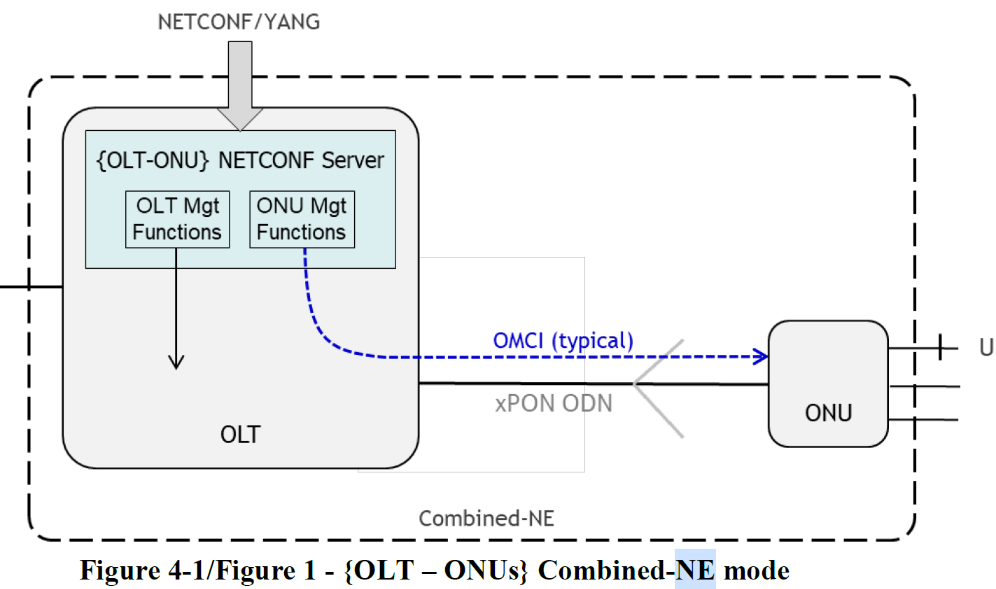
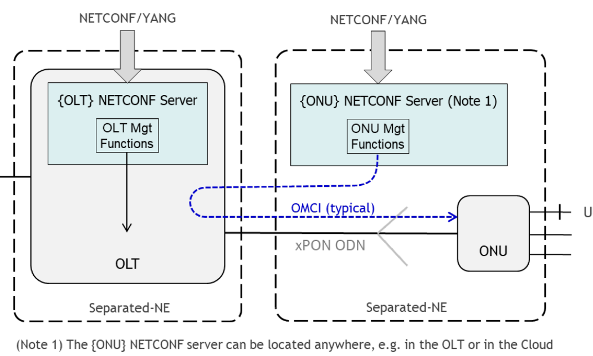
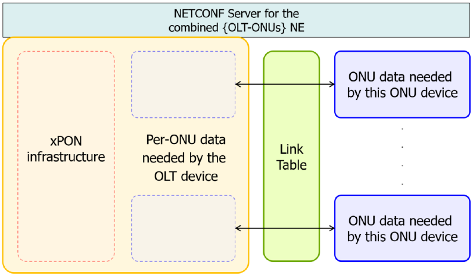
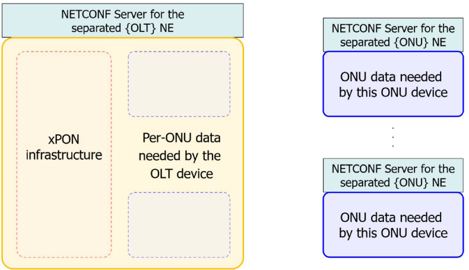
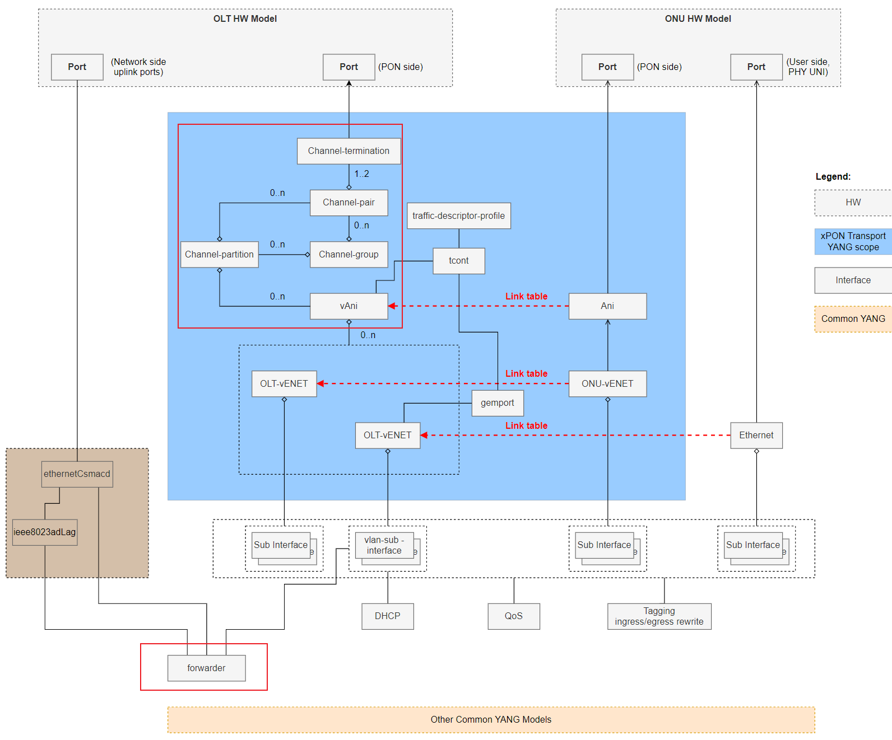
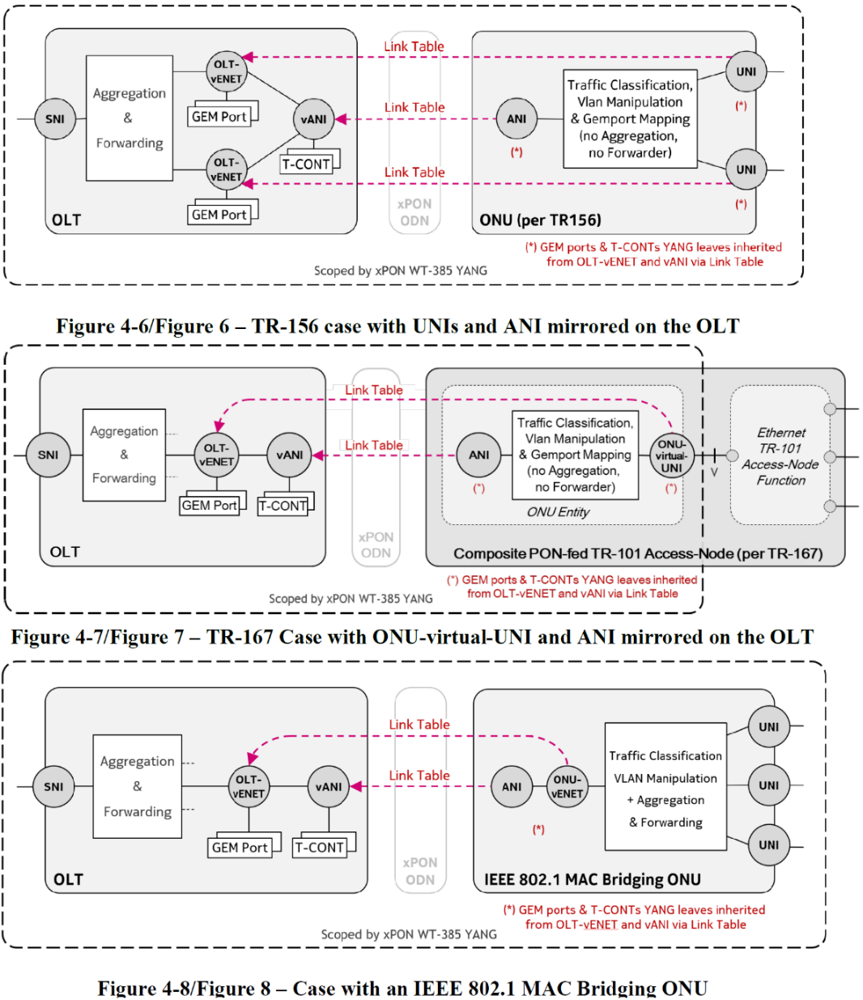
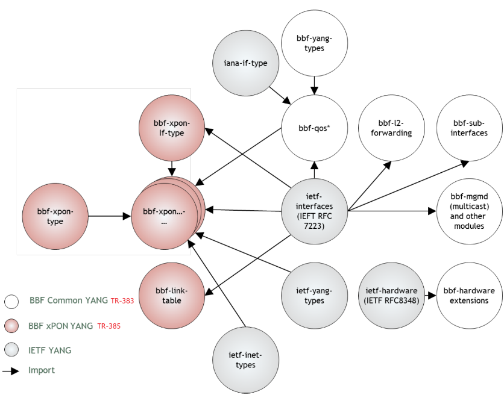
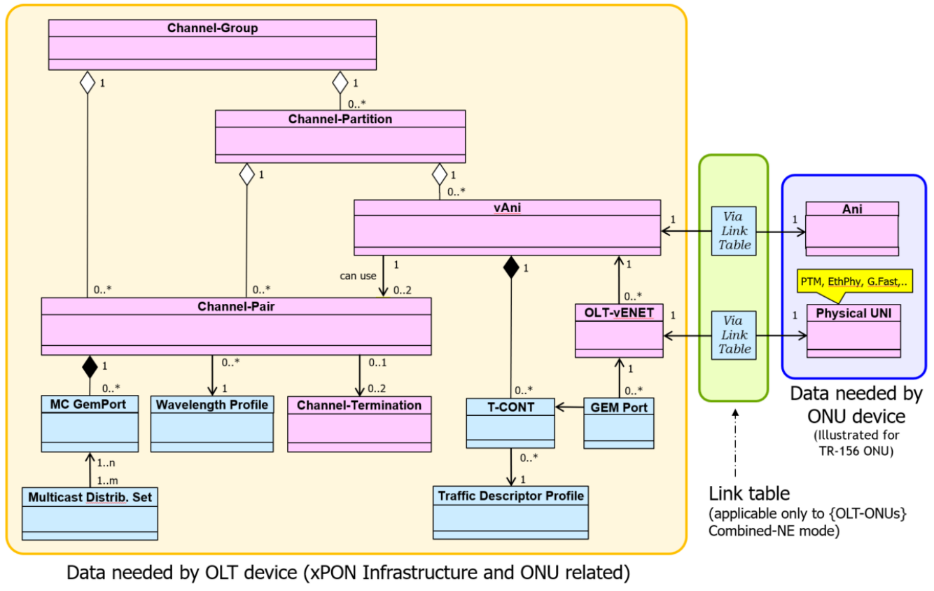

## chanpter 4

### 两种NE mode
* **Combinded-NE mode**: OLT上统一的Netconf server处理请求, ONU的消息通过OLT转换为OMIC消息传递给ONU
    
* **Separated-NE mode**: OLT和ONU有自己单独的Netconf server. ONU的Netconf server可以在OLT上, 也可以在其他地方, 消息可以通过OMCI或其他协议传递(OLT仅用于透明传输)
    

### xPON Yang模型
1. xPON model要求Netconf客户端负责配置**OLT和ONU之间的接口和其他数据结构**, 并且用于OLT和ONU的函数需要有清晰的区分
2. 需支持的主要参数:
    1. **xPON infrastructure**
        1. Channel group
        2. Channel partition
        3. Channel pair
        4. Channel termination
    2. **per-ONU data needed by OLT device**
    3. **per-ONU data needed by ONU device itself**
3. 上述三类数据用于Combinded-NE mode:
    
4. 上述三类数据用于Separated-NE mode:
    

## chapter 5
### channel group
* **channel group**: 表示ODN feeder线路资源(1:1). 
* **channel partition**: channel group可以分为多个不重叠的信道分区. YANG模型强制要求, 所有的ONU都是配置在partition上的, 不能直接配置在pair或termination上. partition可以理解为提供xPon服务的单元
    * **channel pair**: 表示group中的不同的波长资源, 一个channel group**包含多个**channel pair, 不同pair不能使用相同的波长. **一个channel pair只能属于一个channel partition**. 
        * **channel termination**: 是OLT上的物理资源, 一个channel pair**包含一个或两个**channel term.


 
### OLT-ONU接口
* **ANI接口**: 属于特定ONU, 在YANG模型中**表示物理ONU设备**(ani-onu-id, ANI的config和show都代表的ONU). 
    * **ONU-vENET接口**: ONU上的虚拟接口, 用于和OLT之间传输以太网帧数据. ONU-vENET配置在ANI接口上
* **vANI接口**:  OLT上的虚拟接口，**代表OLT眼中的ONU**. vANI配置在channel partition上, vANI的config和show都是应用在OLT上.
    * **OLT-vENET接口**: OLT上的虚拟接口, 用于和ONU之间传输以太网帧数据. OLT-vENET配置在vANI接口上
* **UNI接口**: 属于ONU面向用户侧的接口, 连接下一级设备
    * **ONU-virtual-UNI接口**:  属于ONU上, 是一个传输以太网帧的虚拟接口, 用于用户侧的TR-101 access node. ONU-virtual-UNI配置在用户侧UNI接口上

几种接口的表现如下:


### YANG模块关系


### ONU presence
> yang模型定义文件都在**xpon-system-common** repo中

ONU presence状态: `xpon-system-common\yang\bbf\tr385\standard\interface\bbf-xpon-onu-types.yang`
* onu-present: **ONU正在使用本地channel termination上的光信号**. <font color='red'>OLT怎么认为ONU正在使用光信号?</font>
    * 收到Serial_Number_ONU PLOAM消息
    * 或收到Tuning_Resp PLOAM消息
    * ONU持续发送光信号到OLT
* onu-not-present: **ONU没有使用任何本地channel termination的光信号**
    * ONT没有发送光信号
    * ONU没有接收任何下行光信号

onu-presence-state用于下面两个yang中(用法见TR-385pdf page 36备注):
* `xpon-system-common\yang\bbf\tr385\standard\interface\bbf-xpon-onu-state.yang`
* `xpon-system-common\yang\bbf\tr385\standard\interface\bbf-xponvani-v-ani-body.yang`

### Type B protection
Type B保护就是针对channel pair的备份保护. **当有两个channel termination时, 两个term可以互为备份, 以primary/secondary区分哪个为当前active的term**.

配置primary/secondary:
```yang
//xpon-system-common\yang\bbf\tr385\standard\interface\bbf-xpon-channel-termination-body.yang
grouping channel-termination-config-data {
    leaf meant-for-type-b-primary-role {
      type boolean; //true=primary, false=secondary
      //...
    }
}
```

type b状态分为三种, 在`bbf-xpon-onu-types.yang`中定义
* active
* standby
* not-part-of-type-b

### ONU波长移动
ONU Wavelength Mobility: 在任意时刻, 为每个ONU选择和执行可以有效使用的channel pair, 即选择合适的波长.
* 确保在要切换到的channel pair上ONU是激活的. 即**修改preferred channel pair时不影响ONU的active状态**
* ONU切换channel pair时要in service. 使用Action切换, 不需要down up ONU
* 遇到错误, ONU可以自动fallback到预定义的**protection channel pair** (波长保护)

```yang
//bbf-xponvani-v-ani-body.yang
grouping v-ani-config-data {
    leaf preferred-channel-pair{}
    leaf protection-channel-pair {}
}
```

### ICTP
波长移动依赖于**ICTP协议(Inter Channel-Termination Protocol)**. 
* ICTP通过TCP连接在channel termination之间传输
* TCP一般通过ICTP proxy连接, 不直接连接CT. ICTP proxy在OLT上可以有多个
* 一个OLT上ICTP proxy的个数和他们负责哪些CT, 由OLT供应商决定


YANG模型:
```yang
//bbf-xpon-base.yang
container xpon {
    container ictp {
        leaf activated //====>ICTP enable/disable
        container all-ictp-proxies-all-channel-groups { //====>每个ictp proxy的配置, key为proxy name
            list proxy {
                container all-channel-terminations-proxied-by-this-proxy { 
                    list channel-termination {//====>ictp proxy负责连接的CT, 指向channel terms

container xpon-state {
    container ictp {
        container all-ictp-proxies-all-channel-groups { //====>每个ictp proxy的状态信息
            list proxy {
                leaf proxy-ip-address
                container known-peered-proxies { //====>涉及该proxy对等关系的相关信息
                    list proxy { //====>与本proxy对等的其他proxy, 比如上面OLT1上的Proxy B/C
```

## chapter 6


### link table
适用于**Combinded-NE mode**网络结构, 在OLT的对应接口上与ONU建立链路关系, 分为**querying interface**和**queried interface**
* querying接口可以从queried接口继承一些参数
* 只能配置一个方向, ONU-->OLT
* 只有如下接口需要配置link table
    * `From=ANI, To = vANI`: ONU ANI从OLT vANI继承**T-CONT**配置
    * `From=ONU-vENET, To=OLT-vENET`: ONU-vENET从OLT-vENET继承**GEM Port**配置
    * `From=UNI, To=OLT-vENET`:  ONU UNI从OLT-vENET继承**GEM Port**配置
    * `From=virtual-UNI, To=OLT-vENET`: ONU 虚拟UNI从OLT-vENET继承**GEM Port**配置

在YANG模型中分别用from和to表示querying和queried接口.
```yang
//bbf-link-table.yang
list link-table {
    leaf from-interface {
    leaf-list to-interface {
```

### xPon Yang文件
* Module bbf-xpon-types.yang: 通用YANG类型定义
* Module bbf-xpon-if-type.yang: interface type类型定义
* Module bbf-xpon.yang: xpon基础设备的配置
    * Submodule bbf-xpon-base.yang: ietf-interfaces基础配置
    * Submodule bbf-xpon-wavelength-profile-body.yang: 波长配置文件
    * Submodule bbf-xpon-multicast-gemport-body.yang
    * Submodule bbf-xpon-channel-group-body.yang
    * Submodule bbf-xpon-channel-partition-body.yang
    * Submodule bbf-xpon-channel-pair-body.yang
    * Submodule bbf-xpon-channel-termination-body.yang
    * Submodule bbf-xpon-multicast-distribution-set-body.yang
* Module bbf-xponvani.yang: vANI配置
    * Submodule bbf-xponvani-base.yang
    * Submodule bbf-xponvani-v-ani-body.yang: vANI配置和状态信息
    * Submodule bbf-xponvani-v-enet-body.yang: OLT-vENET接口的配置和状态
* Module bbf-xpongemtcont.yang: GEM port, T-CONT, traffic descriptor profiles配置
    * Submodule bbf-xpongemtcont-base.yang
    * Submodule bbf-xpongemtcont-traffic-descriptor-profile-body.yang
    * Submodule bbf-xpongemtcont-tcont-body.yang
    * Submodule bbf-xpongemtcont-gemport-body.yang
* Module bbf-xpongemtcont-qos.yang: T-CONT QoS配置
* Module bbf-link-table.yang: OLT和ONU两端的nterface之间链接的link table配置.
* Module bbf-xponani.yang: ONU ANI接口配置
    * Submodule bbf-xponani-base.yang
    * Submodule bbf-xponani-ani-body.yang: ANI接口配置和状态
    * Submodule bbf-xponani-v-enet-body.yang: ONU-vENET接口配置和状态
* Module bbf-xpon-onu-state.yang
* Module bbf-xpon-onu-types.yang: 类型定义
* Module bbf-xpon-performance-management.yang
* Module bbf-xpon-power-management.yang
* Module bbf-xponani-power-management.yang
* Module bbf-xponvani-power-management.yang
* Module bbf-xpongemtcont-gemport-performance-management.yang
* Module bbf-xpon-defects.yang: OLT检测到的ONU缺陷
* Module bbf-hardware-transceivers-xpon.yang: 接收器配置
