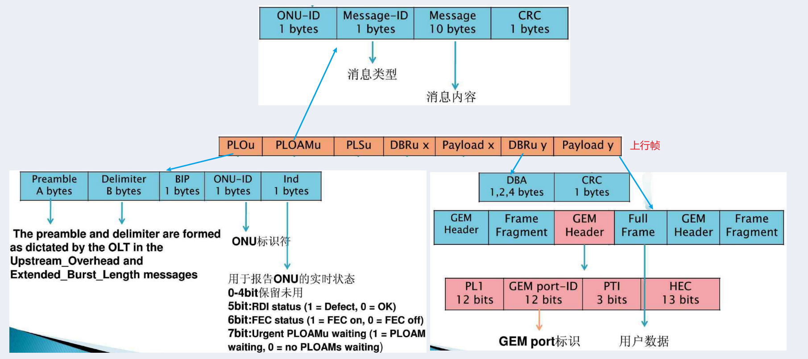

GPON: 对应协议 TG984.x, 网络结构如下:

## 帧结构

GPON 主要体现在**传输汇聚层**:

- 成帧子层: 测距 ranging, 分配带宽, 保护倒带, 保密安全, 上行时隙分配
- 适配子层: 提供 2 个适配器, GEM 适配器和 OMCI 适配器

### 上行帧

GPON 上行通过**TDMA 方式**传输数据, 上行链路分为不同的时隙, 根据**下行的 US BW Map 分配上行时隙**.

- PLOu: 物理层开销
  - Preamble: 用于物理层识别上行 burst 的起始点
  - Delimiter: 用于 GTC 层识别上行帧的起始点
  - BIP: 前一个 BIP 后所以传输字节的奇偶校验信息
- PLOAMu: 上行 PLOAM 消息
- PLSu: 上行功率控制序列
- DBRu x: 上行动态带宽报告
- Payload x: 具体的上行数据, 与 DBR x 组合出现, x 代表不同的**T-CONT**
  - GEM Header
    - PLI: payload 的长度
    - PTI: payload 的类型

### 下行帧

GPON 下行为**广播方式**, 帧长固定为**125us**, ONU 通过 ONU ID 识别属于自己的数据.

- PCBD
  - Psync: 固定值 0xB6AB31F0, 用于让 ONU 找到每个帧的开头
  - Ident: 复帧计数器, 值=前一帧+1
  - PLOAMd:下行 PLOAM 消息
  - BIP: 传输数据的间查奇偶校验
  - Plend:下行 payload 长度, 连续两个 plend 保证健壮性
  - US BW Map: n 个 8 bytes, 带宽分配, 可以不带
    - Alloc ID: 带宽分配的接收者
    - sstart: 时隙开始时间
    - sstop: 时隙结束时间
- Payload: 下行数据, 与 PCBD 组合出现

## 业务流

### GEM port

GEM Port 标识的是 GPON 系统中 OLT 和 ONU 之间的业务虚通道，即**承载业务流的通道**，类似于 ATM 虚连接中的 VPI/VCI 标识.

- 每个 GEM Port 由一个唯一的 **GEM Port-ID** 来标识. 可以通过 Port-ID 对数据流进行过滤
- GEM Port-ID 由 OLT 基于 GPON 端口分配.
- 一个 GEM port 可以承载一种业务，也可以承载多种业务.

### T-CONT

T-CONT(传输容器) 是 GPON 系统中**上行业务流最基本的控制单元**，是上行方向承载业务的载体，**所有的 GEM port 都要映射到 T-CONT 中，由 OLT 通过 DBA 调度的方式进行数据上行**.

- T-CONT 根据用户具体配置可以承载多个或者一个 GEM port.
- 每个 T-CONT 由 **Alloc-ID** 来唯一标识.
- Alloc-ID 由 OLT 基于 GPON 端口分配.
- **每个 ONU 支持多个 T-CONT**，并可以配置为不同的业务类型.

T-Cont 带宽类型:

- FB: 固定带宽
- AB: 保证带宽
- NAB: 非保证带宽
- BE: best effort 带宽
- 混合: 前三种混合

### DBA

DBA：Dynamic Bandwidth Allocation 动态带宽分配. 即 **OLT 根据 ONU 的上行突发业务量需求，动态地调整分配上行带宽给 ONU，既满足了 ONU 上行带宽需求**，也提高了 PON 系统带宽的利用率.

DBA 原理过程如下：

- OLT 内部 DBA 模块不断收集 DBA 报告信息，通过 DBA 算法进行计算。
- OLT 将计算结果以 **BW Map** 的形式下发给各 ONU。
- 各 ONU 根据 BW Map 信息在允许的时隙内发送上行突发数据，占用上行带宽。

### 业务流转发

## ONU 注册

### PLOAM 消息

G.984.3 9.2 节有各种消息的具体格式:

OAM Alarm 也是由 PLOAM 消息传递的.

### 注册流程

具体流程在 G.984.3 A.6:

1. ONU 监听 ds frame, 并完成物理同步和复帧同步
1. ONU 接收 OLT 周期性发送的 US Overhead 和 Extended burst length 两个 PLOAM 消息
1. ONU 根据接收的工作参数调整自己的参数
1. OLT discover 流程会周期性的发送 SN Request 消息
1. ONU 发送 Seria_Number_ONU, 通知 OLT 自己的序列号
1. OLT 根据新的 ONU SN 号分配 ONU ID, 通过 Assign_ONU_ID 发送给 ONU
1. OLT 通过 Ranging Request 消息测量新 ONU 的均衡时延, ONU 用 Seria_Number_ONU 作为回复
1. OLT 通过 Ranging_Time 将计算后的延时值发给 ONU
1. ONU 根据分配的均衡延时调整自己的上行帧发送起点
1. ONU 完成调整, 开始正常工作

### ONU 状态切换

## ranging 测距的过程和目的

- https://forum.huawei.com/enterprise/en/gpon-talking-about-to-the-ranging/thread/652319-100181

OLT 必须精确计算其到每个 ONU 的距离，以控制每个 ONU 发送上游数据的时间。从 OLT 的角度来看，所有 ONU 的传输距离相同。这种增加的延迟称为均衡延迟（EqD）。这是测距过程。基于这个思路，GPON 系统使用以下方法:

- 基于最远的 ONU，首先计算每个 ONU 到 OLT 的延迟，然后精确计算每个 ONU 到 OLT 的距离 (用到 mac logical distance)
- 向靠近 OLT 的 ONU 添加延迟，以确保从此 ONU 向 OLT 发送信号的周期与最远 ONU 的周期相同. 实际目的是**确保所有 ONU 到 OLT 的逻辑距离相同**.

OLT 通过测距过程获得 t 往返延迟（RTD），然后计算 OLT 和每个 ONU 之间的物理。OLT 指定合适的 EqD。OLT 使用 RTD 和 EqD 来同步每个 ONU 发送的数据帧，并确保每个 ONU 发送的数据在拆分器上不冲突。也就是说，OLT 确保所有 ONU 处于相同的逻辑距离，并在相应的时隙中发送数据。
在测距过程中，OLT 需要打开一个窗口，即 quiet window，并暂停其他 ONU 的上行传输信道。要打开窗口，OLT 会将 BWmap 设置为空，并且不授权任何时隙。

如果不进行测距，ONU 发送的数据帧可能会因为不同距离造成的各种延迟而在分路器上发生冲突。OLT 使用范围为每个 ONU 分配不同的时隙以发送上游数据，以及均衡延迟参数。这样，所有 ONU 的上行数据聚合到光纤上并插入指定时隙后，不会发生冲突，间隙也不大。每个 ONU 根据 OLT 发送的下游数据包内的 BWmap 字段中包含的带宽信息，在指定的时间段内发送上游数据。

### quiet window

quiet window 包括两部分:

- serial number quiet window (O2~O3): window size depends on PON differential fiber distance.
  - For 20km serial number quiet window size is 250 μs
  - For 40km serial number quiet window size is 450 μs.
- ranging quiet window(O4): window size depends on PON differential fiber distance.
  - For 20km serial number quiet window size is 202 μs
  - For 40km serial number quiet window size is 402 μs.

## FEC

### 下行 FEC

G.984.3 13.2:
When constructing the DS frame with FEC, the FEC parity bytes are inserted at the end of every codeword. When using RS(255,239), **every 239 data bytes are followed with 16 parity bytes**.

### 上行 FEC

G.984.3 13.3:
When constructing the US transmission with FEC, the FEC parity bytes are inserted at the end of every codeword. When using RS(255,239), **every 239 data bytes are followed with 16 parity bytes**.

