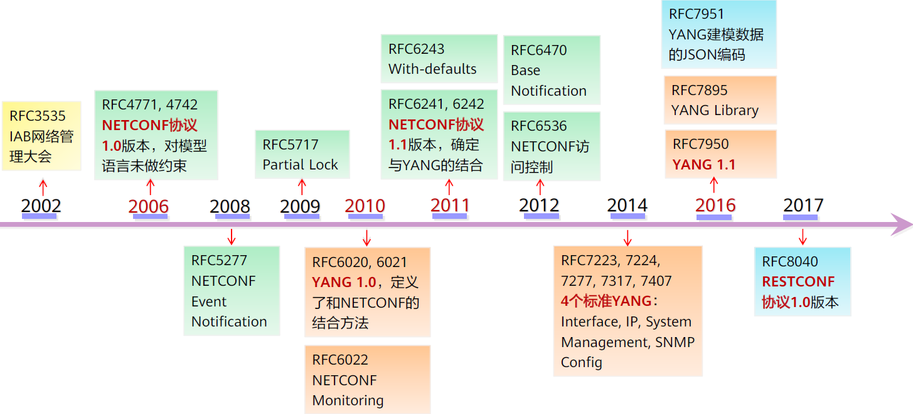
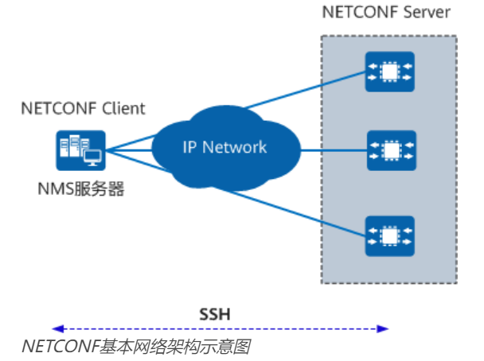
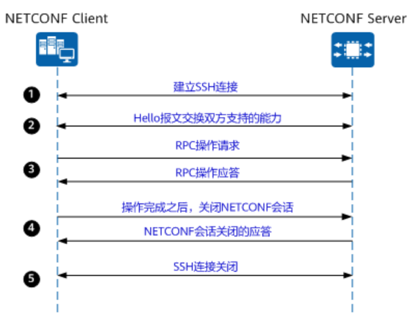
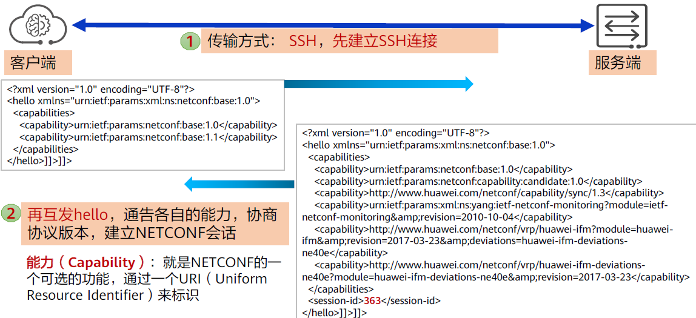
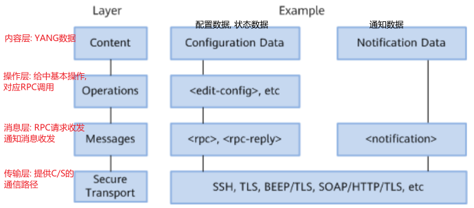
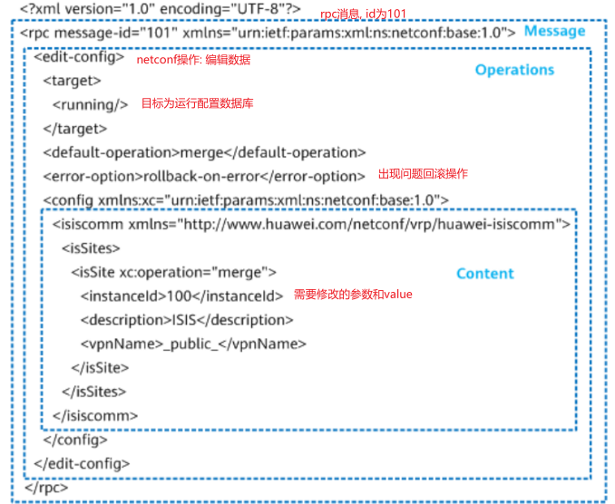
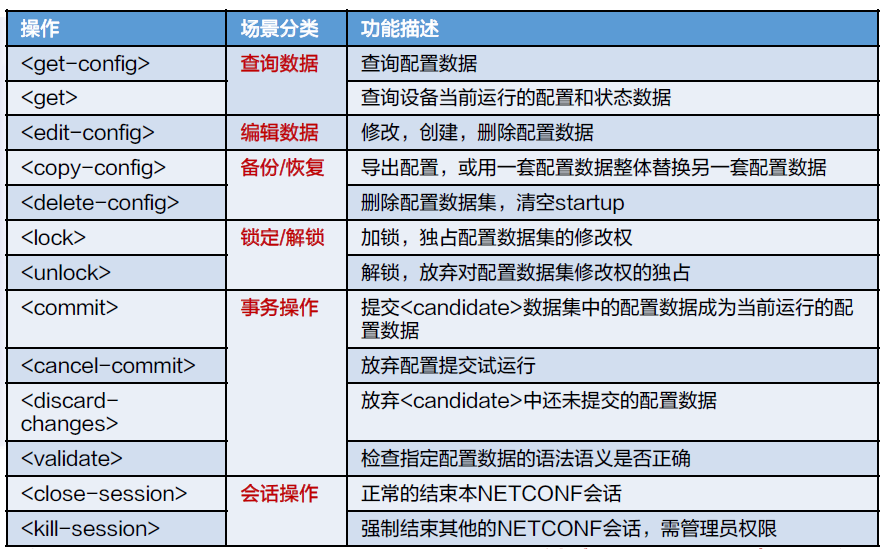
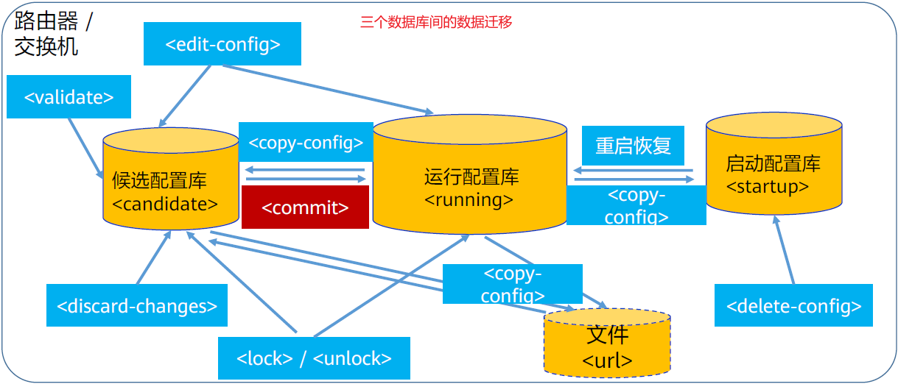
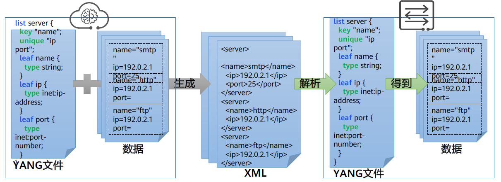

## Protocol versions

## NetConf Protocol
Netconf defines the acquisition (get) and config of data, and the yang data of the world described by the YANG model encapsulates operations to implement the management of the network world.

### Architecture

* client:
    * Send RPC requests (RPC communication mode), query and modify parameters.
    * Receive alerts and events unsolicited by NETCONF Server
* server:
    * After receiving the request from Client, the data is parsed and then the client is returned with a response
    * When a device fails or other events occur, the Notification mechanism is used to proactively notify the device of alarms and events to Client

### session


A capability set is a set of basic and extended functions implemented based on the NETCONF protocol.  NETCONF capability sets include standard capability sets defined by the IETF standards Body and their respective extended capability sets defined by each device manufacturer.  The device can use the capability set to add protocol operations and expand the operation scope of existing configuration objects.  

competency negotiation is the ability of both parties to inform themselves of their support by sending messages to each other during the session establishment phase.

Once a NETCONF session is established, the client and server immediately send a Hello message to the peer (containing a list of the set of capabilities supported by the client <hello> elements) announcing the respective supported set of capabilities. This allows both parties to leverage their negotiated capabilities to implement specific management functions.


### 四层结构

## NetConf packet format


the sections are described in detail below:

### rpc communication mode
the first node above xml is the communication mode, corresponding to different information:
* `<rpc >`: Used to encapsulate client requests sent to server
* `< rpc-reply >`: Used to encapsulate the reply message for rpc requests, the server responds to each rpc operation with a reply message encapsulated with the rpc-reply element
    * `<rpc-error>`: If any errors or alarms occur during the processing of the request, only the rpc-error element is encapsulated within the rpc-reply element and returned to The Client
    * `<ok>`: If no errors or alarms occur during the processing of the request, the server encapsulates an ok element inside the rpc-reply element and returns it to Client

### the type of operation
The edit-config above is a Netconf operation, which is one of the basic operations below


in addition to basic read and write, it also supports transaction operation rollback, lock anti-interference and other actions.

### target
NETCONF defines the existence of one or more configuration databases and allows configuration operations to be performed on them, specifying which target database to operate on each rpc request:
* running: runs the configuration database to save the complete configuration that is currently active on the network device
* candidate: an alternate configuration database that holds the collection of configuration data that the appliance will submit to running
* startup: starts the configuration database, which holds the configuration data loaded when the device starts, equivalent to the saved configuration file



### content
The content part is the specific config parameters or the obtained data, which corresponds to the YANG model to standardize the data content.

## YANG model
YANG = Yet Another Next Generation (Yang) Data Modeling Language.  It is a modeling language that describes network concepts. YANG can be converted into XML data very well, wrapped in the Netconf protocol for transmission.


### YANG example
```
module example-foo{
    yang-version 1.1;
    namespace "urn:example:foo";
    prefix "foo";
 
    import example-extensions{
        prefix "myext";
    }
    organization "BTR Technologies Co., Ltd.";
    contact
        "Barret Ren Personal
        People's Republic of China
        Email: barretren@qq.com";
    description "Basic example YANG module file.";
    revision 2022-05-12 {
        description "Add units attribute.";
        reference "barret private.";
    }
 
    container example-list {
        description "List of example parameters.";
 
        list interface{
            key "namea";
            leaf namea{
                type string;
            }
        }
 
        leaf mtu{
            type uint32;
            description "the MTU of the interface";
            myext:c-define "MY_MTU";
        }
    }
}
```

Using the pyang tool, you can convert the YANG model into a YANG Tree view, and the entire YANG model is displayed in the form of a tree. The command is: **pyang -f tree example.yang -o example.tree**.
```shell
module: example-foo
  +--rw example-list
     +--rw interface* [namea]
     |  +--rw namea    string
     +--rw mtu?         uint32
```

### YANG Statement
| 语句          | 功能                                          | 语句          | 功能                            |
| :----------- | :-------------------------------------------- | :----------- | :------------------------------ |
| augment      | 对其他模型进行扩展                             | choice       | 定义互斥选择分支                 |
| config       | true表示配置数据，false表示状态数据             | case         | 表示choice里的不同分支           |
| contact      | YANG模块联系信息                               | description  | 功能描述                        |
| extension    | 定义YANG的扩展                                 | feature      | 特性声明                        |
| grouping     | 可重用的数据结构                               | uses         | 引用grouping定义的数据结构       |
| leaf         | 叶子节点,包含简单数据                           | leaf-list    | 定义叶子列表                     |
| list         | 列表节点,定义列表条目                           | key          | list的key,唯一标识列表           |
| mandatory    | 节点必须出现                                   | must         | 定义节点必须满足的约束            |
| max-elements | 列表的最大实例个数                             | min-elements | 列表的最小实例个数               |
| module       | YANG将数据模型构建为模块，模块名与YANG文件名一致 | namespace    | 模块的名字空间，是全球唯一的URI。 |
| notification | 定义通知                                       | length       | 字符串长度                       |
| pattern      | 正则表达式约束                                 | range        | 参数取值范围                     |
| prefix       | namespace的简写                               | organization | YANG归属组织名                   |
| reference    | 参考或引用说明                                 | unique       | 值必须和指定数据相等             |
| revision     | 版本信息,提供编辑版本历史                       | container    | 容器节点,若干节点的集合           |
| rpc          | 定义RPC操作,需要代码实现                        | typedef      | 定义派生类型                     |
| when         | 定义节点满足什么条件才可见                      | import       | 导入其他YANG模型文件             |

### YANG types
ANG allows users to use typedef to define the type they need, either based on build-in type or another derived type.

| 类型         | 说明                                 | 类型                 | 说明                          |
| :---------- | :---------------------------------- | :------------------ | :--------------------------- |
| binary      | Any binary data                     | bits                | A set of bits or flags       |
| boolean     | "true" or "false"                   | decimal64           | 64-bit signed decimal number |
| empty       | A leaf that does not have any value | enumeration         | Enumerated strings           |
| identityref | A reference to an abstract identity | instance-identifier | References a data tree node  |
| int8        | 8-bit signed integer                | int16               | 16-bit signed integer        |
| int32       | 32-bit signed integer               | int64               | 64-bit signed integer        |
| leafref     | A reference to a leaf instance      | string              | Human-readable string        |
| uint8       | 8-bit unsigned integer              | uint16              | 16-bit unsigned integer      |
| uint32      | 32-bit unsigned integer             | uint64              | 64-bit unsigned integer      |
| union       | Choice of member types              |                     |                              |

### YANG and XML
In order to take advantage of tools such as existing XML parsers in various programming languages, the YANG model converts XML data after populating the data and passing it in a NetConf message. The counterpart then parses the XML according to the YANG model to obtain the real data:

xml files can be produced manually using **pyang -f yin example.yang -o example.yin**:

