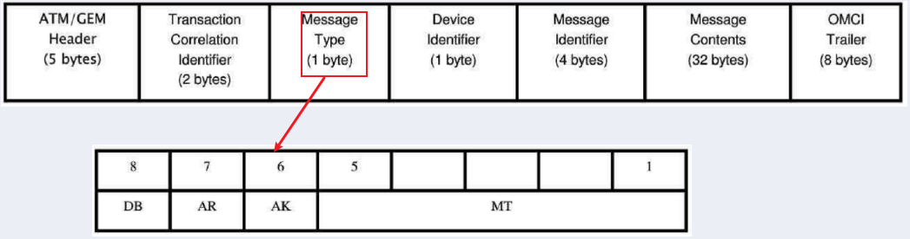
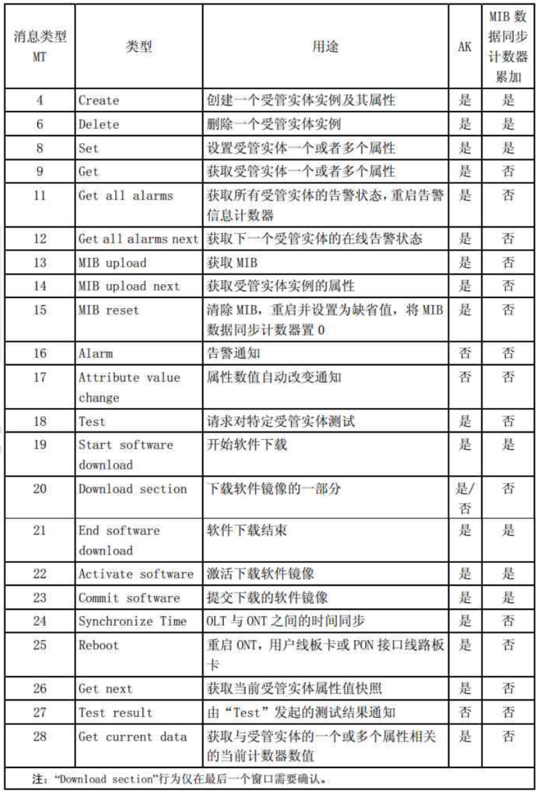
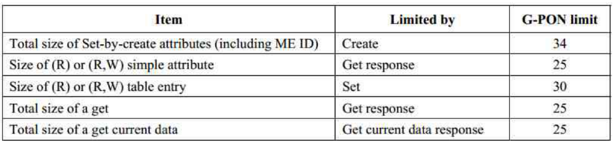

## OMCI

OMCI 是 GPON 标准(**G.988**)定义的一个**配置传输通道**, 用于**获取 ONU, 对其进行管理和控制**.

- 建立 OMCI 通道: ONT 向 OLT 注册时
- OLT 是主设备, ONT 是从设备
- 停等级制: OLT 在收到正确回复后, 才会下发下一个消息
  - 高优先级 OMCI 消息需要在 1s 内完成应答
  - 低优先级 OMCI 消息需要在 3s 内完成应答

### OMCI 消息格式

固定**53 bytes**:


- ATM/GEM header: header 信息, 发送到哪个 ONU
- Transaction correlation Identifier: 事务相关标识, 一组事务消息该字段要一致; 的最高位表示优先级的高低，1 表示高优先级，0 表示低优先级
- Message Type: 消息类型
  - DB: 固定 0
  - AR: 1=需要回复, 0=不需要回复
  - AK: 1=该消息是回复报文, 0=该消息不是回复报文
  - MT: 消息类型, **消息的 MT 值在 G.984.4 11.1.4 节, 具体每类消息的格式在 G.984.4 II-2 节**.
    
- device identifier: 设备标识, OMCI 固定为 0xA
- message Identifier: 高 2 位是目标 entity(**在 G.984.4 11.1.6 节**)，后 2 位是 entity id, **具体每类实体的内容在 G.984.4 9 节**
- Message contents: 消息具体内容
- OMCI trailer: OMCI 消息尾部, 包含**报文长度和 CRC**

### 消息大小限制

OMCI 消息格式固定 53bytes, 所以对于不同消息类型, 能传递的消息大小是有限制的. 比如下面消息的大小限制:


出现消息超长的处理方式:

- ONT 上报**参数错误代码**, OLT 简化其请求, 保证回复内容不要太长
- ONT 提供部分数据和**属性的部分列表掩码**, OLT 获取到部分数据之后, 再请求未回复的数据

### OMCI 通道

1. ONT register, OLT 分配**ONU ID**给 ONT, ONT 根据 ONU ID 建立 OMCI 的**T-CONT**
1. 注册成功后, OLT 下发 OMCI GEN Prot 配置(PLOAM 消息), ONT 收到消息后, 把**GEM port 与 OMCI T-CONT 对应**
1. 之后, ONT 根据 GEM Port 识别属于自己的 OMCI 报文.

### 消息解析举例

OMCI 消息如下:

```
30e1480a0096000100010002000000000000000000000e100168ffff000001000000000000000000000028b58e12c5
```

下面进行解析:

```
30e1 ====>Transaction　Correlation　Identifier, 低优先级
48 ====>message type, 0b01001000(DB=0, AR=1, AK=0, MT=8/set)
0a ====>device identifier
00960001 ====>message Identifier, 目标实体为0x0096(150=SIP Agent Config Data), 0x0001表示第一个实例
00010002000000000000000000000e100168ffff0000010000000000000000 ====>消息内容, 需要按照G.984.4 9.9.3节进行解析
    0001 ====>Proxy server address pointer
    0002 ====>Outbound proxy address pointer
    00000000 ====>Primary SIP DNS
    00000000 ====>Secondary SIP DNS
    0000 ====>TCP/UDP pointer
    0e100168 ====>SIP reg exp time
    ffff0000 ====>SIP rereg head start time
    0100 ====>Host part URI
    00 ====>SIP status
    0000 ====>SIP registrar
    00000000 ====>Softswitch
00000028b58e12c5 ====>trailer
```

## OMCI message type

- message type 见 G.984.4 Table **11-1 – OMCI message types**.
- message Identifier 见 G.984.4 Table **11-2 – Managed entity identifiers**

具体的 ME 格式见 G.988 A.3.
GPON 上线后 OMCI 消息交互的 log, 可供解析不同的 ME 参考: 
- [gpon omci log](omci.assets/gpon_omci.log)
- [xggpon omci log](omci.assets/xgpon_omci.log)
