XGS-PON: 基于 G.9807.x 标准，下行速率为 10G,上行 速率为 10G (对称),发布时间：2015-2016 年. XG(S)-PON 是在已有 GPON 技术标准上演进的增强下一代 GPON 技术.
**下表看来, GPON 和 XGS-PON 的区别就是波长的区别, 其他基础结构基本一样(个人理解)**
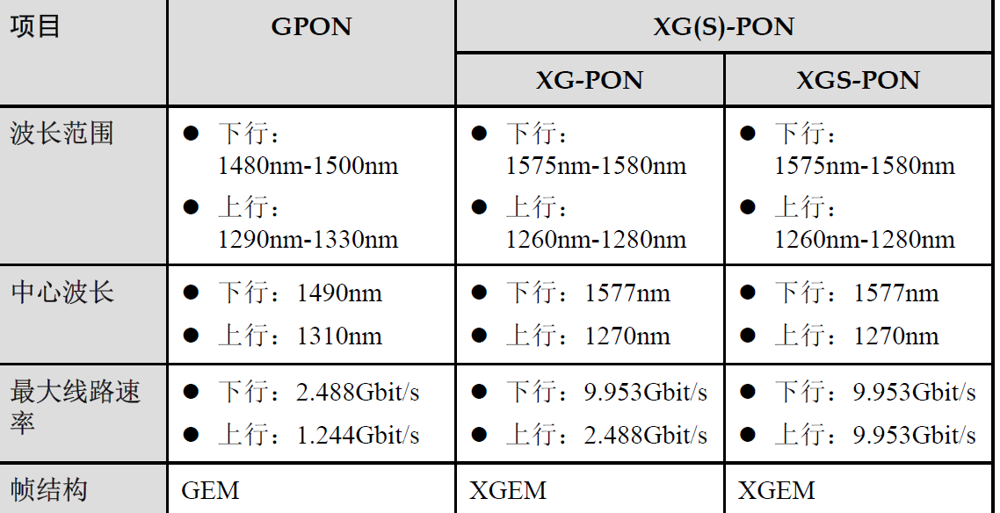

## 网络共存模式

G.9807.1 A.6 一共定义了如下的四种共存(coexistence)场景:

- 场景 1: GPON 和 XGS-PON 通过 WDM1r 共存；XGS-PON 使用一个 XG-PON 指定端口. **WDM(波分复用)**: XGS-PON (包括 OLT 及 ONU) 使用的是 **(下行)1577nm/(上行)1270nm** 的波长；GPON (包括 OLT 及 ONU) 使用的是 **(下行)1490nm/(上行)1310nm** 的波长；而视频业务使用的是 **1550nm** 的波长；因此互不影响
  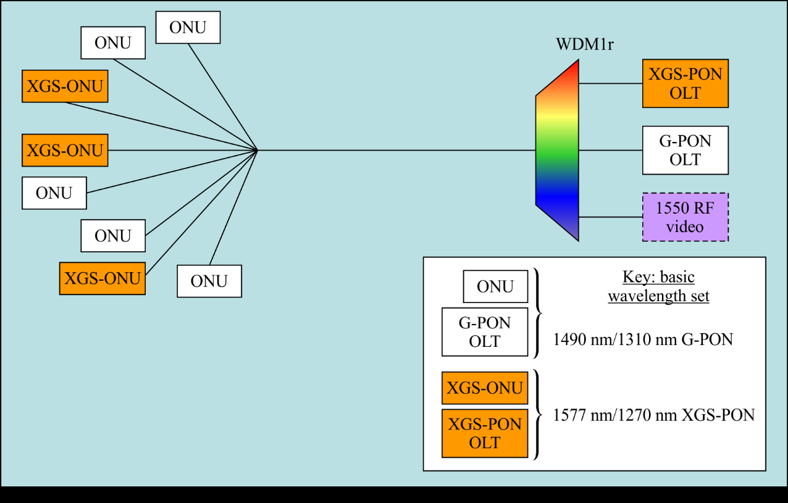
- 场景 2: XG-PON 和 XGS-PON 通过 WDM1r 共存；XGS-PON 使用一个 GPON 指定端口
  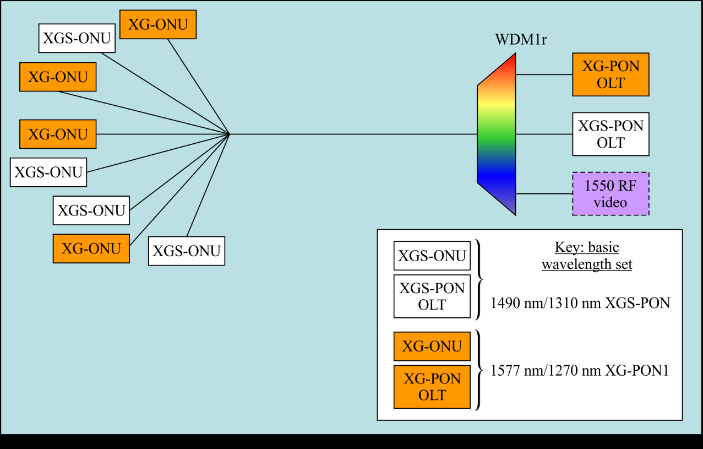
- 场景 3: XG-PON 和 XGS-PON 在 TDMA(上行)/TDM(下行)模式
  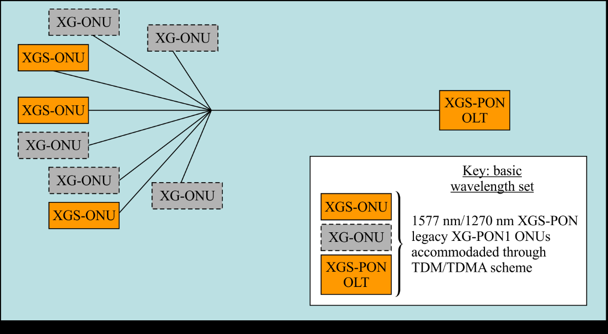
- 场景 4: GPON, XG-PON 和 XGS-PON 通过 WDM1r 共存；XGS-PON 使用 XG-PON 端口, 与场景 3 的 XG-PON 共存
  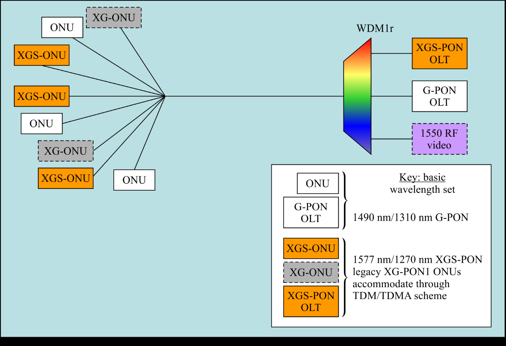

## 帧结构

### 上行帧

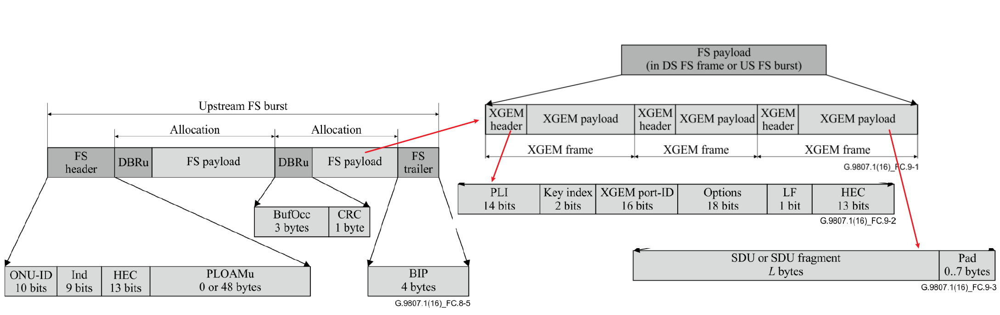

### 下行帧

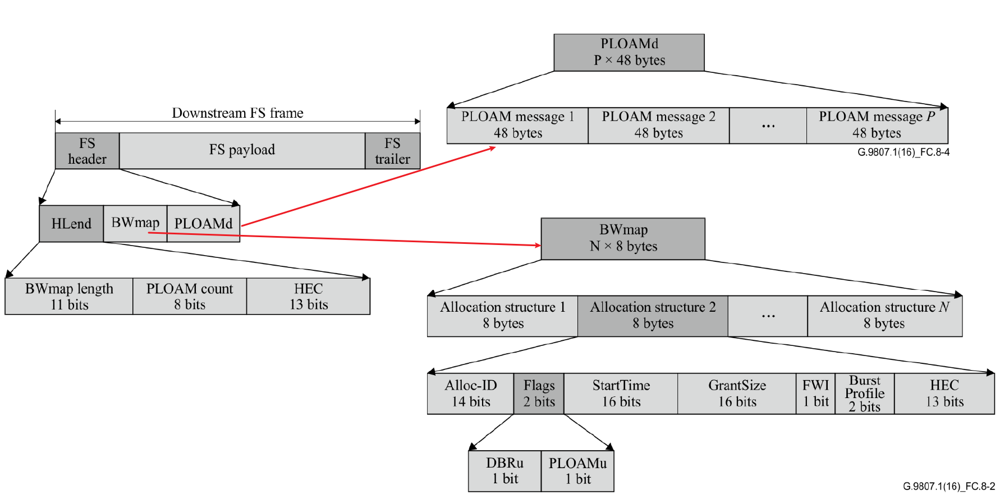

## ONU 上线流程

- OSS/BSS: The operational support system and billing support system., 运营支持和计费支持系统

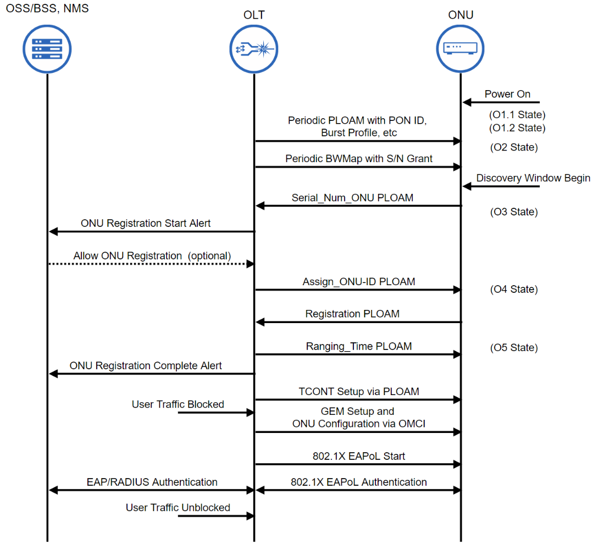

### CPE DHCP 流程

option 82 是 dhcp 报文中的中继代理信息选项（relay agent information option）。**当 dhcp client 发送请求报文到 dhcp server 时，若需要经过 dhcp 中继，则由 dhcp 中继将 option 82 添加到请求报文中**。option 82 包含很多 sub-option，sub-option 1 中定义了代理电路 id（即 circuit id），sub-option 2 中定义了代理远程 id（即 remote id），sub-option 5 为链路选择（link selection）子项，该选项中包含了 dhcp 中继添加的 ip 地址。

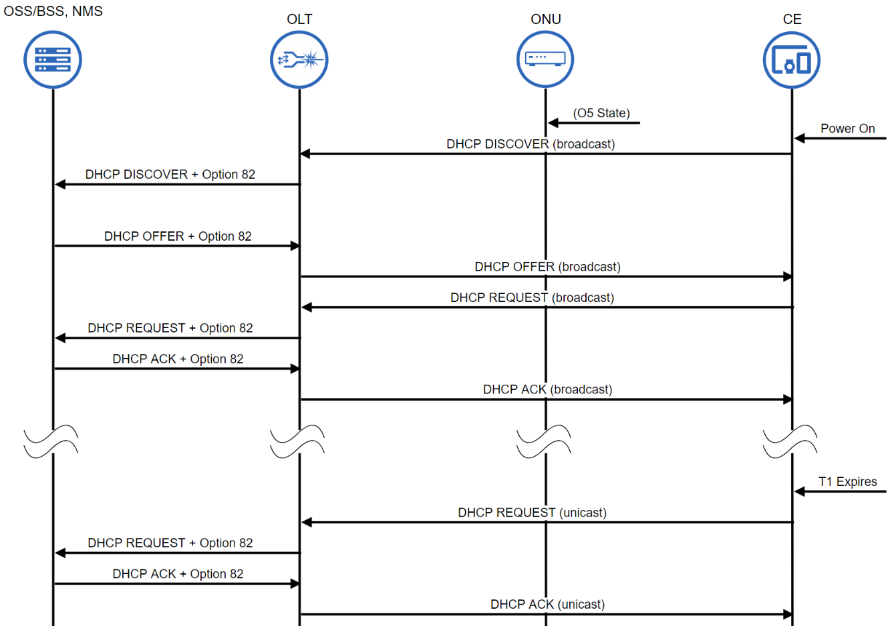

## 配置管理接口

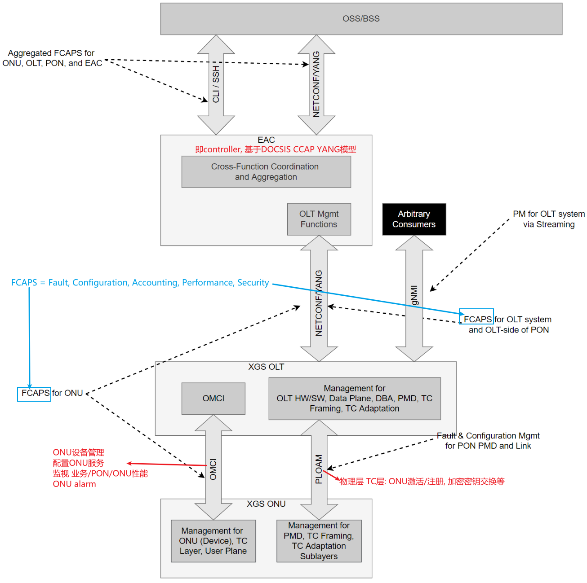

## FEC

### 下行 FEC

XGS-PON 下行的 FEC 默认是 enabled, 下行 frame 中没有表示 FEC on/off 的 bit(和 GPON 不一样)

### 上行 FEC

上行 FEC 通过指定 brust profile 来控制:
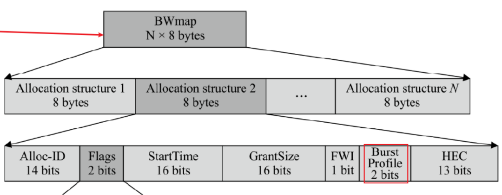
