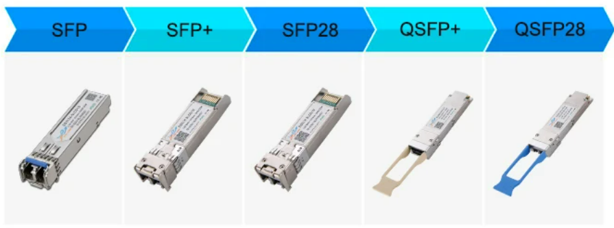

## SFP
SFP是**SMALL FORM PLUGGABLE**（小型可插拔）的缩写，可以简单的理解为GBIC的升级版本，它的体积只有GBIC模块的1/2。这种设计极大地增加了网络设备的端口密度。
SFP封装光模块的传输速率有**155M、1.25G、2.5G**等，接口类型主要以LC接口为主，一般用在SONET/SDH网络、百兆/千兆以太网以及其他低速传输应用。

## SFP+
SFP+与SFP外观尺寸相同，SFP+封装光模块的传输速率有6G、8G、10G等，采用该封装类型的有6G/8GFC光模块、10G光模块、10G电口模块、10G DAC高速线缆以及10G AOC有源光缆。
SFP+系列产品主要用于数据中心**10G**（10GBASE-SR）以太网链路中。

## SFP28
SFP28是SFP+的加强版，和SFP+具有相同的尺寸，但其能支持单通道**25Gb/s**的速率。SFP28为10G-25G-100G网络升级提供了一种高效的解决方案，可满足下一代数据中心网络持续增长的需求。

## QSFP+
QSFP+封装能同时支持4通道传输，每条通道数据速率为10Gbit/s，通过4个通道实现40Gbps传输速率。
与SFP+相比，QSFP+光模块的传输速率可达SFP+光模块的四倍，在部署**40G**网络时可直接使用QSFP+光模块，从而在有效节省成本的同时提高端口密度。

## QSFP28
QSFP28封装类型是为满足100G应用需求而产生的，它能同时支持4通道传输，每条通道数据速率为25Gbit/s，通过4个通道实现100Gbps传输速率。可满足**100G**以太网（4×25Gbps）与EDR InfiniBand的应用需求。

从内置光器件数量来看，SFP、SFP+、SFP28内置单个激光器和单个探测器，而QSFP+、QSFP28内置4通道激光器阵列和4通道探测器阵列。并且这5种封装类型的接口协议都有所不同。