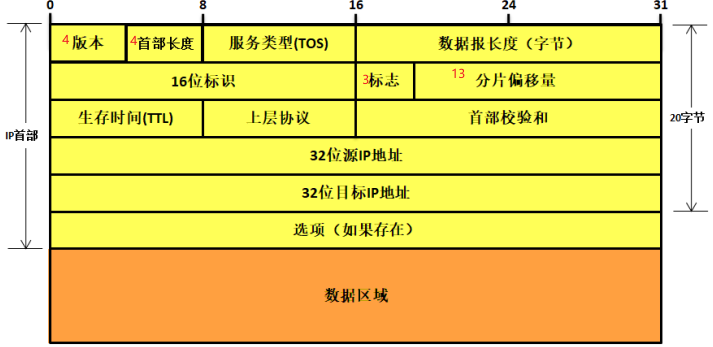
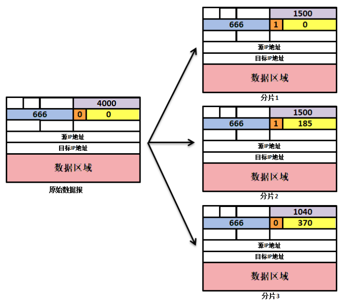

## 1 IP 数据格式

IP 协议的三大特点：

- **无状态**：通信双方不同步传输数据的状态信息。
- **不可靠**：它不能保证 IP 数据报能成功地到达目的地。 IP 仅提供最好的传输服务。
- **无连接**：通信双方不会长久的维持对方的任何信息。每个数据报的处理是相互独立的。这也说明， IP 数据报可以不按发送顺序接收

IP 数据格式如下：普通的 IP 首部长为 20 个字节，除非含有选项字段



- 服务类型（**TOS**）字段包括一个 3 bit 的优先权子字段（现在已被忽略）， 4 bit 的 TO S 子字段和 1 bit 未用位但必须置 0。 4 bit 的 TOS 分别代表：**最小时延、最大吞吐量、最高可靠性和最小费用**。 4 bit 中只能置其中 1 bit。如果所有 4 bit 均为 0，那么就意味着是一般服务。
- **标识字段**唯一地标识主机发送的每一份数据报。通常每发送一份报文它的值就会加 1
- **TTL**（time-to-live）生存时间字段设置了数据报可以经过的最多路由器数。

## 2 IP 分片

IP 头部中的如下三个字段给 IP 的分片和重组提供了足够的信息：

- 数据报标识
- 标志
- 片偏移

一个 IP 数据报的每个分片都具有自己的 IP 头部，它们具有**相同的标识值，但具有不同的片偏移**。并且**除了最后一个分片外，其他分片都将设置 MF 标志**。此外，每个分片的 IP 头部的总长度字段将被设置为该分片的长度。常见的网络 MTU 默认值参考：
例如下面 ICMP 数据被分片：



## 3 IP 路由

### IP 模块工作原理


### IP 路由表

使用 route 或 netstat 可以查看本机缓存路由信息：

```bash
> route
Kernel IP routing table
Destination     Gateway         Genmask         Flags Metric Ref    Use Iface
default         135.202.28.254  0.0.0.0         UG    0      0        0 eth0
135.202.28.188  0.0.0.0         255.255.255.128 U     0      0        0 eth0
link-local      0.0.0.0         255.255.0.0     U     1002   0        0 eth0
172.17.0.0      0.0.0.0         255.255.0.0     U     0      0        0 docker0
```

上面显示路由表各项的含义如下：

| **字段**    | **含义**                                                                                                                      |
| ----------- | ----------------------------------------------------------------------------------------------------------------------------- |
| Destination | 目标网络或主机                                                                                                                |
| Gateway     | 网关地址，\*表示目标和本机在同一网络，不需要路由                                                                              |
| Genmask     | 网络掩码                                                                                                                      |
| Flags       | 路由标志：- U：该路由是活动的- H：该路由目标是一台主机- G：该路由目标是网关- D：该路由是重定向生成的- M：该路由被重定向修改过 |
| Metric      | 路由距离，到达指定网络的中转数                                                                                                |
| Ref         | 路由项被引用的次数，Linux 不使用该项                                                                                          |
| Use         | 路由项被使用的次数                                                                                                            |
| Iface       | 路由项对应的输出网卡接口                                                                                                      |

所有的 IP 路由选择只为数据报传输提供下一站路由器的 IP 地址，它假定下一站路由器比发送数据报的主机更接近目的。


## 4 ICMP 重定向

重定向报文是发送给 IP 数据的发送端，**用来更新路由表**，基本流程如下所示:


- 假定主机发送一份 IP 数据报给 R1。这种选路决策经常发生，因为 R1 是该主机的**默认路由**。
- R1 收到数据报并且检查它的路由表，发现 R2 是发送该数据报的下一站。当它把数据报发送给 R2 时， R1 检测到它正在发送的接口与数据报到达接口是相同的（即主机和两个路由器所在的 LAN）。这样就给路由器发送重定向报文给原始发送端提供了线索。
- **R1 发送一份 ICMP 重定向报文给主机，告诉它以后把数据报发送给 R2 而不是 R1**

重定向一般用来让具有很少选路信息的主机逐渐建立更完善的路由表，主机在启动时只需一个默认路由，通过接收重定向报文来逐步学习。

### 重定向报文格式

ICMP 重定向报文格式如下：不同的代码表示不同的重定向类型


