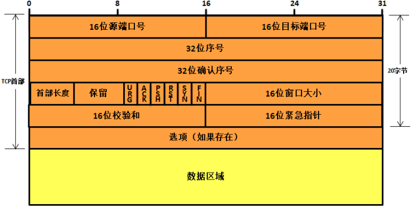
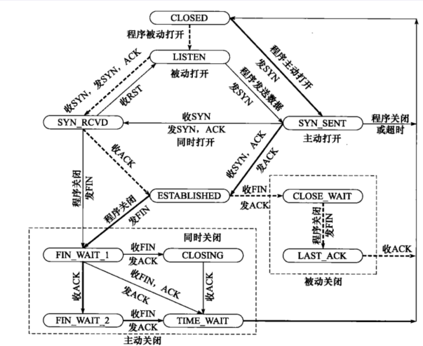

# 可靠的字节流传输

TCP 的特点是：面向连接、字节流、可靠传输, TCP 对接收到的 IP 数据包进行重排、整理，保证不会乱序.
TCP 的传输结构如下：

主要依靠如下机制:

## 发送应答机制

每个发送的报文都必须得到接收方的应答，才认为是传输成功。

## 捎带机制

TCP 协议的确认是通过捎带的方式来实现，即接收方把确认信息放到反向传来的是数据报文中，不必单独为确认信息申请一个报文，捎带机制减少了网络中的通信流量

## 超时重传机制

发送每个报文都会启动定时器，规定时间内没有收到应答，就重发该报文。

## 缓存机制

- TCP 会将数据存储在一个缓存空间中，等到数据量足够大的时候在进行发送数据，等收到接收方的确认时删除数据, 这样能提供传输的效率并且减少网络中的通信量
- 在接收方也有同样的缓存机制, 等待将缓存的数据组装成完整的数据

## flow control

TCP 提供了流量控制服务（flow-control service）以**消除接收方缓冲区溢出**的可能性, 即**发送方的发送速率与接收方应用程序的读取速率相匹配**.
TCP 通过让发送方维护一个称为**接收窗口**（receive window）的变量来提供流量控制.

- 它用于给发送方一个指示：接收方还能接收多少数据
- 接收方会将此窗口值放在 TCP 报文的首部中的窗口字段，然后传递给发送方
- 这个窗口的大小是在发送数据的时候动态调整的

## 差错控制

TCP 协议也会采用校验和的方式来检验数据的有效性，主机在接收数据的时候，会将重复的报文丢弃，将乱序的报文重组，发现某段报文丢失了会请求发送方进行重发.

# TCP 报文格式

## 头部结构

固定头部结构如下：

- 源端口号：表示报文来自哪里
- 目的端口号：报文传给哪个上层协议或应用程序
- 序号：一次 TCP 通信中某一个传输方向上字节流的每个字节的编号，保证不乱序
  - 当开启一个 TCP 会话时，他的初始序列号（ISN）是随机的，可能是 0~4294967295 之间的任意值
  - 像 wireshark 这种抓包工具，通常显示的都是相对序列号与确认号，而不是实际序列号与确认号
- 确认号：接收方的响应，下一次报文需要携带上一次的报文响应
- FLAGS:
  - URG：首部中的紧急指针字段标志，如果是 1 表示紧急指针字段有效。
  - ACK：首部中的确认序号字段标志，如果是 1 表示确认序号字段有效。
  - PSH：该字段置一表示接收方应该尽快将这个报文段交给应用层。
  - RST：重新建立 TCP 连接。
  - SYN：用同步序号发起连接。
  - FIN：中止连接。
- 窗口大小：告诉对方，本端接收缓冲区还能容纳多少字节

## 头部选项

TCP 选项字段是可变长的可选信息，典型的选项如下：

# TCP 状态机

下图描述了所有的 TCP 状态和可能的状态转换（虚线表示服务器端的状态变化，实线表示客户端的状态变化）：

## 三次握手

- 客户端首先向服务器端发送一个特殊的 TCP 报文(不包含应用层数据)
  - 首部中的 SYN 标志位会被置为 1
  - 包含随机的初始序号 A
- 服务器收到 SYN 报文后, 会向客户端发送允许链接的 tcp 报文:
  - 首部中的 SYN 和 ACK 置为 1
  - 确认序号为 A+1
  - 服务器随机选择自己的初始序号 B
- 客户端收到回复后, 需要再次发送确认报文:
  - 首部中的 ACK 置为 1
  - 发送序号为 A+1
  - 确认序号为 B+1, 并告知窗口大小(**开始携带数据**)

## 四次挥手

- 客户端发送 FIN=1 的报文, 表示客户端到服务器方向上连接停止, 发送序号为 C
- 服务器收到报文后, 回复 ACK=1 的报文, 确认序号为 C+1
- 服务器发送 FIN=1 的报文, 表示服务器到客户端方向上连接停止, 发送序号为 D
- 客户端收到报文后, 回复 ACK=1 的报文, 确认序号为 D+1

# 带外数据

带外数据（Out Of Band），用于迅速告知对方本端发生的重要事件，比普通数据（**也叫带内数据**）优先级更高，应当立即发出。TCP 在头部提供**紧急指针标志和紧急指针**两个字段，利用传输普通数据的连接来传输紧急数据。
发送端一次发送多字节的带外数据时，只有最后一个字节被当作带外数据，其他数据被当作普通数据，如下图结构：

> 如果 TCP 设置了**SO_OOBINLINE**选项，则带外数据会被当作普通数据放在接收缓冲区，紧急指针仍然可以用于读取带外数据。
