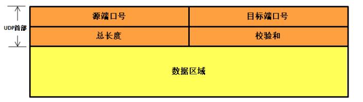

# 不可靠的传输

UDP 是 User Datagram Protocol 的简称，是一种**无连接、不可靠**的协议，更**没有流量控制、拥塞控制**等功能, 它只是简单地实现从一端主机到另一端主机的数据传输功能.
UDP 协议的特点：

1. 无连接、不可靠
1. 尽可能提供交付数据服务，出现差错直接丢弃，无反馈
1. 面向报文，发送方的 UDP 拿到上层数据直接添加个 UDP 首部，然后进行校验后就递交给 IP 层，而接收的一方在接收到 UDP 报文后简单进行校验，然后直接去除数据递交给上层应用
1. 支持一对一，一对多，多对一，多对多的交互通信
1. 速度快， UDP 没有 TCP 的握手、确认、窗口、重传、拥塞控制等机制， UDP 是一个无状态的传输协议，所以它在传递数据时非常快

# UDP 报文格式

