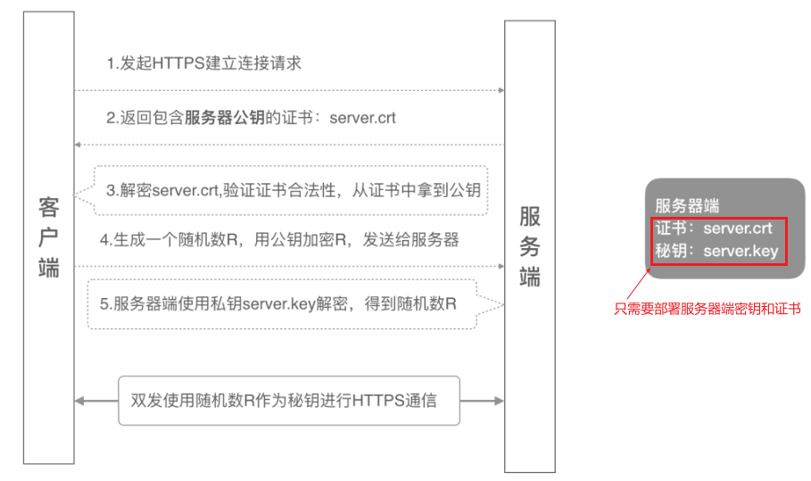
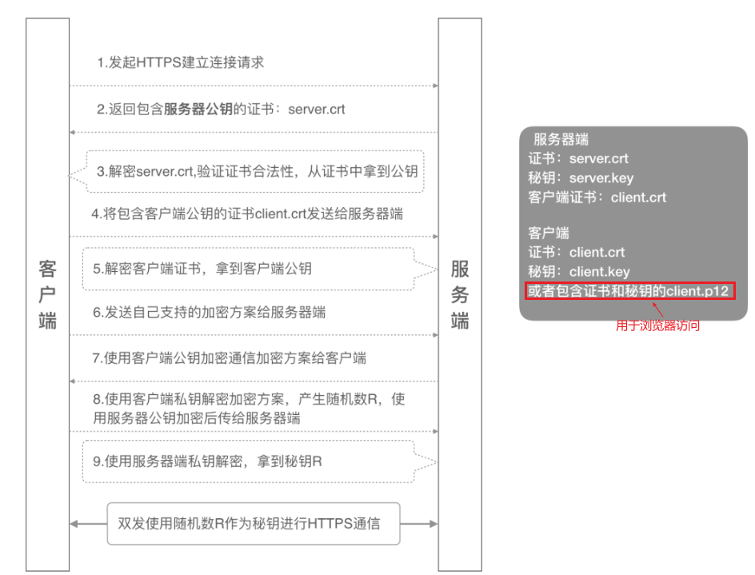
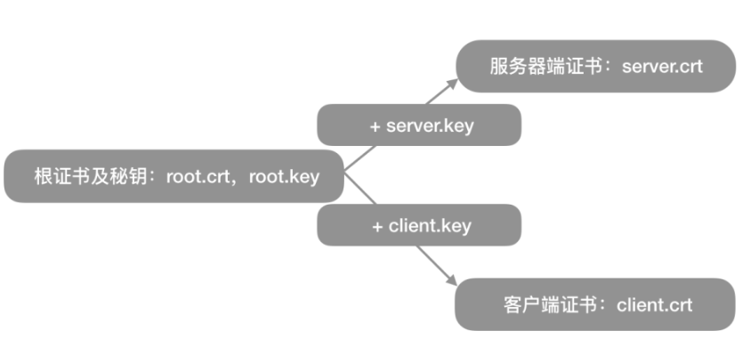
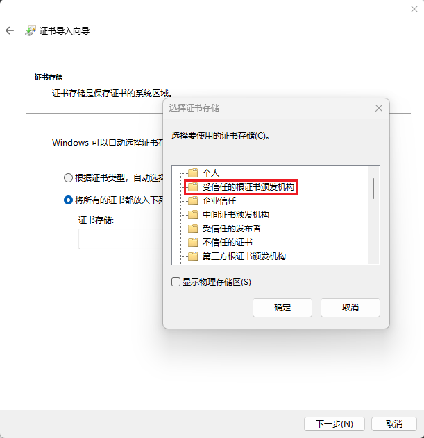
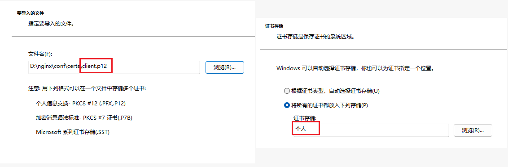
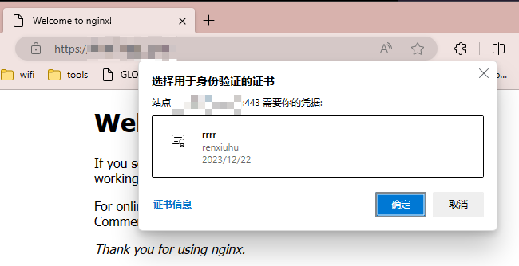

> https 服务器推荐 nginx, 配置简单且灵活

# 单向验证流程

单向认证流程中，服务器端保存着公钥证书和私钥两个文件，整个握手过程如下:


# 双向验证流程

双向认证，客户端和服务器端都需要验证对方的身份. 在建立 HTTPS 连接的过程中，握手的流程比单向认证多了几步。客户端除了需要从服务器端下载服务器的公钥证书进行验证外，还需要把客户端的公钥证书上传到服务器端给服务器端进行验证，等双方都认证通过了，才开始建立安全通信通道进行数据传输:


上面图里的 5 个证书是必须的, 另外需要一个 CA 根证书用于生成服务器和客户端密钥和证书, 其关系如下:


# 证书生成

## 创建根证书和密钥

```bash
# 根证书密钥
$ openssl genrsa -out root.key 1024

# 根证书
$ openssl req -new -x509 -days 365 -key root.key -out root.crt
```

**注意**: 创建证书请求文件/服务器请求文件/客户端请求文件均要注意这三点：

- Common Name 填写证书的颁发者；
- 所有字段的填写，根证书、服务器端证书、客户端证书需保持一致
- 最后的密码可以直接回车跳过

## 创建服务器证书和密钥

```bash
$ mkdir -p ./demoCA/newcerts
$ touch ./demoCA/index.txt
$ echo 01 > ./demoCA/serial

# 服务器密钥
$ openssl genrsa -out server.key 1024

# 服务器证书请求文件
$ openssl req -new -out server.csr -key server.key -config ./openssl.cnf

# 服务器证书
$ openssl ca -in server.csr -out server.crt -cert root.crt -keyfile root.key -extfile ./openssl.cnf -extensions v3_req

# 验证证书内容
openssl req -noout -text -in server.csr
openssl x509 -text -noout -in server.crt
```

## 创建客户端证书和密钥

```bash
# 客户端密钥
$ openssl genrsa -out client.key 1024

# 客户端证书请求文件
$ openssl req -new -out client.csr -key client.key

# 客户端证书
$ openssl x509 -req -in client.csr -out client.crt -CA root.crt -CAkey root.key -CAcreateserial -days 365

# P12格式证书: 包含客户端的公钥和私钥，主要用来给浏览器访问使用
$ openssl pkcs12 -export -clcerts -in client.crt -inkey client.key -out client.p12
```

# 配置证书

## nginx 服务器配置

```conf
server {
    listen       443 ssl;
    server_name  www.yourdomain.com;

    ssl_certificate      /data/sslKey/server.crt;  #server公钥证书
    ssl_certificate_key  /data/sslKey/server.key;  #server私钥
    ssl_client_certificate /data/sslKey/root.crt;  #CA证书

    #开启客户端证书验证
    ssl_verify_client on;
    #指定双向认证客户端证书到根证书的深度，默认是1
    #如果客户端证书不是由根证书直接颁发的, 需要设置为1
    ssl_verify_depth 1;

    location / {
        root   html;
        index  index.html index.htm;
    }
}
```

## 导入根证书以支持单向验证

将根证书导入到客户端设备中, 这样客户端房网 https 网址时才会显示网址是安全的:


## 客户端携带证书以支持双向验证

双击 client.p12 导入到个人证书中：


导入成功后用浏览器访问会要求选择要发送的 client 证书，选择对应证书即可正常访问，否则会收到 400 error code：

