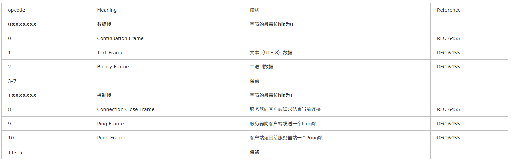

# 帧结构

```plain
  0                   1                   2                   3
  0 1 2 3 4 5 6 7 8 9 0 1 2 3 4 5 6 7 8 9 0 1 2 3 4 5 6 7 8 9 0 1
 +-+-+-+-+-------+-+-------------+-------------------------------+
 |F|R|R|R| opcode|M| Payload len |    Extended payload length    |
 |I|S|S|S|  (4)  |A|     (7)     |             (16/64)           |
 |N|V|V|V|       |S|             |   (if payload len==126/127)   |
 | |1|2|3|       |K|             |                               |
 +-+-+-+-+-------+-+-------------+ - - - - - - - - - - - - - - - +
 |     Extended payload length continued, if payload len == 127  |
 + - - - - - - - - - - - - - - - +-------------------------------+
 |                               |Masking-key, if MASK set to 1  |
 +-------------------------------+-------------------------------+
 | Masking-key (continued)       |          Payload Data         |
 +-------------------------------+ - - - - - - - - - - - - - - - +
 :                     Payload Data continued ...                :
 + - - - - - - - - - - - - - - - - - - - - - - - - - - - - - - - +
 |                     Payload Data continued ...                |
 +---------------------------------------------------------------+
```

- FIN: 表示这是否是构成消息的最后一个片段
- RSV1, RSV2, RSV3: 保留位
- opcode: 桢的类型, 见[消息类型](#消息类型)
- mark: Payload Data 是否被掩码处理. 客户端发送给服务器的帧必须置为 1, 服务器发送给客户端的帧必须置为 0
- payload len 和 extened payload length: 数据长度. payload len值不同, 含义不同:
    - 如果值在 0-125：表示 Payload Data 的长度
    - 如果值是 126：表示实际长度在后续的 16 位(Extended payload length)中(无符号整数)。允许长度 126 到 65535 字节。
    - 如果值是 127：表示实际长度在后续的 64 位(Extended payload length) 中(最高有效位必须为 0 的无符号整数)。允许长度 65536 字节及以上
- Masking-key: 又客户端随机选择的 32 位值, 用于对 payload data 进行掩码/去掩码 操作。服务器使用收到的 Masking-Key 来还原数据，客户端在发送前用它来掩码数据.
- payload data: 实际有效数据

# 消息类型

WebSocket 帧可以是 6 种类型之一：text、binary、ping、pong、close 和 continuation


- 0: 表示该帧是分片消息的一个非首片段
- 1 是告诉服务器把数据转换成字符串
- 2 是告诉服务器不要把数据转换成字符串，直接当做二进制数据来用。这会在传输图片之类的操作中用到
- 8 是服务器向客户端请求结束当前连接用的，WebSocket 的建立连接需要握手协议，那么关闭也需要双方的协商
- 9 和 10 是成对的。服务器向客户端发送一个 Ping 帧时客户端会自动返回一个 Pong 帧，并且数据部分与发送的完全相同。如果不同或收不到，则说明网络有问题
