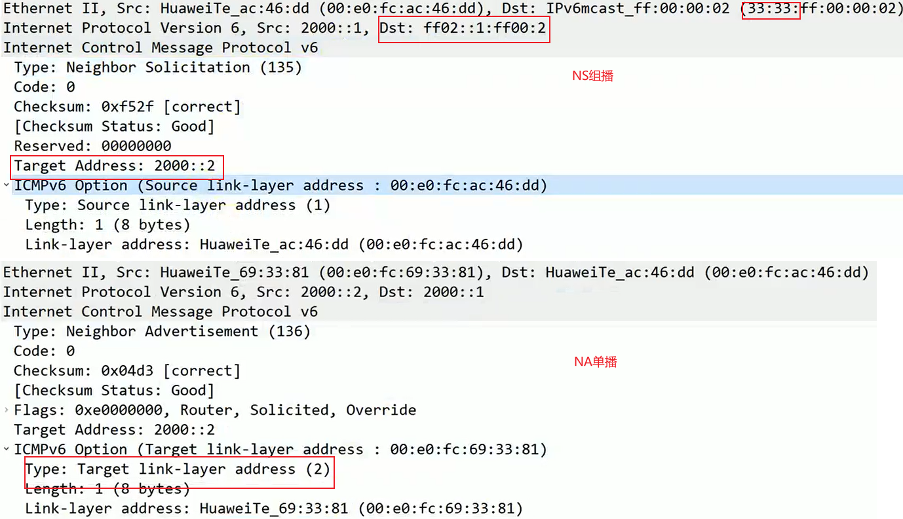
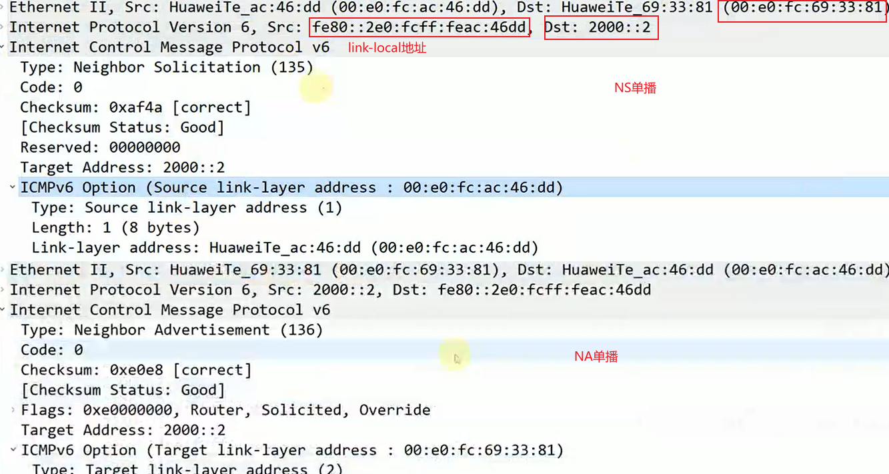
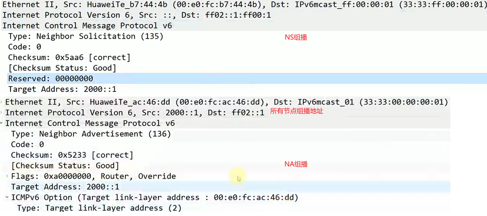
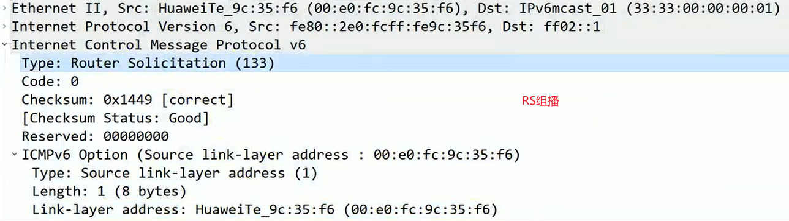
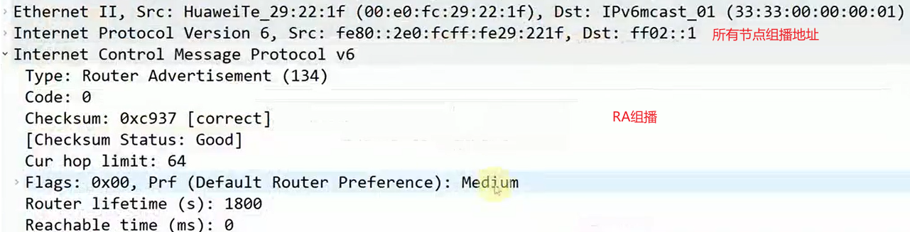

# NDP

IPv6 邻居发现协议 NDP, 对应如下 ICMPv6 type:

- NDP 协议:https://zhuanlan.zhihu.com/p/110407399
- IPv6 组播和被请求节点组播地址: https://www.cnblogs.com/fengf233/p/10906444.html

| ICMPv6 type | 消息名称   | 简称 |
| ----------- | ---------- | ---- |
| 133         | 路由器请求 | RS   |
| 134         | 路由器通告 | RA   |
| 135         | 邻居请求   | NS   |
| 136         | 邻居通告   | NA   |

## NA/NA 报文格式

### 用于查找 mac

### 用于 NUD 邻居状态跟踪:

### 用于 DAD 冲突地址检测:

## RS/RA 报文

### RA 回应 RS

RS 为组播, RA 为单播回应

### 周期性发 RA

RA 周期性主动发送, 为所有节点组播

