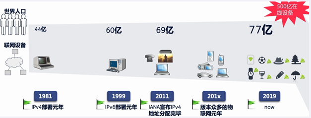
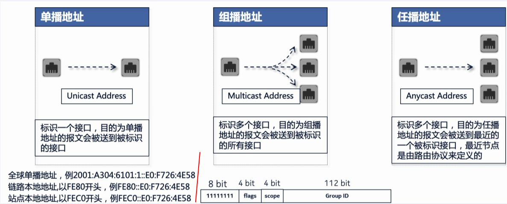

# 为什么需要 IPv6

- IPv4 总量不足
- IP 地址分配不均，各个国家分配总量不符合需求



# IPv6 的特点

- 地址数量多：2 的 128 次方
- 简化、高效的报文结构
- 内置的安全特性
- 更好的支持移动性
- 更好的 QoS 控制
- 用组播代替广播
- 自动地址配置，方便 IPv6 忘了的部署
- 提供多种过渡机制

# IPv6 的表示

## 书写格式

- 用十六进制表示
- 4 位一组，中间用“：”隔开，共 8 组（16 \* 8 = 128bit）
- 以 0 开头的组可以省略前面的 0
- 连续多个全 0 的组可以用“::”表示（::只能出现一次）
- 地址前缀长度用“/xx”表示

比如如下的地址格式和简写

```
//全写格式：
2001：0410：0000：0001：0000：0000：0000：45ff /64
//简写格式：去除开头的0
2001：410：0：1：0：0：0：45ff /64
//间歇格式：简写全0组
2001：410：0：1::45ff /64
```

## 地址分类

IPv6 的地址组成：**前缀+接口标识**

- 前缀：相当于 IPv4 的网络 ID，如果两个 ip 不经过路由直接通信，前缀需要一致
- 接口标识：相当于 IPv4 的主机 ID

例如上面例子的 ip`2001:0410:0000:0001:0000:0000:0000:45ff/64`的地址构成如下

| 地址前缀，长度 64 | 2001:0410:0000:0001 | 接口标识 | 0000:0000:45ff |
| ----------------- | ------------------- | -------- | -------------- |

地址分类如下：


# IPv6 的报文结构


- 所有可选字段被移出 IPv6 的抱头，或删除或置于扩展报头中
- 服务类型、传输协议和生存时间被改变
- 新增流标签域
- 固定的报头长度（40 字节），不需要消耗过多的内存容量
