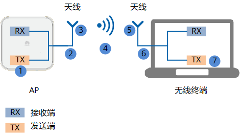

# 802.11 协议族

## 协议分类

- Connectivity：主要是标准无线局域网的协议，主要集中在 PHY 和 MAC 层，一般路由器演进都是以这些协议作为主要标志
- Spectrum：有点偏向认知无线电的方向，主要是和同频其他设备共存的问题。其主要内容演进集中于 CSMA/CA 过程以及其中的 CCA 部分（Clear Channel Assessment）
  - 比如 802.11h 主要是回避雷达，802.11af 是回避 TV，因为这些频段都已有别的协议工作，只是在空闲的时候，那么可以用作 802.11 协议接入。
- Management：这个主要是管理层面上的内容了，实际上主要是 AP+AC 或者多 AP 环境下，如何完成网络中的一些任务，比如 TPC（Transmission Power Control）。其主要演进是在上层的交互内容上。
- Security：安全问题
  - 802.11i，即 WPA2 主要是接入层面的安全
  - 802.11w 主要是管理帧安全（避免一些无线攻击的方法，以及管理帧加密）。
- Seamless：其含义为无缝接入，主要是漫游和热点接入的问题。
- Applications：与应用有关的内容，更直接一些的话就是针对应用层的优化
  - 比如 802.11e 是初始的优化版本，其主要针对数据帧进行分类，并修改 802.11 的 MAC 层接入机制，即在 MAC 层（即 CSMA/CA 机制上）提供了 QOS 机制
  - 802.11aa 是针对组播流量进行优化（即组播视频流）。实际上 802.11ae 也可以划入这一类，不过其主要优化的是管理帧（即为管理帧提供 802.11e 中的 QOS 功能）。
- Others：其实还有一些 802.11 版本，不过与无线局域网的应用场景有些区别
  - 比如 802.11ah（Sub-1G 的低功耗网络），802.11p（车载网），802.11z（D2D 的连接），802.11az（定位）等。

## wifi 版本演进

注意物理层速率和实际数据速率的区别!

| 协议     | 俗称   | 发布年份 | 支持频段(GHz) | 理论物理速率                         |
| -------- | ------ | -------- | ------------- | ------------------------------------ |
| 802.11   | legacy | 1997     | 2.4           | 2Mbps                                |
| 802.11b  | wifi 1 | 1999     | 2.4           | 1 至 11 Mbps                         |
| 802.11a  | wifi 2 | 1999     | 5             | 6 至 54 Mbps                         |
| 802.11g  | wifi 3 | 2003     | 2.4           | 6 至 54 Mbps                         |
| 802.11n  | wifi 4 | 2009     | 2.4、5        | 72 至 600 Mbps                       |
| 802.11ac | wifi 5 | 2014     | 5             | 433 至 6933 Mbps                     |
| 802.11ax | wifi 6 | 2019     | 2.4、5、6     | 600 至 9608 Mbps                     |
| 802.11be | wifi 7 | 2024     | 2.4、5、6     | 单流: 2.88Gbps 16×16 MIMO: 46Gbps |

- **802.11** 定义了两种 radio-based 物理层的标准:
  - **FHSS**: 频率跳变，通过在多个频率之间快速切换来提高通信的安全性和抗干扰能力)。
  - **DSSS**: 直接序列，用 11bit chipping sequence 保证传输的完整性
- **802.11b** 废弃 FHSS，增加了变种的 DSSS/CCK，可以提供 11M 的带宽
- **802.11a**: 增加了 OFDM 64QAM 技术(正交频分多路复用)，在 5GHz 频段可提供 54M 带宽
- **802.11g**: 使用 OFDM 技术在 2.4GHz 频段提供 54M 带宽
- **802.11n**: 增加了 MIMO 技术(多天线多通道)
- **802.11ac**: OFDM 256QAM 和下行 MU-MIMO 技术
- **802.11ax**: OFDMA 1024QAM， 完整版上下行 MU-MIMO 技术, 多用户多输入输出系统
- **802.11be**: OFDMA 4096QAM

# 物理层划分

- PLCP: 物理层收敛程序, 负责将 MAC 帧转化之后发送到传输介质
- PMD: 物理媒介, 负责传输 MAC 帧

# 信道划分

## 2.4 GHz channel 频率

计算公式如下：

注意：1-13 信道是基本常用信道，14 很少支持

## 5 GHz channel 频率

计算公式如下：

常用如下信道：

# 功率和信号强度

- ① 和 ⑦ 表示射频发送端处的功率，单位是 dBm。
- ② 和 ⑥ 表示连接天线的转接头和馈线等线路损耗，单位是 dB。
- ③ 和 ⑤ 表示天线增益，单位 dBi 或 dBd。
- ④ 表示路径损耗和障碍物衰减，是发送和接收天线之间的信号能量损耗程度，单位是 dB。

基于上面的拓扑，解释如下概念：

- **射频发射功率**：① 表示 AP 端的射频发射功率，⑦ 表示无线终端的射频发射功率。
- **EIRP**：有效全向辐射功率 EIRP(Effective Isotropic Radiated Power)，即天线端发射出去时的信号强度，EIRP = ① - ②+ ③。
- **RSSI**：接收信号强度指示 RSSI(Received Signal Strength Indicator)，指示无线网络覆盖内某处位置的信号强度，是 EIRP 经过一段传输路径损耗和障碍物衰减后的值。网规遇到的信号强度弱问题就是指 RSSI 弱，没有达到指标要求值，导致无线终端接收到很弱的信号甚至接收不到信号
  - **接收信号强度 = 射频发射功率 + 发射端天线增益 – 路径损耗 – 障碍物衰减 + 接收端天线增益**

# 802.11b 帧

## 物理层 header

## 数据发送

## 数据接收

# 802.11 a/g/n 帧

## 物理层 header

相比 802.11b 的物理层头部，802.11a/g 较为复杂一些, 基于 ofdm symbol:

## 数据发送

802.11a/g 和 802.11b 的发送过程基本变化不大:

## 数据接收

和 802.11b 不太相同相同的是: 如果 CS 检测到的话，那么可能就存在一个数据帧，那么需要再次通过 FD 来确定是不是一个数据帧, 而不是检测 SFD.

