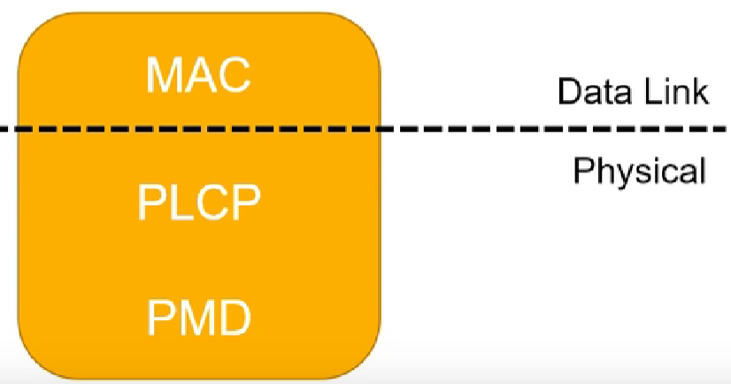
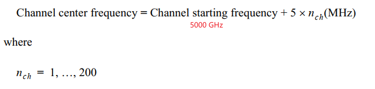

IEEE 802.11 也叫 Wi-Fi，用于有限地理空间内数据传输，主要特性有:

- 通过空间传播信号
- 电源管理
- 安全加密管理

# 物理层协议演进

| 协议     | 俗称   | 支持频段(GHz) | 信道带宽(MHz)               | 最高理论数据速率(Mbit/s) |
| -------- | ------ | ------------- | --------------------------- | ------------------------ |
| 802.11   | wifi 0 | 2.4           |                             | 2                        |
| 802.11b  | wifi 1 | 2.4           | 20                          | 11                       |
| 802.11a  | wifi 2 | 5             | 20                          | 54                       |
| 802.11g  | wifi 3 | 2.4           | 20                          | 54                       |
| 802.11n  | wifi 4 | 2.4、5        | 20、40                      | 600                      |
| 802.11ac | wifi 5 | 5             | 20、40、80、80+80、160      | 6933.33                  |
| 802.11ax | wifi 6 | 2.4、5、6     | 20、40、80、80+80、160      | 9607.8                   |
| 802.11be | wifi 7 | 2.4、5、6     | 20、40、80、80+80、160、320 | 46120                    |

- **802.11** 定义了两种 radio-based 物理层的标准(2.4GHz，提供 2M 带宽):
  - **frequency hopping**: 频率跳变，通过在多个频率之间快速切换来提高通信的安全性和抗干扰能力。
  - **direct sequence**: 直接序列，用 11bit chipping sequence 保证传输的完整性
- **802.11b** 增加了变种的 direct sequence，可以提供 11M 的带宽
- **802.11a**: 增加了 OFDM 64QAM 技术(正交频分多路复用)，在 5GHz 频段可提供 54M 带宽
- **802.11g**: 使用 OFDM 技术在 2.4GHz 频段提供 54M 带宽
- **802.11n**: 增加了 MIMO 技术(多天线多通道),可提供 108M 带宽
- **802.11ac**: OFDM 256QAM 和 MU-MIMO 技术
- **802.11ax**: OFDMA 1024QAM

# 物理层划分

- PLCP: 物理层收敛程序, 负责将 MAC 帧转化之后发送到传输介质
- PMD: 物理媒介, 负责传输 MAC 帧

# 信道划分

## 2.4 GHz channel 频率

计算公式如下：

注意：1-13 信道是基本常用信道，14 很少支持

## 5 GHz channel 频率

计算公式如下：

常用如下信道：

# 功率和信号强度

- ① 和 ⑦ 表示射频发送端处的功率，单位是 dBm。
- ② 和 ⑥ 表示连接天线的转接头和馈线等线路损耗，单位是 dB。
- ③ 和 ⑤ 表示天线增益，单位 dBi 或 dBd。
- ④ 表示路径损耗和障碍物衰减，是发送和接收天线之间的信号能量损耗程度，单位是 dB。

基于上面的拓扑，解释如下概念：

- **射频发射功率**：① 表示 AP 端的射频发射功率，⑦ 表示无线终端的射频发射功率。
- **EIRP**：有效全向辐射功率 EIRP(Effective Isotropic Radiated Power)，即天线端发射出去时的信号强度，EIRP = ① - ②+ ③。
- **RSSI**：接收信号强度指示 RSSI(Received Signal Strength Indicator)，指示无线网络覆盖内某处位置的信号强度，是 EIRP 经过一段传输路径损耗和障碍物衰减后的值。网规遇到的信号强度弱问题就是指 RSSI 弱，没有达到指标要求值，导致无线终端接收到很弱的信号甚至接收不到信号
  - **接收信号强度 = 射频发射功率 + 发射端天线增益 – 路径损耗 – 障碍物衰减 + 接收端天线增益**

# 802.11b

## 物理层 header

## 数据发送

## 数据接收

# 802.11 a/g

## 物理层 header

相比 802.11b 的物理层头部，802.11a/g 较为复杂一些, 基于 ofdm symbol:

## 数据发送

802.11a/g 和 802.11b 的发送过程基本变化不大:

## 数据接收

和 802.11b 不太相同相同的是: 如果 CS 检测到的话，那么可能就存在一个数据帧，那么需要再次通过 FD 来确定是不是一个数据帧, 而不是检测 SFD.

