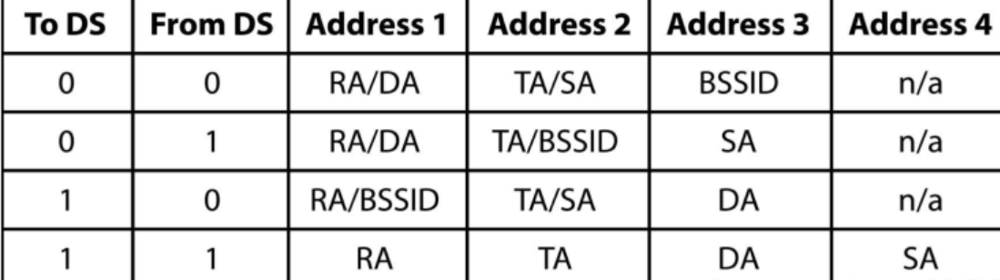

# CSMA/CA 机制

在 802.11 中通过 **CSMA/CA 算法**来处理数据冲突的问题， 全称 Carrier Sense Multiple Access with Collision Avoidance(载波监听多路访问和冲突避免), 分为 **Basic 和 RTS/CTS 模式**.

> 另一个 CSMA/CD 也是解决数据冲突问题, 用于**有线网络**.

## 监听信道空闲

如下三种方式判断信道是否空闲, 是否可以进行 backoff 过程.

- 物理载波监听: **CCA 机制**
  - 能量检测: 若信号强度大于 ED_threshold，则认为信道是忙，若小于 ED_threshold，则认为信道是闲
  - 载波侦听: 识别 802.11 数据帧的物理层头部（PLCP header）中的 preamble 部分(preamble 采用特定的序列所构造，该序列对于发送方和接收方都是已知的)
- 虚拟载波监听: **NAV 机制**, 每个 sta 有自己的 NAV 变量, 根据 CTS 中的 duration 设置其值进行倒数

## Basic 模式

- 当 STA 1 与 STA 2 都有数据要发送，需要在竞争信道进行发送时，其首先需要等待 DIFS 时间(**分布式帧间间隙**)，若 DIFS 时间内，信道保持空闲状态，那么就可以进行 backoff 过程。
- 若 STA 1 与 STA 2 进入 backoff 过程时，其首先需要从竞争窗口（Contention window）选择一个随机数，在 802.11 协议中，默认的初始竞争窗口为 31，即随机回退计数值的范围即是[0,31]。在上图中，STA 1 则是选择了 8，而 STA 2 选择了 2。
- 在 backoff 过程中，每经过一个 slot time，节点会 "监听" 一次信道，**若信道空闲，则相应的随机回退计数器的值减 1**。如上图中，经过 3 个 slot time 后，STA 1 的随机倒数计数器从 8 递减至 5，而 STA 2 相应从 2 递减至 0。
- **当节点的随机倒数计数器倒数至 0 时，节点竞争获得信道，从而可以发送数据**。如上图，STA 2 获得信道后，发送 PACKET A 给 AP。在 AP 接收到数据后，会采用 CRC 机制对数据进行校验，若校验通过，AP 会在 SIFS(**短帧间间隔**) 后，反馈 ACK 确认帧。
- 当 STA 2 成功发送完数据，等待了 SIFS 的时间之后，AP 会向节点反馈 ACK 确认帧。当 STA 2 成功接收到 ACK 帧之后，这一次传输完成。
- 当这一次传输完成后，节点需要再次等待 DIFS 的时间后，重新开始 backoff 过程。若节点刚刚发送完数据，那么在 backoff 过程开始时，需要重新从竞争窗口中选择
- 一个随机数进行倒数。若节点没有发送数据，那么直接从上一次的倒数结果继续倒数。如上图中，STA 1 没有竞争到信道，那么其在第二次的 backoff 过程中，直接基于上次的 5 直接进行倒数至 4。

basic 模式有缺陷, 下面两个典型问题无法通过物理监听的方式解决. 所以需要 RTS/CTS 模式.

## RTS/CTS 模式

RTS/CTS 模式的主要思路为:

- 在 backoff 过程倒数到 0 之后, STA2 发送 RTS 到 AP, 告知要发送数据的长度和所需时间
- AP 回复 CTS, 告知所有节点某时间间隔内需要收特定数据, 其他节点暂停发送
- STA1 收发 CTS 后, 发现不是回复给它的, 会根据 CTS 中的 duration 设置本地的 NAV 进行等待倒数
- STA2 收到 CTS 开始发送数据; 数据接收完成, AP 会回复 ACK 表示数据成功接收
- STA2 如果等不到 CTS, 会再次 bookoff 后重试

RTS/CTS 另外一个思维就是 "采用小的数据包碰撞，来避免大的数据包碰撞" ，**如果数据包太小，那么则不需要采用 RTS/CTS 机制**。设置 **RTS_threshold** 的范围一般为 2347，其单位是 byte，即如果数据包大小如果大于 2347 byte，那么才会采用 RTS/CTS 模式.

# MAC 帧结构

802.11MAC 层负责客户端与 AP 之间的通讯。主要功能包括：扫描、接入、认证、加密、漫游和同步.

下图为物理层开始多级的拆分, 注意: 不同版本的 wifi 协议, 物理层的格式不一样, 下图的物理层格式为 802.11b.

- To DS：表明该帧是 BSS 向 DS 发送的帧；
- From DS：表明该帧是 DS 向 BSS 发送的帧；
  
- Address：依次为**源地址(SA)、目的地址(DA)、传输工作站地址(TA)、接收工作站地址(RA)**，SA 与 DA 必不可少，后两个只对跨 BSS 的通信有用，而目的地址可以为单播地址(Unicast address)、多播地址(Multicast address)、广播地址(Broadcast address).

对于不同的帧类型, 帧的具体格式会有所变化:

## 管理帧

type = 00, 用于在主机之间建立二层连接和认证, 常见子类型有:

- Action：触发 AP 的下一步动作

## 控制帧

type = 01, 控制数据包的发送, 拥塞管理, 防止冲撞. **控制帧不需要 data 部分**.

- BAR/BA：block 块确认请求和 确认， 类似 TCP/IP 的窗口机制
- CTS/RTS：请求发送/清除发送， 一般用于解决隐藏节点问题

## 数据帧

type = 10, 由于数据发送和接收方式的不同, 可以细分很多数据帧类型:

