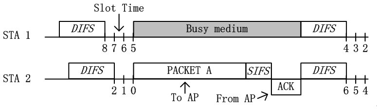
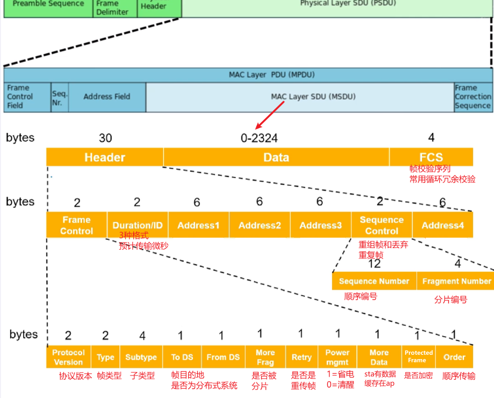

# 监听信道空闲

## 物理载波监听

又称**CCA 机制**

### 能量检测

直接用物理层接收的能量来判断是否有信号进行接入, 若信号强度大于 ED_threshold，则认为信道是忙，若小于 ED_threshold，则认为信道是闲.

在 802.11 中（以 802.11a/g 为例），**能量检测阈值为-62 dBm**

### 载波侦听

- 识别 802.11 数据帧头部的 preamble 部分(preamble 采用特定的序列所构造，该序列对于发送方和接收方都是已知的).
- 监听的节点会不断采样信道信号，用其做相关运算，其计算值需要与一个阈值进行判断。若大于，则认为检测到了一个信号，若小于则没有检测到

在 802.11 中（以 802.11a/g 为例），**载波侦听阈值为-82 dBm**

## 虚拟载波监听

又叫 **NAV 机制**, 每个 sta 有自己的 NAV 变量, 根据 CTS 中的 duration 设置其值进行倒数

# CSMA/CA 机制

在 802.11 中通过 **CSMA/CA 算法**来处理数据冲突的问题， 全称 Carrier Sense Multiple Access with Collision Avoidance(载波监听多路访问和冲突避免), 分为 **Basic 和 RTS/CTS 模式**.

> 另一个 CSMA/CD 也是解决数据冲突问题, 用于**有线网络**.

## Basic 模式

- 当 STA 1 与 STA 2 都有数据要发送，需要在竞争信道进行发送时，其首先需要等待 DIFS 时间(**分布式帧间间隙**)，若 DIFS 时间内，信道保持空闲状态，那么就可以进行 backoff 过程。
- 若 STA 1 与 STA 2 进入 backoff 过程时，其首先需要从竞争窗口（Contention window）选择一个随机数，在 802.11 协议中，默认的初始竞争窗口为 31，即随机回退计数值的范围即是[0,31]。在上图中，STA 1 则是选择了 8，而 STA 2 选择了 2。
- 在 backoff 过程中，每经过一个 slot time，节点会 "监听" 一次信道，**若信道空闲，则相应的随机回退计数器的值减 1**。如上图中，经过 3 个 slot time 后，STA 1 的随机倒数计数器从 8 递减至 5，而 STA 2 相应从 2 递减至 0。
- **当节点的随机倒数计数器倒数至 0 时，节点竞争获得信道，从而可以发送数据**。如上图，STA 2 获得信道后，发送 PACKET A 给 AP。在 AP 接收到数据后，会采用 CRC 机制对数据进行校验，若校验通过，AP 会在 SIFS(**短帧间间隔**) 后，反馈 ACK 确认帧。
- 当 STA 2 成功发送完数据，等待了 SIFS 的时间之后，AP 会向节点反馈 ACK 确认帧。当 STA 2 成功接收到 ACK 帧之后，这一次传输完成。
- 当这一次传输完成后，节点需要再次等待 DIFS 的时间后，重新开始 backoff 过程。若节点刚刚发送完数据，那么在 backoff 过程开始时，需要重新从竞争窗口中选择
- 一个随机数进行倒数。若节点没有发送数据，那么直接从上一次的倒数结果继续倒数。如上图中，STA 1 没有竞争到信道，那么其在第二次的 backoff 过程中，直接基于上次的 5 直接进行倒数至 4。

basic 模式有缺陷, 下面两个典型问题无法通过物理监听的方式解决. 所以需要 RTS/CTS 模式.

## RTS/CTS 模式

RTS/CTS 模式的主要思路为:

- 在 backoff 过程倒数到 0 之后, STA2 发送 RTS 到 AP, 告知要发送数据的长度和所需时间
- AP 回复 CTS, 告知所有节点某时间间隔内需要收特定数据, 其他节点暂停发送
- STA1 收发 CTS 后, 发现不是回复给它的, 会根据 CTS 中的 duration 设置本地的 NAV 进行等待倒数
- STA2 收到 CTS 开始发送数据; 数据接收完成, AP 会回复 ACK 表示数据成功接收
- STA2 如果等不到 CTS, 会再次 bookoff 后重试

RTS/CTS 另外一个思维就是 "采用小的数据包碰撞，来避免大的数据包碰撞" ，**如果数据包太小，那么则不需要采用 RTS/CTS 机制**。设置 **RTS_threshold** 的范围一般为 2347，其单位是 byte，即如果数据包大小如果大于 2347 byte，那么才会采用 RTS/CTS 模式.

# MAC 帧结构

802.11MAC 层负责客户端与 AP 之间的通讯。主要功能包括：扫描、接入、认证、加密、漫游和同步.

下图为物理层开始多级的拆分, 注意: 不同版本的 wifi 协议, 物理层的格式不一样, 下图的物理层格式为 802.11b.

- Address：根据 To DS 和 From DS 的组合不同，四个地址含义不同
- Protected Frame: 为 1 表示帧体部分包含加密处理过的数据，为 0 则表示没有进行加密处理

对于不同的帧类型, 帧的具体格式会有所变化:

## Duration ID

标记帧传输的时间, 当 bit15 为 0 时, 用来设定 NAV 的值, STA 需要监听此值来更新虚拟监听的 NAV 值:

## To DS 和 From DS

- To DS：表明该帧是无线链路向 AP 发送的帧；
- From DS：表明该帧是 AP 向无线链路发送的帧；

两个字段有以下 4 中组合, 会导致 address 的含义不同:

分别对应下图 4 中使用场景(SA 指源地址, DA 指目的地址, TA 指 wifi 发送端, RA 指 wifi 接收端):

## 管理帧

type = 00, 用于在主机之间建立二层连接和认证, 常见子类型有:

- Action：触发 AP 的下一步动作

## 控制帧

type = 01, 控制数据包的发送, 拥塞管理, 信道的获取, 收到数据的应答等. **控制帧不需要 data 部分**.

- BAR/BA：block 块确认请求和 确认， 类似 TCP/IP 的窗口机制
- CTS/RTS：请求发送/清除发送， 一般用于解决隐藏节点问题

## 数据帧

type = 10, 由于数据发送和接收方式的不同, 可以细分很多数据帧类型:

# QOS

802.11e 是对 802.11 mac 层的增强协议, 提供了 QOS 机制. 在此之前, 802.11 没有提供服务区分，所有的流量都被视为 best-effort 流量.
要提供 QOS, 就需要对数据流量进行分类, 优先传输高优先级的数据, 保证服务质量. AP 需要处理有线网络的优先级, 映射到 wifi 网络上, 再与 sta 交互.

## 有线网络 vlan Tag

802.11e 的优先级实际上是通过 vlan 协议的 Q-Tag 映射的:

802.p 中对上图 PCP 的 8 个优先级进行了固定映射, 然后再映射到 802.11e 中的四个优先级上:

## wifi mac 层优先级

当数据包到达 MAC 层时，根据上面的映射关系，将**原始数据包中的优先级映射到 802.1e 的不同优先级队列**中:

如图所示, 四个优先级由低到高分别为:

- 背景流量 `AC_BK`：对于延迟要求最不敏感的流量，比如文件传输，打印作业的流量
- 尽力传输 `AC_BE`：默认的无线流量类型就是 best-effort 类型，比如网页访问的数据流量类型。对于延迟有一定需求，但是没有那么敏感。
- 视频服务 `AC_VI`：视频流量的优先级低于语音服务，高于其他两项。视频服务也是延迟敏感类型的服务，所以具有一定的优先级
- 语音服务 `AC_VO`：一般为 VoIP 流量类型，对延迟最为敏感，同时也是优先级最高的流量。

之后在 wifi 中传输时, 需要将优先级信息放到 mac 帧的 QoS Control 字段(具体格式参照协议 9.2.4.5):

## Admission Control

除了四个默认的优先级, 可以通过 QoS control 字段的 TID 属性使用自定义优先级, 并通过 Admission Control 在 AP 和 STA 之间协商如下信息(6.3.26 TS management interface).

- 定义数据的类型
  
- 配置 QoS 参数
  
