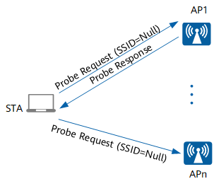
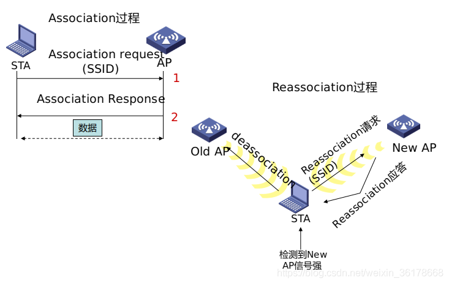
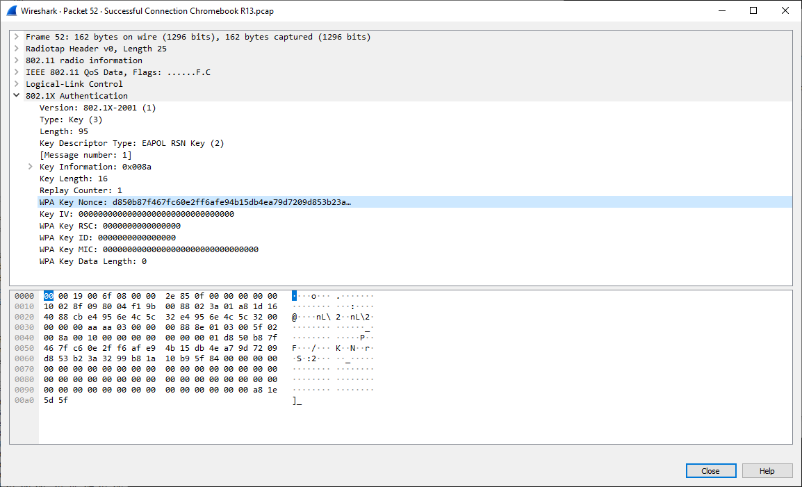
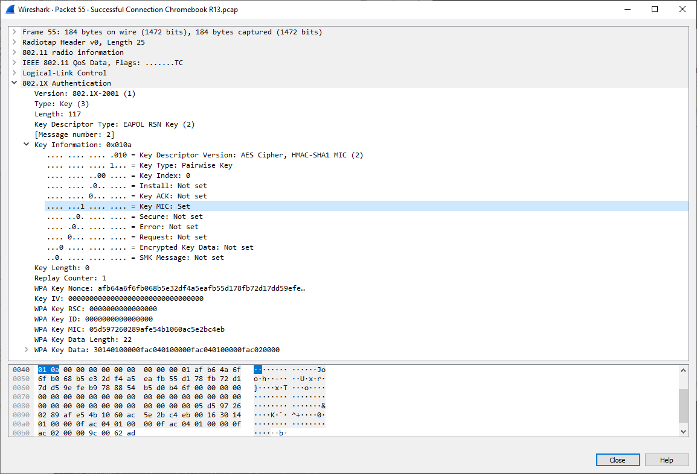

# 用户接入流程

## WEP 接入过程

STA (工作站)启动初始化、开始正式使用、AP 传送数据幀之前，要经过一下才能接入:

- 扫描(Scaning)
- 认证(Authentication)
- 关联(Association)
- 四次握手: AP 和 STA 进行四次握手；
- DHCP 过程；
- ARP 过程；
- 加密的数据通信业务

### 扫描

802.11MAC 使用 Scanning 功能来完成虚招 AP 的过程, 分为两种模式:

- 被动模式: STA 在每个信道上**侦听 AP 定期发送的 Beacon 帧**（帧中包含 SSID、支持速率等信息），以获取 AP 的相关信息
  
- 主动模式:
  - **客户端发送携带有指定 SSID 的 Probe Request**：STA 依次在每个信道发出 Probe Request 帧，寻找与 STA 有相同 SSID 的 AP，只有能够提供指定 SSID 无线服务的 AP 接收到该探测请求后才回复探查响应
    
  - **客户端发送广播 Probe Request**: 客户端会定期地在其支持的信道列表中，发送 Probe Request 帧扫描无线网络。当 AP 收到 Probe Request 帧后，会回应 Probe Response 帧通告可以提供的无线网络信息
    

### 认证

- **开放系统认证**: 不认证, 任何 sta 都可以认证成功
  
- **共享密钥认证**: STA 和 AP 预先配置相同的共享密钥，AP 在链路认证过程验证两边的密钥配置是否相同。如果一致，则认证成功；否则，认证失败
  
  - STA 向 AP 发送认证请求（Authentication Request）。
  - AP 随即生成一个“挑战短语（Challenge）”发给 STA。
  - STA **使用预先设置好的密钥加密**“挑战短语”（EncryptedChallenge）并发给 AP。
  - AP 接收到经过加密的“挑战短语”，**用预先设置好的密钥解密该消息**，然后将解密后的“挑战短语”与之前发送给 STA 的进行比较。如果相同，认证成功；否则，认证失败。

### 关联



- STA 向 AP 发送 Association Request 请求，请求帧中会携带 STA 自身的各种参数以及根据服务配置选择的各种参数（主要包括支持的速率、支持的信道、支持的 QoS 的能力以及选择的接入认证和加密算法）
- AP 收到关联请求后判断是否需要进行用户的接入认证，并回应 Association Response

## WPA/WPA2 接入流程

### 接入认证计算 PMK

**WPA/WPA2 仅支持开放式系统认证**, 所以上面的认证过程并没有验证密码. 在关联之后, 还需要一个接入认证阶段和后面的 4 次握手:

- 家庭使用 PSK 方式, 用在安全要求低的地方:
  - sta 和 ap 两侧都通过 ssid 和 passphrase 算出 PSK, 四次握手前, 通过`pbkdf2_sha1(passphrase, ssid, ssid_len)`计算
  - sta 根据 PSK 计算出 PMK
  - ap 在根据 PSK 计算出 PMK 和 GMK
  - 之后进行 4 次握手
- 工业级的才需要下面 EAP 的认证方式.
  
  - EAP-MD5：一种 EAP 认证方式，使用 CHAP 方式进行认证
  - EAP-TLS：是一种基于证书的身份认证，它需要 PKI 的部署来管理证书。它推荐进行服务器和客户端之间双向认证，认证双方是用证书来标识自己的身份。在认证通过之后，TLS 的认证双方会协商出一个共享密钥、SessionID 以及整套的加密套件（加密，压缩和数据完整性校验），这样认证双方就建立了一个安全可靠的数据传输通道。EAP-TLS 是客户端和 AAA 服务器借助接入设备的透传，通过 TLS 协议进行的身份认证。EAP-TLS 可以利用 SessionID 进行快速重认证，简化认证流程，加快认证速度，可对较大的 TLS 报文进行分片处理
  - EAP-TTLS：是一种基于证书的身份认证，利用 TLS 认证在客户端和 AAA 服务器之间建立起一个安全通道，在安全通道内部再承载子类型。它具有保护用户标识和 EAP 认证的协商过程的作用。隧道内的子类型可以是 EAP 类型，也可以是非 EAP 类型。目前 EIA 支持 TTLS 下三个 EAP 的子类型（EAP-MSCHAPv2，EAP-MD5，EAP-GTC）和两个非 EAP 的子类型（MSCHAPv2，PAP）。EIA 在配置接入策略指定首选 EAP 类型为 EAP-TTLS 时，也必须首选一种 EAP 的子类型。在实际认证过程中，如果终端采用非 EAP 的子类型，如 PAP，则终端可以忽略 EIA 的配置，使用终端配置的子类型进行认证
  - EAP-PEAP：是一种基于证书的身份认证，利用 TLS 认证在客户端和 AAA 服务器之间建立起一个安全通道，在安全通道上再发起 EAP 认证。它具有保护用户标识，保护 EAP 认证的协商过程的作用。目前 EIA 仅支持 EAP-MSCHAPv2、EAP-MD5 和 EAP-GTC 认证类型
  - EAP-SIM：是一种基于 GSM-SIM 卡的身份认证，EAP-SIM 提供了双向认证，即服务器端认证客户端，客户端认证服务器端，只有双向认证通过之后，服务器端才发送 EAP-Success 消息至客户端，客户端才可以接入网络。同时，EAP-SIM 认证机制还通过多次挑战响应机制，生成更强的会话密钥

### 四次握手

4 次握手是**密钥协商阶段**, 是**根据接入认证阶段生成的成对主钥 PMK**(Pairwise Master Key)产生成对临时密钥 PTK(Pairwise Transient Key)和群组临时密钥 GTK(Group Temporal Key)。

- PTK: 四次握手后用来加密单播数据, 计算公式为`PTK = PRF (PMK + ANonce + SNonce + Mac(AA)+ Mac(SA))`
  - PMK: 四次握手前用 sha 算法生成
  - ANonce: ap 生成的随机数
  - SNonce: sta 生成的随机数
  - MAC(AA): ap 的 mac 地址
  - MAC(SA): sta 的 mac 地址
- GTK: 四次握手后用来加密组播和广播数据, 由 AP 侧计算得来, 公式为`GTK=PRF-X(GMK,”Group key expanision”,ap mac|Anonce)`
  - GMK: group master key, 四次握手前生成
  - ap mac: ap 的 mac 地址
  - Anonce: ap 生成的随机数

四次握手通过 EAPOL(Extensible authentication protocol over LAN)进行消息交换。


**Message 1**:

AP 发起四次握手，**AP 生成随机数 ANonce 发送给 Station，Station 用它生成 PTK**。


由于在 4 次握手之前已经经历了认证和关联的阶段，因此 Station 是知道 AP 的 Mac 地址，所以只需要 ANonce 就可以生成 PTK 和 MIC 了。

- PTK(sta) 根据公式计算
- 提取 PTK(sta)的前 16 个字节 KCK 和 EAPOL 报文计算出 MIC(sta)

**Message 2**:

**Station 创建了自己的 PTK 后，它会立即响应一条 EAPOL 消息给 AP，包含了生成的随机数 SNonce 和 MIC**。MIC 是用来校验 Station 发来的消息的完整性(除了 1/4，从 2/4 报文开始，后面的每个报文都会有 MIC)


AP 收到 SNonce 后可以生成 PTK 和 MIC 了

- AP 收到 SNonce 后用相同方式生成 PTK(ap), 生成的 PTK 就可以用来加密后面两次握手的 key 了
- 根据 PTK(ap)的前 16 字节和 EAPOL 生成 MIC(ap), 并与消息中的 MIC(sta)比较. 相同则进行下一步握手, 否则表示握手失败(**sta 端 pmk 错误, 也表示 sta 侧密码错误**).
- AP 生成 GTK, 并使用使用 PTK 中间 16 字节的 KEK 加密 GTK

**Message 3**:

这次握手主要是**AP 把 GTK 发送给 Station，并且告知 Station 安装 PTK 和 GTK**。
sta 验证 MIC(ap)是否和 MIC(sta)一致，一致则继续。用自己的 PTK 解密 AP 发过来的加密 GTK, 并保存好 PTK 和 GTK.


**Message 4**:

第四次是**最后一条 EAPOL 消息，相当于一个确认包，告诉 AP PTK 已经安装好，AP 收到该消息后，也安装 PTK**。安装的意思是指使用 PTK 和 GTK 来对数据进行加密.

### PMKSA 超时

以 wpa_supplicant 为例:
`wpa_sm_init`初始化时回设置`dot11RSNAConfigPMKLifetime`时间, 默认是 43200 秒, 当四次握手计算的 pmk 超时时, 会触发调用`pmksa_cache_expire`断开当前连接重新认证进行新的认证和四次握手.
注意只适用于 WPA3 SAE 的 auth type, 当确定是 SAE 时, 会调用`sme_sae_set_pmk`添加 pmksa:

```c
sme_sae_set_pmk:
    wpa_sm_set_pmk(wpa_s->wpa, wpa_s->sme.sae.pmk, PMK_LEN, wpa_s->sme.sae.pmkid, bssid);
        if (bssid)
            sm->cur_pmksa = pmksa_cache_add(...);
                //设置超时时间
                entry->expiration = now.sec + pmksa->sm->dot11RSNAConfigPMKLifetime;
```

报文中可以从如下字段查看：


## WPA3 接入流程

为了保障用户都能接入到网络上，OPEN 式的 WIFI 是唯一可选的方式，虽然开放式的 WIFI 在使用时没遇到问题，但是用户数据也确实存在这明显的安全风险，所以 WPA3 引入了 SAE 和 OWE.

### OWE

OWE 是针对 OPEN 网络，**不需要输入密码进行认证，但是数据通信是加密的**:

- 支持 OWE 的设备会在 RSN 信息域上增加一个元素，在秘钥套件信息的位置增加认证类型为 OWE 的信息
- 在与支持 OWE 的设备关联的过程中，会在关 assoc req 和 assoc rsp 中增加 Diffie-Hellman Parameter，其中附有公钥的信息
- 关联操作成功后，STA 和 AP 就完成了 public 的公钥交换和生成了 PMK/PMKID
- 之后通过四次握手产生 PTK 和 GTK 对端到端的数据进行加密

### SAE

SAE 在 WPA/WPA2-PSK 原有的四次握手前增加了 SAE 握手，实质上是为了动态协商成对主密钥 PMK。WPA/WPA2-PSK 的 PMK 只与 SSID 和预共享密钥有关，而 SAE 引入了动态随机变量，每次协商的 PMK 都是不同的，提升了安全性。

SAE 针对加密网络，通过证实密码信息，用密码进行对等实体同时认证，认证的双方式对等的，**以前是认证者对申请者认证，现在是互相认证**，然后派生出更安全的秘钥. <font color='red'>因此, WPA3 SAE 的关联过程中有四个 auth 帧.</font>


- ao 和 sta 都通过用户的密码映射到椭圆曲线的一个点, 然后构造出 scalar 和 element
- sta 和 ap 交换双方的 scalar 和 element, 再结合密码派生出一个共享的密钥 ss(分成 PMK 和 KCK 两部分)
  
- sta 和 ap 再交换双方计算得到的 KCK 进行双向认证, 如果验证确认对端使用的是相同的密钥, 则认证成功.
  
- 之后通过本端计算得到的 PMK 用于后续的 4 次握手

# 加密算法

- https://zhuanlan.zhihu.com/p/51695002

# SA Query 机制

## 报文格式

SA Query Request 和 Response 是 Action 类型报文:


- Category 字段为 8，表示该 Action 是 SA Query 报文
- Action 为 0 代表 Request，为 1 代表 Response
- Transaction Identifier 代表交互 ID

## ap 侧使用

为防止被仿冒关联或者重关联报文干扰，导致 AP 对客户端作出错误的响应，802.11w 提出 SA Query 机制来保证无线用户的在线连接安全。当 AP 处在安全的连接时，收到**不加密的 assoc 或者 reassoc 请求**时，AP 会发送对应的响应报文，错误码为 30(`WLAN_STATUS_ASSOC_REJECTED_TEMPORARILY`)，并附带 Time Out IE，其中注明了 SA 静默时间。
**SA 静默时间之内，AP 不会再次响应任何关联或者重关联报文。客户端应该在此时间内也保持静默状态，不发送关联或者重关联报文**。

同时，AP 启动 SA Query 机制，向客户端发送 SA Query Request 报文:

- 如果能收到客户端的 SA Query Response 或者任意经过保护的管理帧，则认为当前已有的连接是可靠的，忽略刚刚收到的关联请求。
- 如果没有收到回应，AP 每隔一段时间，会再发送一个 SA Query Request，直到达到最大发送次数后如果还没收到回应，AP 删除客户端信息，Station 需要重新上线。


## sta 侧使用

客户端需要同样的保护机制。对其来说，**如果收到一个未保护的 disaccoc 或者 deauth 报文**，会发起与上述机制相同的 SA Query 校验，由 AP 回复 SA Query Response.
