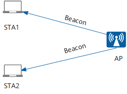

# 用户接入流程

## WEP 接入过程

STA (工作站)启动初始化、开始正式使用、AP 传送数据幀之前，要经过一下才能接入:

- 扫描(Scaning)
- 认证(Authentication)
- 关联(Association)
- 四次握手: AP 和 STA 进行四次握手；
- DHCP 过程；
- ARP 过程；
- 加密的数据通信业务

### 扫描

802.11MAC 使用 Scanning 功能来完成虚招 AP 的过程, 分为两种模式:

- 被动模式: STA 在每个信道上**侦听 AP 定期发送的 Beacon 帧**（帧中包含 SSID、支持速率等信息），以获取 AP 的相关信息
  
- 主动模式:
  - **客户端发送携带有指定 SSID 的 Probe Request**：STA 依次在每个信道发出 Probe Request 帧，寻找与 STA 有相同 SSID 的 AP，只有能够提供指定 SSID 无线服务的 AP 接收到该探测请求后才回复探查响应
    
  - **客户端发送广播 Probe Request**: 客户端会定期地在其支持的信道列表中，发送 Probe Request 帧扫描无线网络。当 AP 收到 Probe Request 帧后，会回应 Probe Response 帧通告可以提供的无线网络信息
    

### 认证

- **开放系统认证**: 不认证, 任何 sta 都可以认证成功
  
- **共享密钥认证**: STA 和 AP 预先配置相同的共享密钥，AP 在链路认证过程验证两边的密钥配置是否相同。如果一致，则认证成功；否则，认证失败
  
  - STA 向 AP 发送认证请求（Authentication Request）。
  - AP 随即生成一个“挑战短语（Challenge）”发给 STA。
  - STA **使用预先设置好的密钥加密**“挑战短语”（EncryptedChallenge）并发给 AP。
  - AP 接收到经过加密的“挑战短语”，**用预先设置好的密钥解密该消息**，然后将解密后的“挑战短语”与之前发送给 STA 的进行比较。如果相同，认证成功；否则，认证失败。

### 关联

- STA 向 AP 发送 Association Request 请求，请求帧中会携带 STA 自身的各种参数以及根据服务配置选择的各种参数（主要包括支持的速率、支持的信道、支持的 QoS 的能力以及选择的接入认证和加密算法）
- AP 收到关联请求后判断是否需要进行用户的接入认证，并回应 Association Response

## WPA/WPA2 接入流程

### 接入认证计算 PMK

**WPA/WPA2 仅支持开放式系统认证**, 所以上面的认证过程并没有验证密码. 在关联之后, 还需要一个接入认证阶段和后面的 4 次握手:

- 家庭使用 PSK 方式, 用在安全要求低的地方:
  - sta 和 ap 两侧都通过 ssid 和 passphrase 算出 PSK
  - sta 根据 PSK 计算出 PMK
  - ap 在根据 PSK 计算出 PMK 和 GMK
  - 之后进行 4 次握手
- 工业级的才需要下面 EAP 的认证方式.
  

### 四次握手

4 次握手是**密钥协商阶段**, 是**根据接入认证阶段生成的成对主钥 PMK**(Pairwise Master Key)产生成对临时密钥 PTK(Pairwise Transient Key)和群组临时密钥 GTK(Group Temporal Key)。

- PTK 用来加密单播报文
- GTK 用来加密组播和广播无线报文

四次握手通过 EAPOL(Extensible authentication protocol over LAN)进行消息交换。

**Message 1**:

由 AP 发起四次握手，**AP 发送一条包含 ANonce 的消息到 Station，Station 用它生成 PTK**。
生成 PTK 的公式：PTK = PRF (PMK + ANonce + SNonce + Mac (AA)+ Mac (SA))，由于在 4 次握手之前已经经历了认证和关联的阶段，因此 Station 是知道 AP 的 Mac 地址，所以只需要 ANonce 就可以生成 PTK 了。

**Message 2**:

**一旦 Station 创建了自己的 PTK，它会立即响应一条 EAPOL 消息给 AP，包含了 SNonce 和 MIC**。
**AP 用 SNonce 生成自己的 PTK，MIC 是用来校验 Station 发来的消息的完整性**(除了 1/4，从 2/4 报文开始，后面的每个报文都会有 MIC)。AP 收到 SNonce 之后，生成的 PTK 就可以用来加密后面两次握手的 key 了。

**Message 3**:

这次握手主要是**把 GTK 发送给 Station，并且告知 Station 安装 PTK 和 GTK**。由于第二次握手生成了 PTK，可以用来加密数据了，所以这里对 GTK 进行了加密。

**Message 4**:

第四次是**最后一条 EAPOL 消息，相当于一个确认包，告诉 AP PTK 已经安装好，AP 收到该消息后，也安装 PTK**。安装的意思是指使用 PTK 和 GTK 来对数据进行加密.

## WPA3 接入流程

为了保障用户都能接入到网络上，OPEN 式的 WIFI 是唯一可选的方式，虽然开放式的 WIFI 在使用时没遇到问题，但是用户数据也确实存在这明显的安全风险，所以 WPA3 引入了 SAE 和 OWE.

### OWE

OWE 是针对 OPEN 网络，**不需要输入密码进行认证，但是数据通信是加密的**:

- 支持 OWE 的设备会在 RSN 信息域上增加一个元素，在秘钥套件信息的位置增加认证类型为 OWE 的信息
- 在与支持 OWE 的设备关联的过程中，会在关 assoc req 和 assoc rsp 中增加 Diffie-Hellman Parameter，其中附有公钥的信息
- 关联操作成功后，STA 和 AP 就完成了 public 的公钥交换和生成了 PMK/PMKID
- 之后通过四次握手产生 PTK 和 GTK 对端到端的数据进行加密

### SAE

SAE 针对加密网络，通过证实密码信息，用密码进行对等实体同时认证，认证的双方式对等的，**以前是认证者对申请者认证，现在是互相认证**，然后派生出更安全的秘钥. 因此, WPA3 SAE 的关联过程中有四个 auth 帧.

- ao 和 sta 都通过用户的密码映射到椭圆曲线的一个点, 然后构造出 scalar 和 element
- sta 和 ap 交换双方的 scalar 和 element, 再结合密码派生出一个共享的密钥 ss(分成 PMK 和 KCK 两部分)
  
- sta 和 ap 再交换双方计算得到的 KCK 进行双向认证, 如果验证确认对端使用的是相同的密钥, 则认证成功.
  
- 之后通过本端计算得到的 PMK 用于后续的 4 次握手

# 加密算法

- https://zhuanlan.zhihu.com/p/51695002
