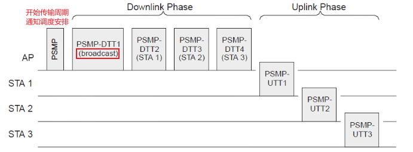
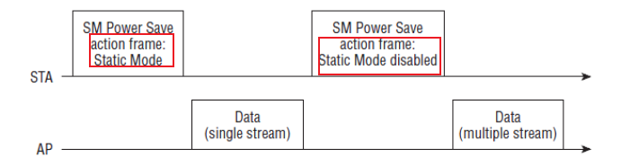
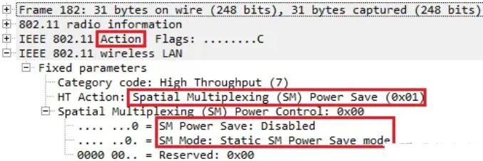

# wifi 工作状态

通常情况下，802.11 设备一共会有 4 个工作状态：

- Sleep（休眠模式）：节点会关闭发送和接收模块进行休眠，从而能耗最低。
- Rx Idle（接收空闲状态）：节点对信道进行监听，但并未真实接收数据帧。
- Rx（接收状态）：节点监听到数据帧，并对其进行接收。
- Tx（发送状态）：节点发送数据帧

# PSM 节能模式

- 节点发送数据，用 Rx Idle 来监听信道的，从而如果没有数据发送，那么就不进行监听，从而就可以减少 Rx Idle 的持续时间了，这个还是很容易做到的
- 节点接收数据, 使用**缓存机制和被动请求机制**让节点去请求接收接收 AP 发来的数据
  - AP 可以通过 **TIM** 字段主动告知 STA 有数据被缓存, 需要 STA 去主动接收
  - AP 发给 sta 的帧中的**more data**flag 可以标识该节点是否还有缓存数据

## AP 缓存机制

当 AP 从外网接收到要转发给节点的数据后，会将以 MSDU 的形式（即 MAC 层的数据帧）缓存在队列中（仅对节能模式下的节点数据进行缓存），并不直接发送给节点

## PS-POLL 机制

- 节点想要获取下行数据，那么节点需要主动跟 AP 请求数据(PS-Poll 帧)
- AP 接收到该帧后，会检查缓存区是否有对应该节点的缓存，如果有就会从缓存区中调出对应该节点的缓存数据，并进行下发
- 如果没有则反馈一个 NULL 帧（既空数据）

## DTIM 保活睡眠

TIM：每一个 Beacon 的帧中都有一个**TIM**，它主要用来**由 AP 通告它管辖下的哪个 STA 有数据现在缓存在 AP 中**，

- TIM 中包含一个 Bitmap，它最大是 251 个字节，每一位映射一个 STA，当为 1 时表示该位对应的 STA 有数据在 AP 中. 结构如下
  
- STA 收到与自己关联的 TIM 就要发送 PS-POLL 帧去请求缓存的数据

DTIM 是 TIM 的特殊情况，**当发送几个 TIM 之后，就要发送一个 DTIM. 一旦 AP 发送了 DTIM, STA 就必须处于清醒，因为广播或组播无重发机制**，不醒来数据就收不到了。

TIM/DTIM 报文格式如下:

- DTIM Count： 当前的 DTIM 值
  - 当 DTIM Count 为 0 表示当前的 TIM 是一个 DTIM
- DTIM Period： 在 AP 中配置的 DTIM 周期
  - 如果 DTIM 周期设置为 1 表示每一个 beacon 都是 DTIM beacon

因此针对 DTIM, STA 可以设置**保活睡眠**(也叫 dtim power save)来减少功耗:
**STA 通过 listen interval 来设置监听 beacon 的间隔: 可以设置成和 DTIM 的间隔一样，或者是 DTIM Period 的倍数。AP 通过 assoc req 帧得知 interval, 会在节点的苏醒时在 TIM 中为其指示缓存状态. 这样一来，每次 DTIM 到来的时候，既可以接收广播数据，也可以接收单播的数据**。

# APSD 节能模式

ASPD 模式是对 PSM 模式的一个直接改进, 对 PS-POLL 一问一答进行数据收发的过程进行改进.

## 基本原理

ASPD 基于 802.11e 中**服务时间**(service period)概念, 采用*先分节点，再分上下行*的传输模式提供 QoS 服务.
`服务时间`: 若节点占据信道后，和 AP 协定一段服务时间，并且在该段时间内，该节点可以传输多个帧，换言之就是**一次竞争多次传输**.

- 通过 trigger frame 启动服务时间. 基于工作模式的不同, trigger frame 的发起者可能是 STA, 也可能是 AP.
- 在最后一个 QOS-Data 帧中的 QOS 控制字段，标注 **EOSP**(End Of Service Period)结束一个服务时间

## S-APSD 模式

基于调度的 APSD, 服务时间是预先调度的(通过管理帧中的 **Schedule Element 字段**), 由 AP 来控制调度并发起 trigger frame:

## U-APSD 模式

基于非调度的 APSD, STA 主动发起 trigger frame:

# PSMP 节能模式

802.11n 中新增的模式, 比 APSD 高级的地方是**在服务时间内划分了下行传输和上行传输的时段**, 不同时段可以与多个 STA 进行数据传输(_先分上下行，再分节点_).

- AP 首先发送一个携带 PSMP 的 action frame，该帧中包含了后续时间内，下行链路和上行链路具体的调度安排
- 下行传输时段, AP 进行突发传输，其中帧间间隔可能会更小. STA 只在被调度的时间内醒来接收数据
- 上线传输时段, STA 只在被调度的时间醒来发送上行数据

# SM Power Save

802.11n 中的多天线下的节能模式, 在该模式下，**节点可以选择关闭多余的天线, 仅使用一根天线**，从而达到节能目的.

在 Wi-Fi 网络中，是否支持 SM Power Save 模式首先要看 AP 发送的 Beacon 帧中相应的 Capabilities 字段：

在确定该网络支持 SM Power Save 模式后，节点需要和 AP 进行沟通，确定一种 SM Power Save 的工作模式. 有两种工作模式:

- 静态模式: 通过 action frame 打开和关闭单流发送
  
- 动态模式: 通过 action frame 打开和关闭单流发送, 但只用于下一个帧, 再之后自动恢复多留方式
  

报文示例:

