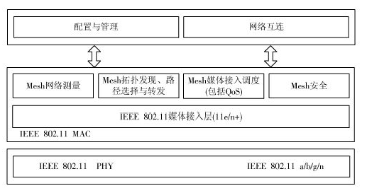
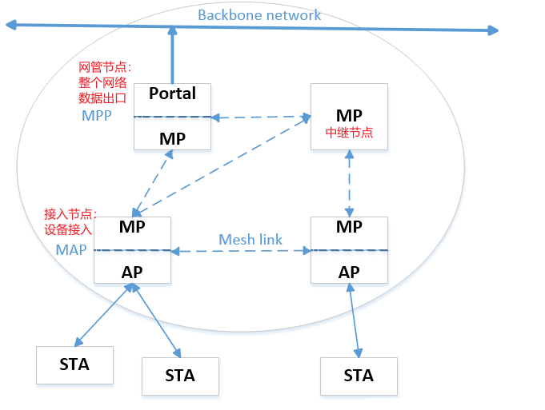
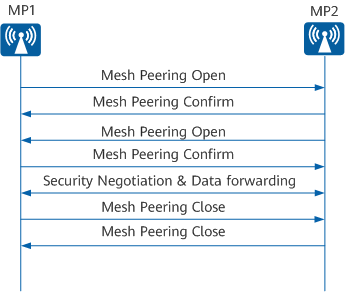

> wifi 的 mesh 功能基于 802.11s.

# wifi mesh 简介

## mesh 的优点

mesh 即多跳网络(multi-hop), 任意两个设备都可以保持无线互联

- 覆盖范围大: 可以使用 MESH 中继的方式将信号向更远的方向扩散，而且性能不会出现明显下降
- 可靠性高: MESH 的无线组网，可以将任意两个节点连接，其中一条或者多条连接断开也不会影响正常使用
- 部署成本低: 由于不需要有线连接，降低了部署成本
- 自组织性: 可通过增加或者减少节点的方式，随时扩大或者缩小网络的覆盖范围

## 协议栈模型

802.11s 基于传统的物理层协议, 提供网络拓扑的发现和建立，信标和同步、mac 接入机制、路径建立和转发、intra-mesh 拥塞控制、交互工作、安全和帧格式、功率控制等内容.

## 节点和拓扑结构

wifi mesh 网络结构如下, 节点被分为三种类型:

# 组网配置过程

在一个 mesh BSS 中，只允许相邻 mesh STAs 之间的直接通信, 相邻的两个对等节点需要建立连接才能通信.

基本过程如下:

- mesh 发现: mesh STA 执行主动扫描或被动扫描以发现正在运行的 mesh BSS, 并解析 beacon 和 probe resp 中包含的 msh profile 信息
- 连接 mesh 节点: 双方通过**两次**Mesh Peering Open/Confirm 的交互，完成 Mesh 连接的建立. 后续进行密钥协商后可以开始数据转发.
  
- 连接拆除: 连接双方中任意一方，均可以主动向对方发送 Mesh Peering Close 报文，以关闭双方间的 Mesh 连接

## mesh profile

mesh profile 是确定 mesh BSS 属性的一组参数，这些属性包含一个 Mesh ID 和多个 Mesh 配置元素的参数. **只要 Mesh profile 相同，则节点间就可以建立连接**.

- **一个 mesh BSS 中，所有的 mesh STA 都使用相同的 mesh profile**
- **mesh STA 无法与 profile 不同的 STA 建立对等连接**

mesh profile 主要内容:

- Mesh id: 区分不同的 mesh 网络, 与 ap 的 ssid 独立发送
- 配置元素:
  - 路径选择协议标识符: 当前的 mesh 网络使用哪种协议来确定到达有线网络或其他目的地的最佳路径
  - 路径选择度量标识符: 当前的 mesh 网络用于计算最佳路径的度量方式
  - 拥塞控制模式标识符: 当前的 MBSS 使用哪种协议来进行拥塞管理
  - 同步方法标识符: 当前 mesh 节点之间所使用的同步方法
  - 认证协议标识符: 当前 mesh 节点之间所使用的认证方法和协议
  - Mesh 组网信息元素: 指定了本地站点连接到多少个对等 STA(peers), 以及当前 STA 是否连接到了有线网络或 mesh 网关
  - Mesh 能力元素: 指定了包括 STA 是否接受新 STA 建立对等连接等其他参数

# mesh 消息格式

在普通的 802.11 的帧格式中多了一个 mesh control header:

