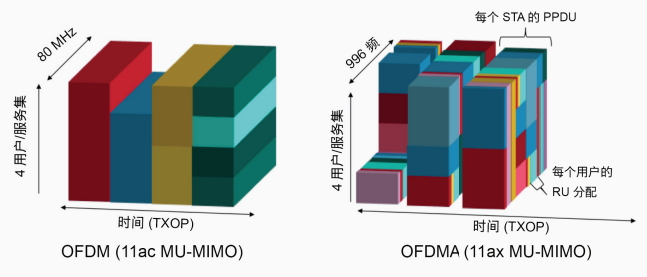
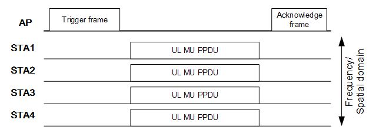
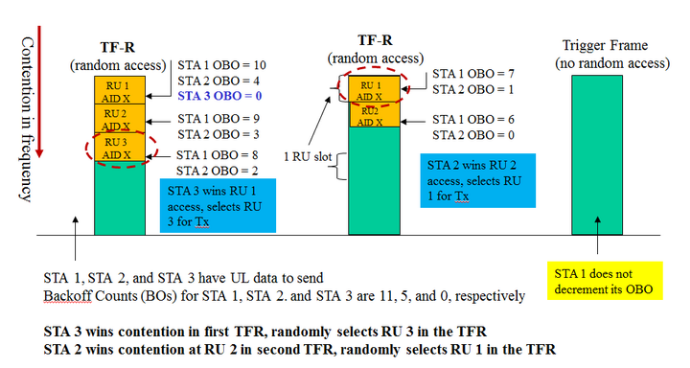
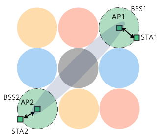
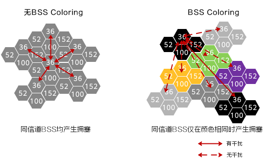
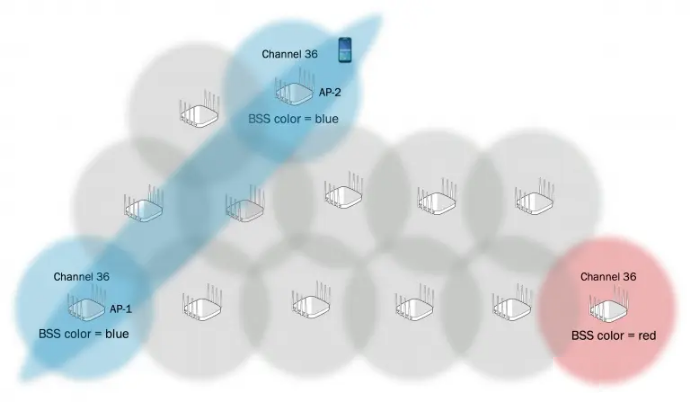
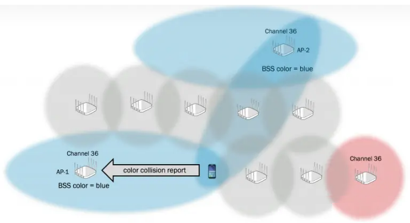
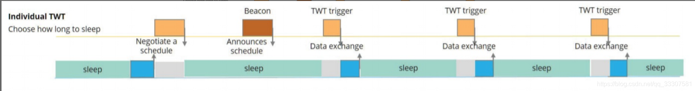
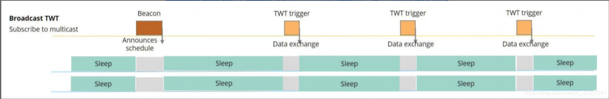
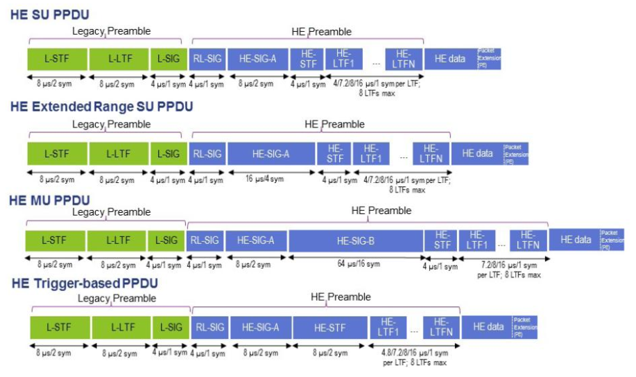

# 主要提升

802.11ax 即 wifi 6, 主要特点如下:

- 协议兼容性: 802.11ax 要求与以往的 802.11a/b/h/n/ac 都进行兼容
  - 修改了帧格式, 前导码由两部分组成: Legacy(与传统 802.11 前导的兼容部分)和 High Efficiency(高效率, 专用于 802.11ax)部分
- 更好的节能性, 引入了**目标唤醒时间 TWT 技术**, 用以增加移动设备的续航能力
- 更高的传输速率以及覆盖范围
  - 更高阶的编码组合 QAM-1024
  - 在相同带宽下, 采用点数更多的 FFT(FFT 点数越多, 子载波数越多)
  - 引入上行 MU-MIMO
  - 引入 OFDMA 技术, 让多个用户通过不同子载波资源**同时接入信道**, 提高信道的利用率
    

# ALOHA 机制

在引入了 OFDMA 的需求之后, 802.11ax 的 MAC 层随机接入机制也发生了变化(**多个用户可以同一时间接入信道)**, 在协议中, 代替传统的 CSMA 思想, 802.11ax 采用了基于 ALOHA 思想设计了竞争协议.

> Slot-Aloha: 节点根据本地的随机数和可竞争的 RU(资源单位) 数目, 判断本轮自己是否可以发送。如果可以, 那么直接随机选择一个 RU 发送竞争信号。这个发送过程中, 没有先监听。而冲突避免是通过中心控制完成的, 即 AP 进行判断, 如果节点选择的 RU 没有冲突, 那么 AP 能够成功解调, 并反馈给节点, 反之, AP 则无法解调。

Aloha 和 CSMA 的核心区别在于 LBT(Listen Before Talk)机制上: Aloha 是没有 LBT 的, 而 CSMA 是基于 LBT 的.

## TF 上行接入

- AP 发送 Trigger frame, 宣称这一轮接入开始。Trigger frame 中, 包含了节点上传所使用的时频资源(RU)信息。
- 根据 Trigger frame 中的指示, 节点选择其对应的 RU 位置, 进行 OFDMA 的接入。多个节点同时向 AP 发送上行 PPDU。
- AP 接收完全部数据后, 反馈 ACK, 结束这一轮传输

## TF-R 上行竞争

TF-R 是基于 TF 的进一步扩展, 是在 TF 机制中, 引入了竞争的机制, 其基本思想是 Slot-Aloha.

TF-R 是在我们前面所述的 TF 过程之前执行的:

- 在每一次接入时, AP 首先发送 TF-R 帧, 在该帧中的部分 RU 其相应 AID=X, 这个 X 代表这个 RU 是供节点竞争接入的.
- 每一个节点首先从 CWO(Contention Window for UL-OFDMA)窗口中, 选择一个随机数并放入 Backoff counter 中
  - 如上图, STA1 选择的是 10, STA2 选择的是 4, STA3 选择的是 0
- 节点比较, 这一轮 TF-R 帧中, 可供竞争的 RU slot 的数目。若 Backoff counter 小于 RU 的总数, 那么节点就可以发送数据, 反之不行
  - 上图第一个帧中 RU 数目为 3, STA3 OBO 选择为 0, 其小于 3, STA3 随机选择了 RU3 进行上行数据传输
- 当 RU=3 被竞争之后, 开始下一个的 TF-R
  - 上图第二个帧中 RU 数目为 2, STA2 OBO 选择为 1, 其小于 2, STA2 随机选择了 RU1 进行上行数据传输
- 之后 RU 自由分配好了, AP 发送 Trigger Frame, 开始 TF 接入流程

# BSS coloring

## 要解决的问题

像下图这种情况, AP1 和 AP2 处于同一信道且可以彼此侦听到对方的帧, 虽然 AP1 和 STA1 的通信和 AP2 无关, 但是 AP1 与 AP2 不能同时跟 STA 通信。

## BSS Color 字段

BSS Coloring 是一个字段, 标识了 BSS 的 ID。当多个无线终端在同一信道上传输时, 802.11ax 能够使用 BSS Coloring 字段区分 BSS. 即: **为不同的 AP 发出的报文套上不同颜色的信封, 接收端接收到报文后不需要拆解就知道是否与自己有关**.

BSS Coloring 的信息是同时被添加在 PHY 层和 MAC 层中的:

- 802.11ax PHY 头部的 Preamble 中, 其 SIG-A 字段包含 6 个 Bit 的 BSS Coloring 信息字段。该字段可以识别多达 63 个 BSS
- 在 Beacon 帧中的 HE Element 中, 包含 BSS Coloring 的子字段, 也是 6 个 Bit 的 BSS Coloring 信息字段, 可以标识 63 个 BSS

## 如何解决问题

根据 BSS color, 接收端不必拆解整个报文就能立马判断是否跟自己相关, 颜色相同表示跟自己相关, 颜色不同就跟自己无关, 对于跟自己无关报文就当不存在, 接收端依旧可以发起通信而不必退避.

如上图所示, 如果不标记颜色, 只要 AP 都是用 36 信道, 都会彼此干扰；但是如果标记了颜色, 则认为只有同为黑色且使用 36 信道的 AP, 才会存在干扰, 颜色不同就不会有干扰。

## 颜色冲突

对于 802.11ax 的 AP, 其如果检测到使用相同颜色的 OBSS, 则它能够更改变其 BSS 颜色, 减少同频干扰.

- 如果 802.11ax AP 听到来自其他 AP 或者该 AP 节点的不同 BSS Coloring 字段, 那么是检测到一次颜色冲突
  
- AP 互相检测不到, 如果 STA 终端检测到颜色冲突, 则该终端会向其关联的 AP 发送颜色冲突报告
  

当 AP 检测到颜色冲突后, 其可以决定改变其 BSS 颜色. **AP 会通过 Beacon 告知所有关联在本 BSS 内部的节点 BSS Coloring 的改变**。BSS Coloring 的改变还可以通过探测响应和重新关联响应帧中进行通知.

# OMI 机制

传统的 802.11a/b/g/n/ac 终端想要传输上行数据时必须通过竞争, 那怎么让 802.11ax 终端不参与一个 OFDMA 的上行传输, 而做为一个独立终端竞争信道, 并进行单独的上行传输?
802.11ax 终端使用 OM 控制字段(**OM Control Subfield**, 其通常位于数据或者管理帧中), 其用来指示改变 AP 的发送或者接收模式:

- 单用户模式: 终端自行竞争, 兼容之前协议
- UL_OFDMA 模式: TF 机制

# TWT 机制

在前几代 802.11 中, AP 通过流量指示消息(**TIM**)发送信令, 表明周期性信标中的数据可用性, 这允许 STA 保持关闭状态, 并且仅周期性地唤醒以接收信标(周期间隔通常为 102.4 ms 的倍数).

- 传统的 TIM 机制参考[DTIM 保活睡眠](4_powersave.md#dtim-保活睡眠).

然而, 这种对信标的严格遵守制约了物联网设备的节能潜力, **这些设备不需要像手机那样定期接入信道, 但必须随时能够接听电话**.

## TWT 分类

802.11ax 中的 TWT 分为两种:

- **individual TWT**: 建立在两个设备之间的协议, 例如: STA-AP, STA-STA(TDLS)
- **broadcast TWT**: 由 HE AP 统一调度, HE STA 可以通过主动申请或者被邀请的方式加入一个 broadcast TWT(`<Broadcast TWT ID, MAC address>`唯一标识), 成为其成员, 然后在特定时间苏醒, 进行帧交换

Conrol field 字段中的**Negotiation Type**字段是指示是 Individual TWT 还是 Broadcast TWT

## Individual TWT

该模式下终端会和 AP 协商特定的 TWT 时间，该时间会被存放在 AP 的时间表中。终端会在特定的时间醒来并和 AP 进行帧交换。

1. 终端想要建立一个 TWT 连接，其会将自己的节能调度信息告知给 AP
1. AP 将会分配 TWT 周期，并将该周期反馈给终端
1. 终端会在指定的 TWT 周期时苏醒，并和 AP 进行数据帧交换
   1. **显式工作模式**: AP 会显式告诉终端下一轮的 TWT 周期
   1. **隐式工作模式**: 终端会自己计算出下一轮的 TWT 周期通(当前 TWT 周期 + 一个特定的时间)

## Broadcast TWT

在该机制下，TWT 时间周期是由 AP 宣告，通常 AP 会在每一个 beacon 帧中宣告本轮的 TWT 时间周期。在一些特殊的情况下，AP 也会在其他的管理帧中宣告，比如 Association 帧，Reassociation 帧或者 Probe Response 帧等.

1. 中断通过**管理帧携带的 TWT elements**加入组或离开组
1. 当终端完成加组后，终端会按照最近接收到的 TWT 时间周期进行工作.
1. 终端在 TWT 时间周期到达后进行苏醒，AP 会发送广播的触发帧，发现哪些终端正在处于苏醒状态(加组后的终端们)，并向这些终端发送数据帧
1. 当 AP 发送完成后，终端恢复到睡眠状态，直到下一次广播 TWT 时间到达

# wifi6 帧格式

## 物理层 header

wifi6 的物理层前导码分成了 non-HE 和 HE 两部分, non-HE 兼容 legacy preamble, 整体格式如下:

- HE SU PPDU: 单用户PPDU,主要是在单用户场景中使用
- HE ER SU PPDU: HE增程(Extended Range)PPDU, 主要针对远离AP的单用户场景中，例如室外场景
- HE MU PPDU: 多用户PPDU,可以同时对一个或者多个用户进行一次或者多次传输
- HE TB PPDU: 主要在上行OFDMA或者上行MU-MIMO场景中进行传输