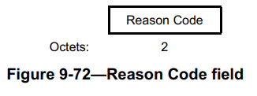

该 Reason Code 字段用于表示**产生非请求通知**的原因, 非请求通知有:

- Disassociation
- Deauthentication
- DELTS
- DELBA
- DLS Teardown
- Mesh Peering Close

例如当对方不适合加入网络时，工作站会送出 Disassociation（解除连接）或 Deauthentication（解除身份认证）帧作为应答。这些帧当中包含一个长度 16bit 的 Reason Code（原因代码）位，表示对方的做法有误.
