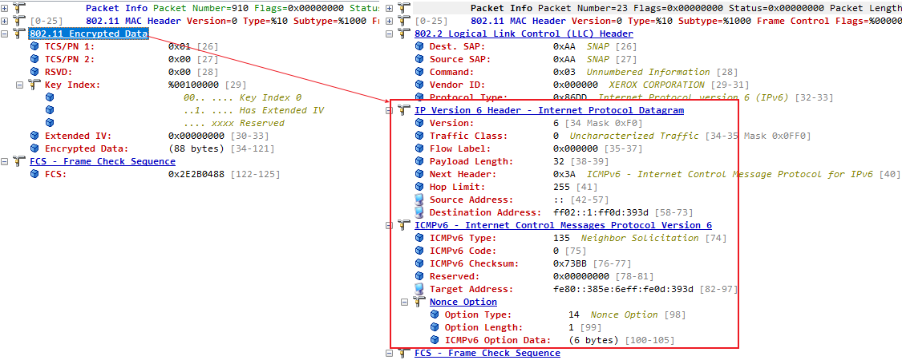

如何抓取 wifi 的 packet

# win 自带网卡抓包

查看自带网卡是否支持 monitor 模式:

```bash
PS C:\Users\Lenovo> netsh wlan show wirelesscapabilities

无线系统功能
----------------------------
    连接到 802.11 无线电的天线数 (值不可用)
    设备运行时可以同时占用的最大通道数(值不可用)
    共存支持                        : 未知


无线设备功能
----------------------------

接口名称: WLAN

    WDI 版本(Windows)                       : 0.1.1.12
    WDI 版本(IHV)                           : 0.1.1.12
    WiFiCx 版本 (IHV)                           : 不支持 WiFiCx 接口
    固件版本                            : D4.74
    站                                     : 支持
    软 AP                                     : 不支持
    网络监视模式                        : 不支持 -------------------------------这里即监控模式
    Wi-Fi Direct 设备                         : 支持
    Wi-Fi Direct GO                             : 支持
    Wi-Fi Direct 客户端                         : 支持
    受保护管理帧                 : 支持
```

可以使用 microsoft network monitor 或 wireshark 设置为监控模式, 然后监听

- microsoft network monitor 参考: https://zhuanlan.zhihu.com/p/312978524
- wireshark 参考: https://zhiliao.h3c.com/Theme/details/183006

# omnipeek 外置抓包器

## 单 channel 抓包

在 omnipeek 中点击 new capture 选择指定的网卡和 channel，start capture 之后就可以看到抓到的包。比如下面是抓到的 bk7231n 模块连接路由器的包：


## 扫描 AP

上面抓包时选择的是单个 channel，如果选择 scan 就可以扫描范围内的 AP：


**从此结果可以看出 sta 连接到哪个 ap，使用的哪个 channel。并可将 channel 和 mac 地址作为抓包的过滤条件**。

## 按 ap 和 sta 过滤报文

在上面显示 ap 和 sta 的页面，可以选择某 AP 和 STA 作为过滤条件，然后隐藏不需要的报文或将选中的报文复制到新窗口：


## 报文解密

### WEP

WEP 模式密码是固定的，只需要在**tools->Decrypt WLAN packets**中增加密码即可


### WPA/WPA2

- 确认抓到了 4 次握手的报文 WAPOL-KEY
- 和 WEP 一样, 添加一个 WPA 类型的 keyset, 然后在 Decrypt WLAN Packets 选择该 key
  
- 之后就可以在新的窗口看到加密的报文被解密, 被解密的报文可以单独保存
  

# 常见报文分析

## Probe req

| element                       | 含义                            |
| ----------------------------- | ------------------------------- |
| SSID                          | 要搜寻的 ssid, 为空表示全部扫描 |
| Supported Rates               | 支持的速率                      |
| Extened Supported Rates       | 支持的扩展速率                  |
| Direcr Sequence Parameter Set | 报文所在的信道                  |
| HT capability info            | 高吞吐能力信息                  |

## Probe rsp

| element                       | 含义                                                |
| ----------------------------- | --------------------------------------------------- |
| Probe imestamp                | 确保 sta 和 ap 的时钟同步                           |
| interval                      | beacon 发送间隔                                     |
| capability info               | 扩频参数集, 指 FHSS、DSSS、ERP、OFDM 和 HT 特定信息 |
| SSID                          | ap 的 ssid                                          |
| Supported Rates               | ap 支持的速率                                       |
| Direcr Sequence Parameter Set | 使用的信道                                          |
| RSN information               | RSN 信息， TKIP 或 CCMP 加密信息和认证方式          |
| Extened Supported Rates       | 支持的扩展速率                                      |
| HT capability info            | 高吞吐能力信息                                      |

## Beacon

| element                       | 含义                                                |
| ----------------------------- | --------------------------------------------------- |
| Beacon timestamp              | 确保 sta 和 ap 的时钟同步                           |
| interval                      | beacon 发送间隔                                     |
| capability info               | 扩频参数集, 指 FHSS、DSSS、ERP、OFDM 和 HT 特定信息 |
| SSID                          | ap 的 ssid                                          |
| Supported Rates               | ap 支持的速率                                       |
| Direcr Sequence Parameter Set | 使用的信道                                          |
| RSN information               | RSN 信息， TKIP 或 CCMP 加密信息和认证方式          |
| Extened Supported Rates       | 支持的扩展速率                                      |
| HT capability info            | 高吞吐能力信息                                      |
| Vendor Specific               | 厂商自定义字段                                      |
