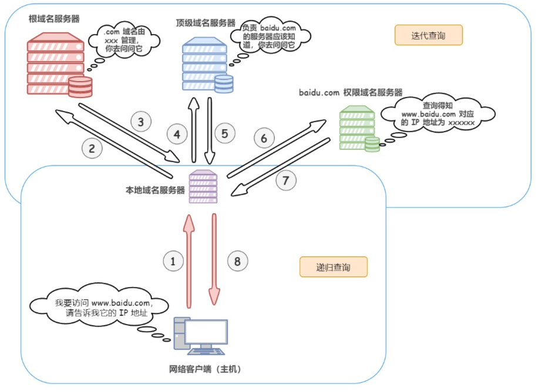
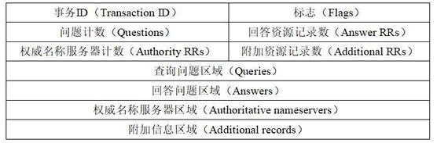
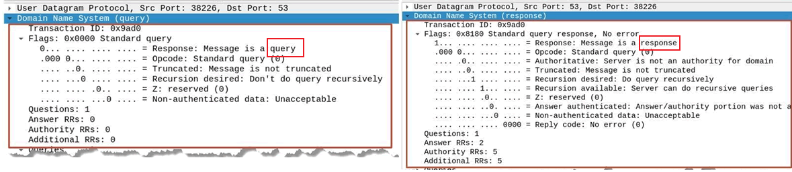
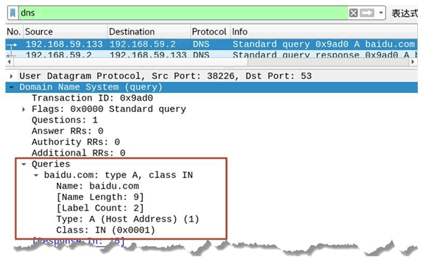
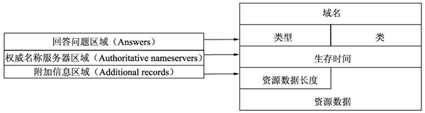
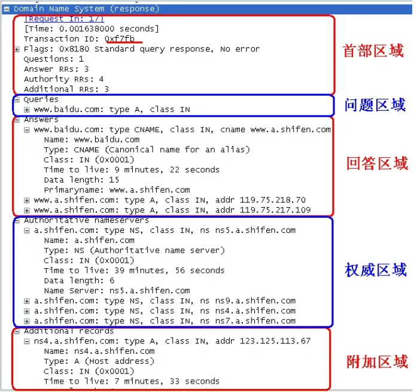

DNS 通常由其他应用层协议使用(如 HTTP、SMTP、FTP)，**将主机名解析为 IP 地址**，其运行在**UDP**之上，使用 **53 号端口**。DNS 除了提供主机名到 IP 地址转换外，还提供如下服务：主机别名、邮件服务器别名、负载分配等。

# DNS 工作原理

1. 用户在浏览器地址栏输入要访问的域名，如http://www.baidu.com。
1. 首先搜索浏览器的 DNS 缓存，**缓存中维护一张域名与 IP 地址的对应表**
1. 若没有命中，则继续搜索操作系统的 DNS 缓存；
1. 若仍然没有命中, 用户的计算机向*本地 DNS 服务器*发出查询请求(**递归查询**)，询问是否有对应的 IP 地址。
1. 本地 DNS 服务器在自身缓存中查找是否有该域名的记录
   1. 如果有，则直接返回 IP 地址
   1. 如果没有，则向根域名服务器发出查询请求(**迭代查询**)
1. 根域名服务器返回一个标明负责该顶级域名的权威域名服务器的 IP 地址。
1. 本地 DNS 服务器向权威域名服务器发出查询请求，获取该域名的 IP 地址。
1. 本地 DNS 服务器将获取的 IP 地址返回给用户计算机，用户计算机通过该 IP 地址访问该网站

示例如下:

# DNS 报文格式

> 参考: http://c.biancheng.net/view/6457.html

DNS 只有两种报文：查询报文、回答报文，两者有着相同格式:

## header 部分

该部分中每个字段含义如下。

- 事务 ID：DNS 报文的 ID 标识。**对于请求报文和其对应的应答报文，该字段的值是相同的**。通过它可以区分 DNS 应答报文是对哪个请求进行响应的。
- 标志：DNS 报文中的标志字段。
- 问题计数：DNS 查询请求的数目。
- 回答资源记录数：DNS 响应的数目。
- 权威名称服务器计数：权威名称服务器的数目。
- 附加资源记录数：额外的记录数目（权威名称服务器对应 IP 地址的数目）

报文示例:

## 查询问题部分

该部分是用来显示 DNS 查询请求的问题，通常只有一个问题

该部分中每个字段含义如下：

- 查询名：一般为要查询的域名，有时也会是 IP 地址，用于反向查询。
- 查询类型：DNS 查询请求的资源类型。通常查询类型为 A 类型，表示由域名获取对应的 IP 地址。
- 查询类：地址类型，通常为互联网地址，值为 1。

报文示例:

## 资源记录部分

源记录部分是指 DNS 报文格式中的最后三个字段，包括回答问题区域字段、权威名称服务器区域字段、附加信息区域字段。这三个字段均采用一种称为**资源记录的格式**:

资源记录格式中每个字段含义如下：

- 域名：DNS 请求的域名。
- 类型：资源记录的类型，与问题部分中的查询类型值是一样的。
- 类：地址类型，与问题部分中的查询类值是一样的。
- **生存时间**：以秒为单位，表示资源记录的生命周期，一般用于当地址解析程序取出资源记录后决定保存及使用缓存数据的时间。它同时也可以表明该资源记录的稳定程度，稳定的信息会被分配一个很大的值。
- 资源数据长度：资源数据的长度。
- 资源数据：表示按查询段要求返回的相关资源记录的数据

报文示例:

