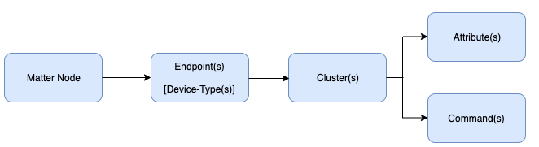
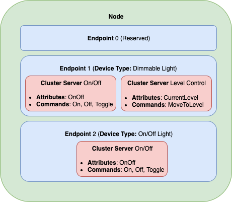
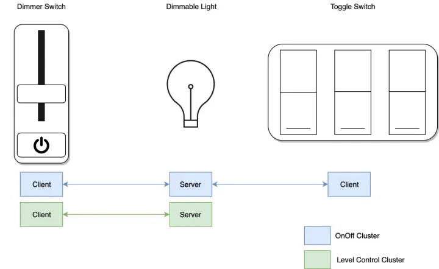

matter 是 CSA 连接标准联盟(原 Zigbee 联盟)新推出的一个**应用层协议**。是一种新的、基于 IP 的连接标准.

## matter 数据模型

**Matter 规范提供了一系列标准 Cluster（及其 Attribute 和 Command）。用户可根据具体设备，从列表中寻找适合自己设备的 Cluster。**

示例：

- Node（节点）：节点通常被定义为一个具有某些功能的网络可寻址实体，具有唯一性。用户可以看到的智能设备实体
- Endpoint（端点）：端点可以被想象为一个可提供某种或某些服务的虚拟设备，每个节点可以拥有多个端点
- Cluster：多个常用操作组合为一个可复用的模块
- Attribute：Attribute 表示可以读取或写入的内容。比如，On/Off Cluster 包含一个 OnOff Attribute，代表设备实际打开或关闭的状态
- Command：Command 代表触发 Cluster 进行某种行为的能力。每条 Command 可以有自己的参数

## Cluster 服务器和 Cluster 客户端

Cluster 服务器和客户端之间的关系如下图所示（照明系统为例）：

