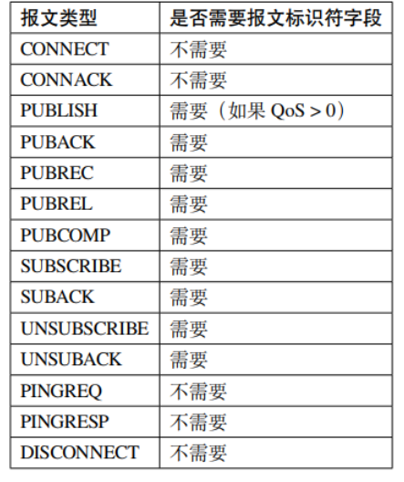
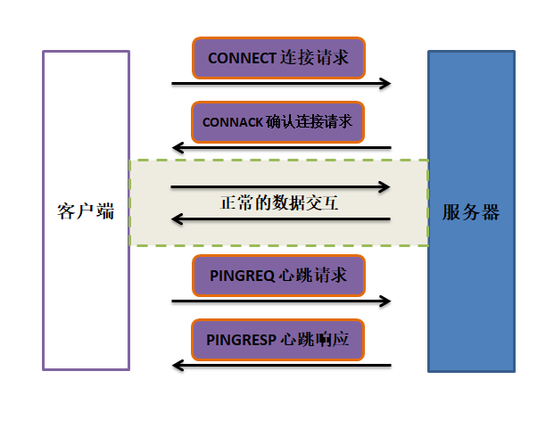

MQTT 协议全称是 Message Queuing Telemetry Transport(消息队列遥测传输协议)，是物联网常用的应用层协议，运行在应用层中，依赖 TCP 协议.

# 通信模型

MQTT 协议提供**一对多的消息发布**，可以降低应用程序的耦合性，用户只需要编写极少量的应用代码就能完成一对多的消息发布与订阅.

- 服务器用于分发消息, 也算发布者
  - 服务器为每个连接的客户端添加一个标签，该标签与服务器中的所有订阅对比，服务器会将消息转发给与标签相匹配的每个订阅者
- 客户端可以发布消息（发送方）、订阅消息（接收方）或两者兼而有之
- 每个客户端与服务器建立连接后就是一个会话，客户端和服务器之间会有状态交互
- 发布者与订阅者可以通过主题名字，一般为 UTF-8 编码的形式发布和订阅主题
  - 一个主题可以有多个级别，各个级别之间用斜杠字符分隔

# 报文格式

整理格式如下:

## 固定 header

存在于所有 MQTT 数据包中，表示数据包类型及数据包的分组类标识.

- DUP: 发布消息的副本。用来在保证消息的可靠传输，如果设置为 1，则在下面的可变 heander 中增加 MessageId，并且需要回复确认，以保证消息传输完成，但不能用于检测消息重复发送。
- Qos: 服务质量, 保证消息传递的次数
  - 00：最多一次，即：<=1
  - 01：至少一次，即：>=1
  - 10：只有一次，即：=1
  - 11：预留
- RET: 是否需要保留此消息, 有新订阅者时继续推送
- byte2: 可变头和 payload 的总大小. 前 7 位用于保存长度, 最后一位表示是否占用下一 byte

## 可变 header

存在于部分 MQTT 数据包中，数据包类型决定了可变头是否存在及其具体内容.

## payload

存在于部分 MQTT 数据包中，表示客户端收到的具体内容. **CONNECT、SUBSCRIBE、SUBACK、UNSUBSCRIBE 四种类型的消息有消息体**.

- CONNECT：客户端的 ClientID、订阅的 Topic、Message 以及用户名和密码。
- SUBSCRIBE: 一系列的要订阅的主题以及 QoS。
- SUBACK: 服务器对于 SUBSCRIBE 所申请的主题及 QoS 进行确认和回复。
- UNSUBSCRIBE: 要订阅的主题。

# MQTT 消息交互

## 建立连接

1. Client 发送 CONNECT 数据包给 Broker, 包含必须的信息
   1. 需要设置 alive 时间, Client 和 Broker 之间在这个时间间隔之内需要至少一次消息交互，否则 Client 和 Broker 会认为它们之间的连接已经断开
1. Broker 在收到 CONNECT 数据包之后，给 Client 返回一个 CONN ACK 数据包
   1. 客户端只能发送一次 CONNECT 报文，按照协议标准，服务器会将第二个 CONNECT 报文当作协议违规处理并断开客户端的连接

交互过程

## 连接断开

### client 主动断开

Client 主动关闭连接的流程非常简单，只需要 Client 向 Broker 发送一个 DISCONNECT 数据包就可以了. **之后就可以关闭底层的 TCP 连接了，Broker 不会有回复**.

### broker 主动断开

> MQTT 协议规定 Broker 在没有收到 Client 的 DISCONNECT 数据包之前都应该和 Client 保持连接。只有当 Broker 在 Keep Alive 的时间间隔内，没有收到 Client 的任何 MQTT 数据包的时候会主动关闭连接。

**Broker 主动关闭连接之前不会向 Client 发送任何 MQTT 数据包，而是直接关闭底层的 TCP 连接**。
