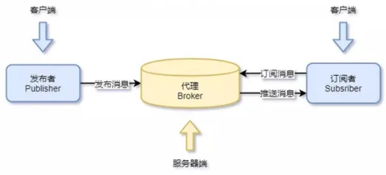

MQTT 协议全称是 Message Queuing Telemetry Transport(消息队列遥测传输协议)，是物联网常用的应用层协议，运行在应用层中，依赖 TCP 协议.

# 通信模型

MQTT 协议提供**一对多的消息发布**，可以降低应用程序的耦合性，用户只需要编写极少量的应用代码就能完成一对多的消息发布与订阅.

- 服务器为每个连接的客户端（订阅者）添加一个标签，该标签与服务器中的所有订阅相匹配，服务器会将消息转发给与标签相匹配的每个订阅者
- 一个主题可以有多个级别，各个级别之间用斜杠字符分隔
- 发布者与订阅者可以通过主题名字，一般为 UTF-8 编码的形式发布和订阅主题
- 每个客户端与服务器建立连接后就是一个会话，客户端和服务器之间会有状态交互

# 报文格式

## 固定 header

## 可变 header

只有某些报文才有可变报头，跟在固定报头后面。报文内容会根据报文类型的不同而有所不同，但可变报头的报文标识符字段存在于在多个类型的报文里，而有一些报文又没有报文标识符字段。

## payload

不同的报文有效载荷也是不一样的， 比如:
SUBSCRIBE 报文的有效载荷包含了一个**主题过滤器列表**，它们标识着客户端想要订阅的主题，每一个过滤器后面跟着一个字节(服务质量要求)，它给出了服务端向客户端发送应用消息所允许的最大 QoS 等级.
