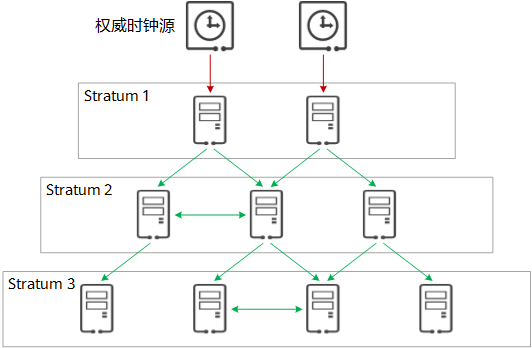
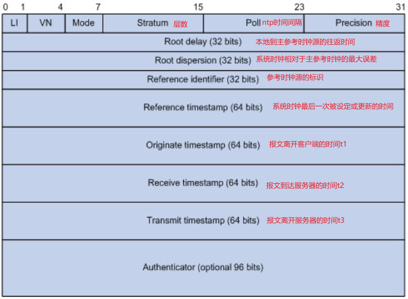
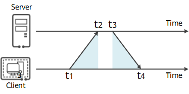

# 为什么时钟同步很重要？

出于诸多原因，精确的时间对于网络至关重要，比如：

- 网络管理：从不同网络设备采集来的日志信息进行分析时，需要以时间作为参照依据。如果不同设备上的系统时间不一致，会因先后顺序等问题给故障定位带来障碍。
- 计费系统：计费业务对于时间尤其敏感，要求所有设备的时间保持一致，否则会引起计费不准确，导致用户质疑、投诉等。
- 协同处理：多个系统协同处理同一个复杂事件，为保证正确的执行顺序，多个系统必须参考同一时钟。
- 系统时间：某些应用或服务需要准确的时间来标记用户登录、交易等操作信息，确保可追溯记录。

因此有一个统一的标准时间对于网络而言意义重大。

# NTP 介绍

网络时间协议 NTP（Network Time Protocol）是 TCP/IP 协议族里面的一个应用层协议，用来使客户端和服务器之间进行时钟同步，提供高精准度的时间校正。NTP 服务器从权威时钟源（例如原子钟、GPS）接收精确的协调世界时 UTC，客户端再从服务器请求和接收时间。
NTP **基于 UDP 报文**进行传输，使用的 UDP **端口号为 123**。

## NTP 时钟层级

NTP 允许客户端从服务器请求和接收时间，而服务器又从权威时钟源（例如原子钟、GPS）接收精确的协调世界时 UTC。
**NTP 以层级来组织模型结构**，层级中的每层被称为 Stratum。通常将从权威时钟获得时钟同步的 NTP 服务器的层数设置为 Stratum 1，并将其作为主时间服务器，为网络中其他的设备提供时钟同步。而 Stratum 2 则从 Stratum 1 获取时间，Stratum 3 从 Stratum 2 获取时间，以此类推。时钟层数的取值范围为 1 ～ 16，取值越小，时钟准确度越高。层数为 1 ～ 15 的时钟处于同步状态；层数为 16 的时钟被认为是未同步的，不能使用.

## NTP 报文格式

## NTP 同步原理

1. 客户端首先向服务端发送一个 NTP 请求报文，其中包含了**该报文离开客户端的时间戳 t1**;
1. NTP 请求报文到达 NTP 服务器，此时 NTP 服务器的时刻为 t2。
1. 当服务端接收到该报文时，NTP 服务器处理之后，于 t3 时刻发出 NTP 应答报文。
1. **该应答报文中携带报文离开 NTP 客户端时的时间戳 t1、到达 NTP 服务器时的时间戳 t2、离开 NTP 服务器时的时间戳 t3**；
1. 客户端在接收到响应报文时，记录**报文返回的时间戳 t4**。

## NTP 计算公式

客户端用上述 4 个时间戳参数就能够计算出 2 个关键参数:

1. 计算 NTP 报文从客户端到服务器的往返延迟 delay(即上图蓝色部分): $$delay = (t4 - t1) - (t3 - t2)$$
1. 计算 client 和 server 之间的时间差 offset: $$offset = \frac{(t2- t1) + (t3 - t4)}{2}$$
1. NTP 客户端计算得到的 delay 和 offset 来调整自己的时钟，实现与 NTP 服务器的时钟同步
