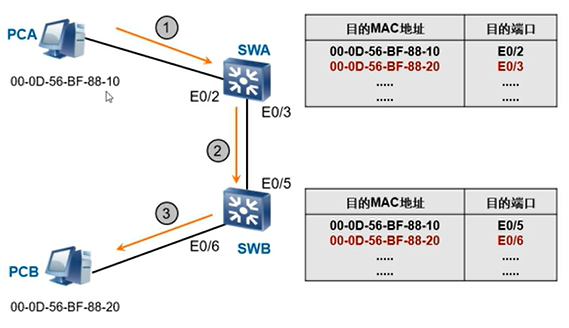
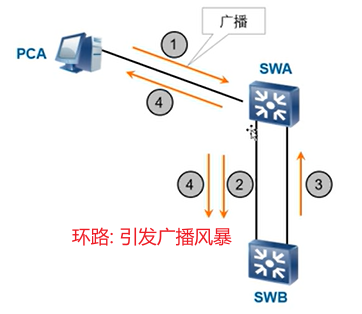
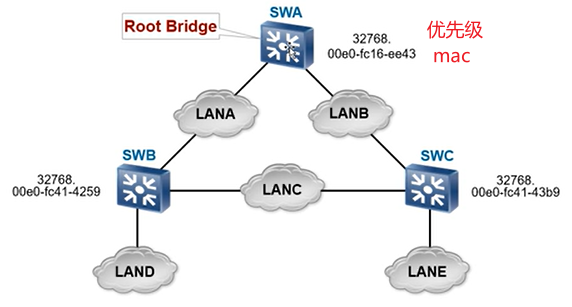
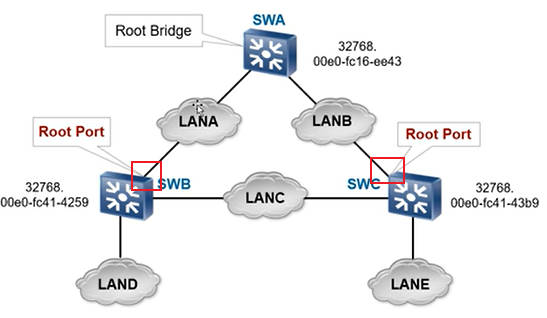
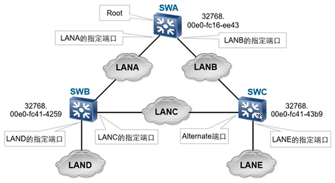
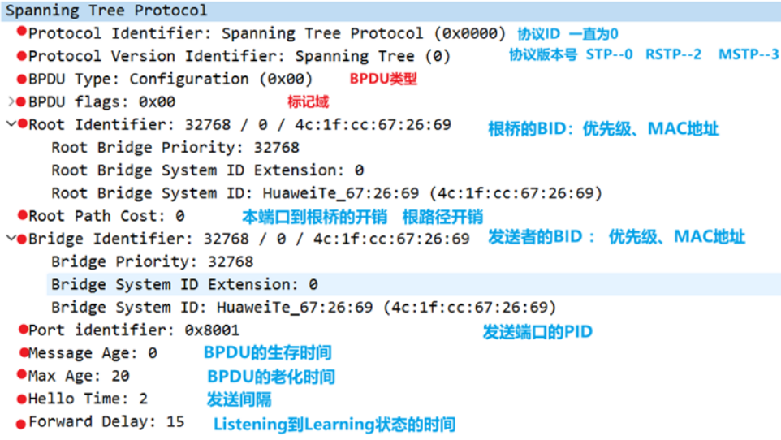

STP 的作用: 形成生成树, 分析是否有冗余路径, 防止环路, 避免网络风暴.

# 交换机转发流程

## 非冗余路径

## 环路

# STP 协议

## 生成树计算过程

1. **选举根交换机**: 交换机 bridge id(2 字节的交换机优先级和 6 字节 mac)
   - 比较优先级, 谁最小就是根
   - 比较 mac 地址: 谁最小就是根
     
1. **选举非根交换机的根端口**: 根交换机到非根交换机最短链路对应的端口
   - 非根交换机不同端口收到根发出的 BPDU (STP 报文), 比较哪个开销最小
     
1. **选举网段的指定端口**: 一条链路两端的端口
   - 非根与根的 lan, 只需要根交换机侧的端口, 因为非根交换机使用跟端口
   - 非根与非根的 lan, 需要两端的端口
     

## BPDU over STP

STP 每隔 2s 会发送一次 BPDU 报文，非根桥连续三次没有收到 BPDU，表示发生故障. BPDU 主要进行根桥、端口角色的选举和通知拓扑结构发生变化.

