IEEE 802.11 也叫 Wi-Fi，用于有限地理空间内数据传输，主要特性有:

- 通过空间传播信号
- 电源管理
- 安全加密管理

# 物理层

## 物理层划分

- PLCP: 物理层收敛程序, 负责将 MAC 帧转化之后发送到传输介质
- PMD: 物理媒介, 负责传输 MAC 帧

## 物理层协议演进

| 协议     | 支持频段(GHz) | 信道带宽(MHz)               | 最高理论数据速率(Mbit/s) |
| -------- | ------------- | --------------------------- | ------------------------ |
| 802.11b  | 2.4           | 20                          | 11                       |
| 802.11a  | 5             | 20                          | 54                       |
| 802.11g  | 2.4           | 20                          | 54                       |
| 802.11n  | 2.4、5        | 20、40                      | 600                      |
| 802.11ac | 5             | 20、40、80、80+80、160      | 6933.33                  |
| 802.11ax | 2.4、5、6     | 20、40、80、80+80、160      | 9607.8                   |
| 802.11be | 2.4、5、6     | 20、40、80、80+80、160、320 | 46120                    |

- **802.11** 定义了两种 radio-based 物理层的标准(2.4GHz，提供 2M 带宽):
  - **frequency hopping**: 频率跳变，通过在多个频率之间快速切换来提高通信的安全性和抗干扰能力。
  - **direct sequence**: 直接序列，用 11bit chipping sequence 保证传输的完整性
- **802.11b** 增加了变种的 direct sequence，可以提供 11M 的带宽
- **802.11a**: 增加了 OFDM 64QAM 技术(正交频分多路复用)，在 5GHz 频段可提供 54M 带宽
- **802.11g**: 使用 OFDM 技术在 2.4GHz 频段提供 54M 带宽
- **802.11n**: 增加了 MIMO 技术(多天线多通道),可提供 108M 带宽
- **802.11ac**: OFDM 256QAM 和 MU-MIMO 技术
- **802.11ax**: OFDMA 1024QAM

## 2.4 GHz channel 频率

计算公式如下：
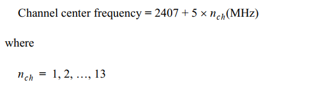

注意：1-13 信道是基本常用信道，14 很少支持
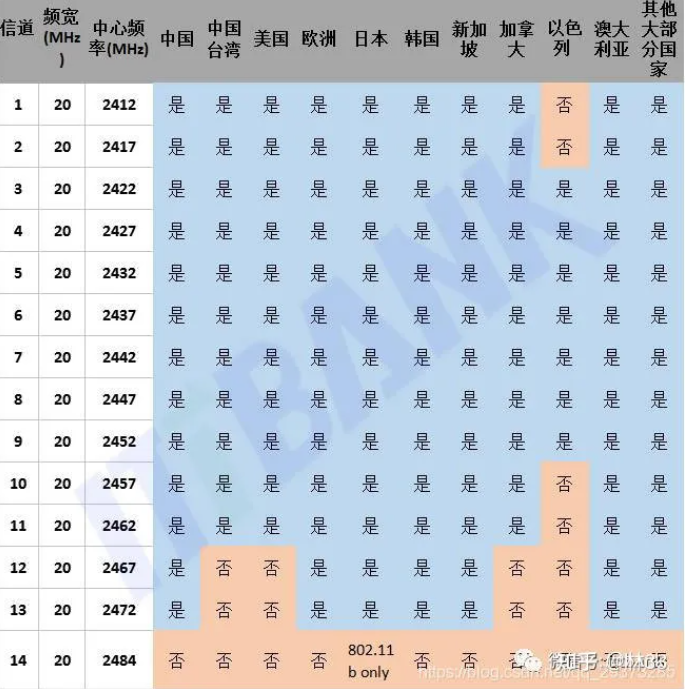

## 5 GHz channel 频率

计算公式如下：

常用如下信道：

# MAC 层

## CSMA/CA

典型的两个问题:

- hidding node: A 和 C 同时发信号,导致 B 端出现冲撞,数据被丢弃
  
- exposed node: B 和 C 虽然相互暴露, 但是借助 CSMA/CA 可以保证同时发信号给其他节点时, 数据不会出现冲撞
  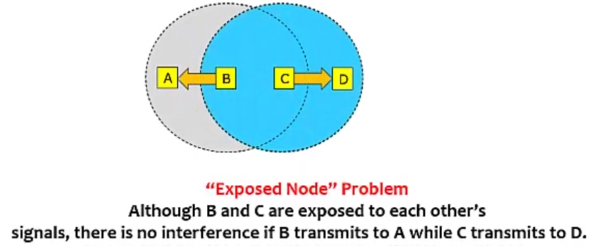

在 802.11 中通过 **CSMA/CA 算法**(载波监听多路访问和冲突避免)来处理上面的两个问题. 主要思路为:
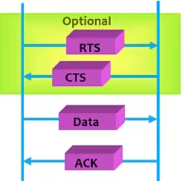

- 在发送真实数据前, 先通过**控制帧**进行通信
- sender 发送 RTS frame 到 receiver, 告知要发送数据的长度和所需时间
- receiver 回复 CTS frame, 告知所有节点某时间间隔内需要收特定数据, 其他节点暂停发送
- sender 收到 CTS 开始发送数据; 数据接收完成, receiver 会回复 ACK 表示数据成功接收
- sender 如果等不到 CTS, 会等会重试

## MAC 帧结构

802.11MAC 层负责客户端与 AP 之间的通讯。主要功能包括：扫描、接入、认证、加密、漫游和同步.

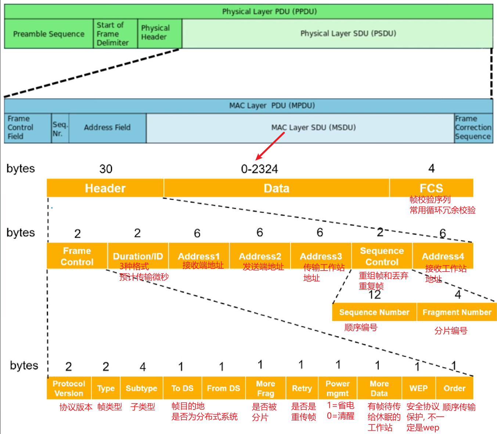

- To DS：表明该帧是 BSS 向 DS 发送的帧；
- From DS：表明该帧是 DS 向 BSS 发送的帧；
  
- Address：依次为**源地址(SA)、目的地址(DA)、传输工作站地址(TA)、接收工作站地址(RA)**，SA 与 DA 必不可少，后两个只对跨 BSS 的通信有用，而目的地址可以为单播地址(Unicast address)、多播地址(Multicast address)、广播地址(Broadcast address).

对于不同的帧类型, 帧的具体格式会有所变化:

### 管理帧

type = 00, 用于在主机之间建立二层连接和认证, 常见子类型有:
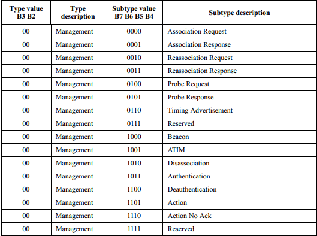

- Action：触发 AP 的下一步动作
-

### 控制帧

type = 01, 控制数据包的发送, 拥塞管理, 防止冲撞. **控制帧不需要 data 部分**.
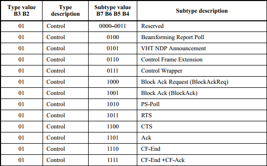

- BAR/BA：block 块确认请求和 确认， 类似 TCP/IP 的窗口机制
- CTS/RTS：请求发送/清除发送， 一般用于解决隐藏节点问题

### 数据帧

type = 10, 由于数据发送和接收方式的不同, 可以细分很多数据帧类型:
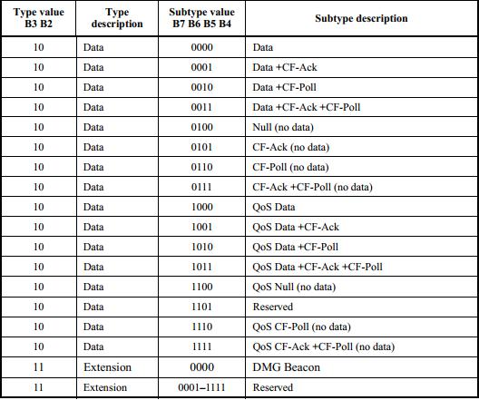

# 用户接入流程

## WEP 接入过程

STA (工作站)启动初始化、开始正式使用、AP 传送数据幀之前，要经过一下才能接入:

- 扫描(Scaning)
- 认证(Authentication)
- 关联(Association)
- 四次握手: AP 和 STA 进行四次握手；
- DHCP 过程；
- ARP 过程；
- 加密的数据通信业务

### 扫描

802.11MAC 使用 Scanning 功能来完成虚招 AP 的过程, 分为两种模式:

- 被动模式: STA 在每个信道上**侦听 AP 定期发送的 Beacon 帧**（帧中包含 SSID、支持速率等信息），以获取 AP 的相关信息
  
- 主动模式:
  - **客户端发送携带有指定 SSID 的 Probe Request**：STA 依次在每个信道发出 Probe Request 帧，寻找与 STA 有相同 SSID 的 AP，只有能够提供指定 SSID 无线服务的 AP 接收到该探测请求后才回复探查响应
    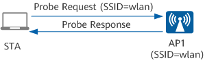
  - **客户端发送广播 Probe Request**: 客户端会定期地在其支持的信道列表中，发送 Probe Request 帧扫描无线网络。当 AP 收到 Probe Request 帧后，会回应 Probe Response 帧通告可以提供的无线网络信息
    

### 认证

- **开放系统认证**: 不认证, 人格 sta 都可以认证成功
  
- **共享密钥认证**: STA 和 AP 预先配置相同的共享密钥，AP 在链路认证过程验证两边的密钥配置是否相同。如果一致，则认证成功；否则，认证失败
  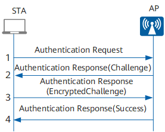
  - STA 向 AP 发送认证请求（Authentication Request）。
  - AP 随即生成一个“挑战短语（Challenge）”发给 STA。
  - STA **使用预先设置好的密钥加密**“挑战短语”（EncryptedChallenge）并发给 AP。
  - AP 接收到经过加密的“挑战短语”，**用预先设置好的密钥解密该消息**，然后将解密后的“挑战短语”与之前发送给 STA 的进行比较。如果相同，认证成功；否则，认证失败。

### 关联

- STA 向 AP 发送 Association Request 请求，请求帧中会携带 STA 自身的各种参数以及根据服务配置选择的各种参数（主要包括支持的速率、支持的信道、支持的 QoS 的能力以及选择的接入认证和加密算法）
- AP 收到关联请求后判断是否需要进行用户的接入认证，并回应 Association Response

## WPA/WPA2 接入流程

### 接入认证计算 PMK

WPA/WPA2 仅支持开放式系统认证, 所以上面的认证过程并没有验证密码. 在关联之后, 还需要一个接入认证阶段和后面的 4 次握手:

- 家庭使用 PSK 方式, 用在安全要求低的地方:
  - sta 和 ap 两侧都通过 ssid 和 passphrase 算出 PSK
  - sta 根据 PSK 计算出 PMK
  - ap 在根据 PSK 计算出 PMK 和 GMK
  - 之后进行 4 次握手
- 工业级的才需要下面 EAP 的认证方式.
  

### 四次握手

4 次握手是**密钥协商阶段**, 是**根据接入认证阶段生成的成对主钥 PMK**(Pairwise Master Key)产生成对临时密钥 PTK(Pairwise Transient Key)和群组临时密钥 GTK(Group Temporal Key)。

- PTK 用来加密单播报文
- GTK 用来加密组播和广播无线报文

四次握手通过 EAPOL(Extensible authentication protocol over LAN)进行消息交换。

**Message 1**:

由 AP 发起四次握手，**AP 发送一条包含 ANonce 的消息到 Station，Station 用它生成 PTK**。
生成 PTK 的公式：PTK = PRF (PMK + ANonce + SNonce + Mac (AA)+ Mac (SA))，由于在 4 次握手之前已经经历了认证和关联的阶段，因此 Station 是知道 AP 的 Mac 地址，所以只需要 ANonce 就可以生成 PTK 了。

**Message 2**:

**一旦 Station 创建了自己的 PTK，它会立即响应一条 EAPOL 消息给 AP，包含了 SNonce 和 MIC**。
**AP 用 SNonce 生成自己的 PTK，MIC 是用来校验 Station 发来的消息的完整性**(除了 1/4，从 2/4 报文开始，后面的每个报文都会有 MIC)。AP 收到 SNonce 之后，生成的 PTK 就可以用来加密后面两次握手的 key 了。

**Message 3**:

这次握手主要是**把 GTK 发送给 Station，并且告知 Station 安装 PTK 和 GTK**。由于第二次握手生成了 PTK，可以用来加密数据了，所以这里对 GTK 进行了加密。

**Message 4**:

第四次是**最后一条 EAPOL 消息，相当于一个确认包，告诉 AP PTK 已经安装好，AP 收到该消息后，也安装 PTK**。安装的意思是指使用 PTK 和 GTK 来对数据进行加密.

# 功率和信号强度

- ① 和 ⑦ 表示射频发送端处的功率，单位是 dBm。
- ② 和 ⑥ 表示连接天线的转接头和馈线等线路损耗，单位是 dB。
- ③ 和 ⑤ 表示天线增益，单位 dBi 或 dBd。
- ④ 表示路径损耗和障碍物衰减，是发送和接收天线之间的信号能量损耗程度，单位是 dB。

基于上面的拓扑，解释如下概念：

- **射频发射功率**：① 表示 AP 端的射频发射功率，⑦ 表示无线终端的射频发射功率。
- **EIRP**：有效全向辐射功率 EIRP(Effective Isotropic Radiated Power)，即天线端发射出去时的信号强度，EIRP = ① - ②+ ③。
- **RSSI**：接收信号强度指示 RSSI(Received Signal Strength Indicator)，指示无线网络覆盖内某处位置的信号强度，是 EIRP 经过一段传输路径损耗和障碍物衰减后的值。网规遇到的信号强度弱问题就是指 RSSI 弱，没有达到指标要求值，导致无线终端接收到很弱的信号甚至接收不到信号
  - **接收信号强度 = 射频发射功率 + 发射端天线增益 – 路径损耗 – 障碍物衰减 + 接收端天线增益**

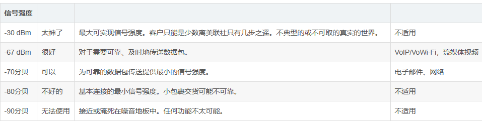

# 加密算法

- https://zhuanlan.zhihu.com/p/51695002

# TIM/DTIM 和保活睡眠

- TIM：每一个 Beacon 的帧中都有一个**TIM**，它主要用来**由 AP 通告它管辖下的哪个 STA 有信息现在缓存在 AP 中**，
  - TIM 中包含一个 Bitmap control 字段，它最大是 251 个字节，每一位映射一个 STA，当为 1 时表示该位对应的 STA 有信息在 AP 中
  - 收到与自己关联的 TIM 就要发送 PS-POLL 帧来与 AP 取来联系并取得它的缓存帧了
- DTIM：TIM 的特殊情况，**当发送几个 TIM 之后，就要发送一个 DTIM**
  - 除了缓存单播信息，也同时指示 AP 缓存的组播或广播信息
  - **一旦 AP 发送了 DTIM, STA 就必须处于清醒，因为广播或组播无重发机制**，不醒来数据就收不到了。

TIM/DTIM 报文格式如下:

- DTIM Count： 当前的 DTIM 值
  - 当 DTIM Count 为 0 表示当前的 TIM 是一个 DTIM
- DTIM Period： 在 AP 中配置的 DTIM 周期
  - 如果 DTIM 周期设置为 1 表示每一个 beacon 都是 DTIM beacon

因此针对 DTIM, STA 可以设置**保活睡眠**(也叫 dtim power save)来减少功耗:
**STA 通过 listen interval 来设置监听 beacon 的间隔: 可以设置成和 DTIM 的间隔一样，或者是 DTIM Period 的倍数。这样一来，每次 DTIM 到来的时候，既可以接收广播数据，也可以接收单播的数据**。
