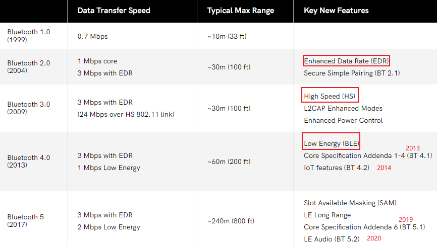
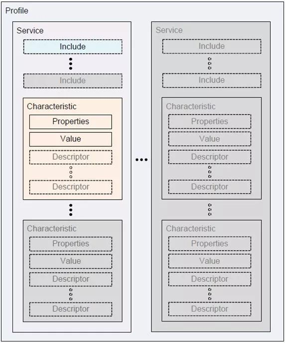
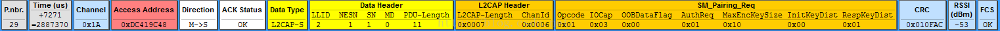

# 蓝牙发展历史

> 目前已经到了 5.4 版本, 可以在官网下载协议标准: https://www.bluetooth.com/zh-cn/specifications/specs/core-specification-5-4

# 蓝牙分类

蓝牙用于短距离交换资料，形成**个人局域网 PAN**. 使用短波特高频 UHF 无线电波, 在 2.4 ~ 2.485GHz 的 ISM 频段上通信. 分为两种:

- BR/EDR: 基础率/增强数据率, 以**点对点**拓扑结构创建一对一的设备通信
- BLE: 低耗能, 使用**点对点**(一对一)、**广播**(一对多)和**网格**(多对多)等多种拓扑结构

# 蓝牙协议栈

蓝牙协议栈由**Host+ HCI(可选) + Controller**三大块组成:

## Controller 层

也叫硬件芯片层, 通常包含以下部分:

- Device Manager: 控制蓝牙设备的通用行为，负责与蓝牙通信过程中，所有的与数据无关的操作，如查询设备，连接设备
- Link Manager: 链路管理，主要负责创建，修改，释放逻辑链路
- Baseband Resource Manager: 基带资源管理，进行**射频信号与数字信号或语音信号的相互转化**
- Link Controller: 链路控制，主要负责编码和解码蓝牙数据包
- PHY: 物理层，主要负责发送，接收物理通道的信息包

## HCI 层

在硬件接口(USB/UART)实现 host 与 controll 交互(**单芯片直连就不需要 HCI 了**), 可以传输下面几种类型的数据:

- command: host 发给芯片的命令
- event: 芯片上报给 host 的事件
- ACL: 双向交互的普通数据
- SCO: 双向交互的音频数据, 比如通话和传统 audio 数据
- ISO: 5.2 加入的 LE Audio 数据

## Host 层

蓝牙协议层, 其中 L2CAP 是公用的, GAP 是核心规范用于设备间连接和配对. 除此之外, 我们可以通过 profile 定义其他蓝牙功能以支持图里其他的协议.

- L2CAP: 链路控制和适配协议
  - Channel Manager: 通道管理，主要用于创建、管理、关闭 L2CAP 通道，用于服务协议和应用数据的传输。
  - L2CAP Resource Manager: L2CAP 资源管理，主要负责管理分片的 PDU 的正确提交。
- GAP 核心规范: 定义了蓝牙设备的基本功能, 设备间**发现、连接、配对绑定**的流程
  - Security Manager Protocol: SMP 安全管理协议，定义了**蓝牙设备配对、认证、解密**等行为的安全操作
  - Attribute Protocol: ATT，属性协议，定义了访问对端设备上数据的一组规则
  - Generic Attribute Profile: GATT，位于 ATT 之上，定义了属性的类型及其使用方法
  - SDP: 服务发现协议, 让 app 查询哪些服务可用
- 其他协议
  - RFCOMM: 串口仿真协议, 用于蓝牙电话/透传 SPP
  - OBEX: 对象交换协议, 用于电话本/短信/文件传输
    - PBAP: 电话本访问协议
    - MAP: 短信访问协议
    - OPP: 对象推送协议
  - HFP: 蓝牙免提协议
  - HSP: 蓝牙耳机协议, 已弃用
  - SPP: 蓝牙串口协议
  - IAP: 苹果特有协议, 用于 carplay
  - AVRCP: 蓝牙音乐控制协议
  - AVCTP: 音视频控制传输协议
  - A2DP: 蓝牙音乐协议, 替换 HSP 的
  - AVDTP: 音视频分布传输协议
  - BNEP: 蓝牙网络封装协议, 用于个人局域网收发 IP 数据
  - HID: 人机接口协议, 用于鼠标/键盘等

### GATT

> 具体格式参考： https://www.cnblogs.com/iini/p/12334646.html

在两个 BLE 设备建立连接之后，双方的数据交互是基于 GATT (Generic Attribute Profile) 规范，根据该规范可以定义出一个个配置文件 (Profile)，描述该蓝牙设备提供的服务 (Service)。

在整个通信过程中，有几个最主要的概念：

- 配置文件 (Profile): Profile 是被蓝牙标准预先定义的一些 Service 的集合，并不真实存在于蓝牙设备中。
  - **如果蓝牙设备之间要相互兼容，它们只要支持相同的 Profile 即可**
  - 一个蓝牙设备可以支持多个 Profile。
- 服务 (Service): Service 是蓝牙设备对外提供的服务，一个设备可以提供多个服务，比如电量信息服务、系统信息服务等。**每个服务由一个 UUID 唯一标识**。
- 特征 (Characteristic): 每个 Service 包含 0 至多个 Characteristic。比如，电量信息服务就会有个 Characteristic 表示电量数据。
  - Characteristic 包含一个值 (value)和 0 至多个描述符 (Descriptor) 组成。
  - **在与蓝牙设备通信时，主要就是通过读写 Characteristic 的 value 完成**。
  - **每个 Characteristic 由一个 UUID 唯一标识**。
- 描述符 (Descriptor): 数据的额外信息。比如温度的单位是什么，数据是用小数表示还是百分比表示等之类的数据描述信息。**每个 Descriptor 由一个 UUID 唯一标识**。包括以下几类:
  - Extended Properties
  - Characteristic User Description
  - Client Characteristic Configuration Descriptor: 客户端特征配置描述符, **用于开启和关闭通知信息**。当主机向 CCCD 中写入 0x0001，此时使能 notify；当写入 0x0000 时，此时禁止 notify。

**UUID 的前 16bits 标识不同的服务/特征/描述符的类型, 可以在标准文件 Assigned Numbers.pdf 中查找**.

### ATT 格式

在数据 channel 传输, 位于 L2CAP 数据格式中的 data 部分:

- handle: 指向属性实体的指针，对端设备可通过属性句柄来访问该属性，它是一个 2 字节长度的十六进制码，起始于 0x0001，在系统初始化时候，各个属性的句柄逐步加一，最大不超过 0xFFFF。

# 链路层

## 频段和信道划分

BLE 占据 40 个信道, 占用 40 个射频信道，信道间隔 2MHz，中心频率为`2402+k*2MHz`。k=0,1,…,39.分为两类:

- 广播信道: 37, 38, 39
- 数据信道: 其他

由于上面频段内由 wifi 等各种设备的干扰, 蓝牙采用了**自适应跳频技术**, 避开干扰频段. 自适应跳频技术基本原理是根据信道状态的好坏，选择蓝牙通信信道。通常可以根据接收信号的 RSSI 和 BER 来判断。

## 4 种工作模式

- LE 1M sym/s：非编码模式，S=2 映射编码模式，S=8 映射编码模式。
- LE 2M sym/s：非编码模式。

## 帧格式

- Access Address 用来标示接收者 ID 或者空中包身份
  - 广播包 Access Address 固定为 **0x8E89BED6**，广播包只能在广播信道（channel）上传输
  - 数据包 Access Address 为一个 **32bit 的随机值**，由 Initiator 生成。数据包只在数据信道上传输. 每建立一次连接，重新生成一次 Access address
- 无论是广播包还是数据包, payload 部分各不相同, 需要根据 PDU 类型解析

### 广播包 data 部分

有效数据部分：包含 N 个 AD Structure，每个 AD Structure 由 Length，AD Type 和 AD Data 组成:

- Length：AD Type 和 AD Data 的长度
- AD Type：指示 AD Data 数据的含义, **在标准文件 Assigned_Number.pdf Common Data Types 定义**
- AD Data: 数据部分

广播包解析示例:

# 设备接入流程

## 广播

设备主动广播自己的 BLE 信息, 默认往三个广播 channel 发送, 并在一定 interval 之后再次发送:

## 扫描

扫描分为主动和被动两种方式:

- 被动扫描: 监听收到的 adv 广播包
- 主动扫描: 发送**scan request**并等待设备回复

## 连接

主设备发送 CONNECT_IND 告诉从设备, 我将在 transmit window 器件发送第一个同步包 P1 给你, 请从设备打开接收窗口. 从设备收到 P1 之后, 会回复数据包 P2. 一旦主设备收到 P2 就认为连接成功.
后续的数据包用来同步时钟和传输数据.

## 配对

> 参考: https://blog.csdn.net/chengbaojin/article/details/103691046

**区别于传统蓝牙, BLE 配对过程是在连接过程之后**, 通过数据 channel 传输 SMP 报文.

- Phase 1: 配对特征交换, 交换双方 IO 能力(会决定第二阶段用什么方式)
- Phase 2: **通过 SMP 协议进行配对操作**用于身份确认, 并生成密钥
  - LE legacy pairing: 生成短期密钥 STK
  - LE Secure Connections: 生成长期密钥 LTK
- Phase 3(可选): 传输特定密钥 SK.

### 阶段 1

- 主设备发送 Pairing Request:
  
- 从设备回复 Pairing Response:
  

根据 IO 能力可以选择配对阶段的方法:

- Just works: 直接进行第二阶段, 配过过程没有保护
- Passkey Entry: 本段需要输入远端随机生成的 6 位数字 TK 进行配对
- Out of Band: 通过 BLE 之外的方式获取 OOB data

### 阶段 2

- 主设备本地生成随机数 Mrand, 计算 Mconfirm 值并通过 Pairing Comfirm 发给从设备:
  
- 从设备本地生成随机数 Srand, 计算 Sconfirm 也通过 Pairing Confirm 发送给主设备:
  
- 主设备收到 Sconfirm 后, 将 Mrand 通过 Paring Random 发给从设备:
  
- 从设备收到 Mrand 后计算 Mconfirm, 并于前面发来的 Mconfigm 比较. 相同则表示配对成功, 然后将 Srand 发给主设备:
  
- 主设备收到 Srand 之后计算 Sconfirm, 与前面发来的 Sconfirm 比较, 确认配对成功
- 主从设备计算 STK, 作为第三阶段临时加密使用

### 阶段 3

- 主设备计算出 STK 后, 通过链路层发起加密请求 LL_ENC_REQ, 并把计算 SK/LTK 的参数传递过去
- 从设备通过 LL_ENC_RSP 将计算 SK/LTK 的参数也发给主设备
- 两边计算 SK 和 LTK, 并从 LL_START_ENC_REQ 开始发送加密数据, 进行 3 次加密握手.
  - SK 用于链路层通信加密, 由 LTK 计算而来
  - LTK 用于保存后下次直接连接

## 绑定

将配对阶段产生的 LTK 和主从设备信息保存到 flash 中, 便于下次直接配对.

# 蓝牙音频传输

mp3 和 flac 音频编码都是在 PCM 音频编码基础上二次编码得到的，其目的是减小文件体积。在音频播放时，就需要**把 mp3，flac 等编码格式的数据还原为 PCM 编码格式的数据，这个过程叫做解码**。然后经过数字-模拟转换（DAC）变成模拟信号，最后经过放大电路驱动喇叭(本机喇叭或有线耳机的喇叭)，将声音播放出来.

在蓝牙系统中，发射端要将被音乐软件解码的 PCM 编码二次编码为蓝牙支持的编码，接受端收到后，再将其解码为 PCM 编码:

