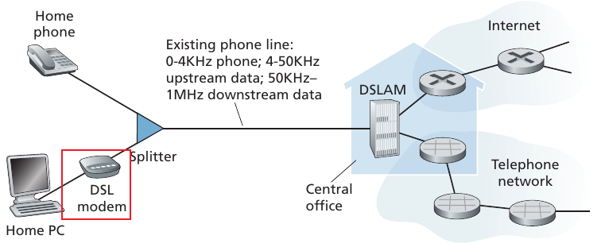
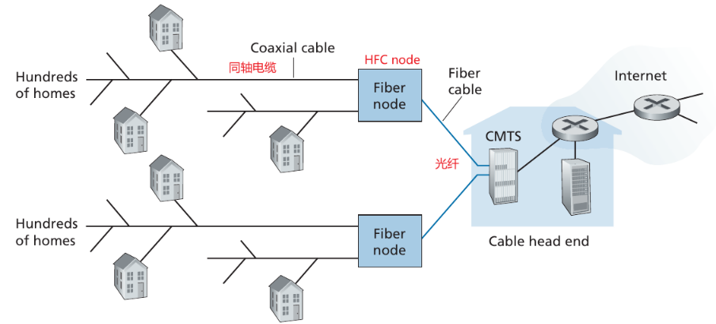
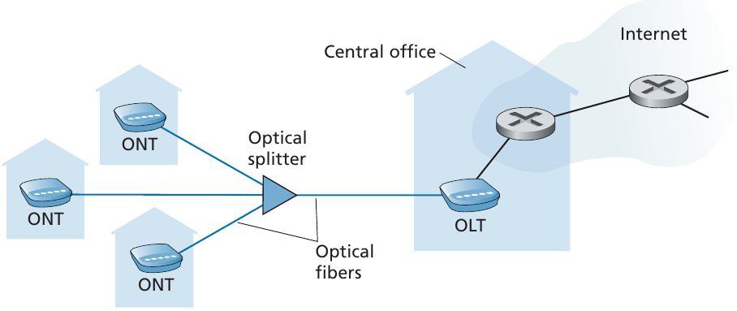
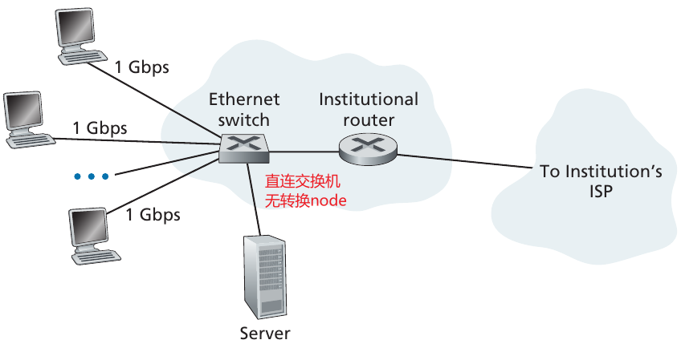
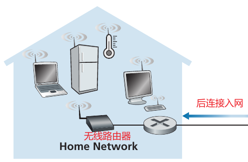
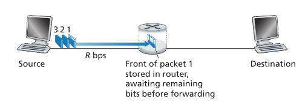
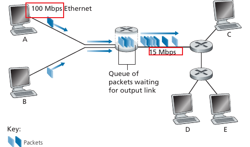
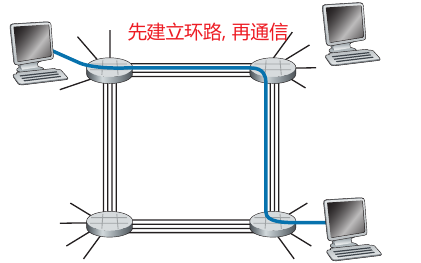
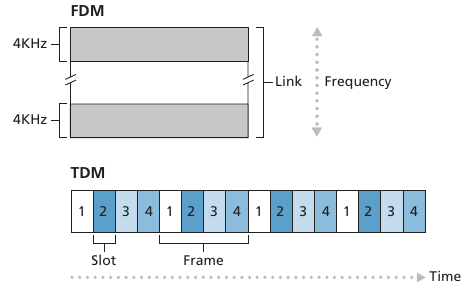

## 网络边缘

### 接入网

- DSL **电话线**接入:
  
- 混合**光纤-同轴电缆**(DOCSIS 协议):
  
- **光纤**到户(分为 AON 和 PON), 下图为 PON:
  
- 以太网(使用**双绞线**):
  
- WIFI 无线网:
  
- 蜂窝网络(2/3/4/5G, chapter 7 介绍)

### 物理媒介

- 双绞铜线
- 同轴电缆
- 光纤
- 地面广播频道
- 卫星广播频道

## 网络核心

### 分组交换

**存储转发传输**:
数据包转发大都使用**存储转发传输**(store-and-forward): 交换机或路由器需要在\*\*接收到完整的数据包之后才开始往一下节点发送. 如下如所示:

假如要传输 L bits, 有 N-1 个交换机, 线路的传输速率为 R bps, 那么从 source 发送到 destination 所花费的最短时间大约为: `delay = N * (L/R)`.

**队列延迟**:
当链路正忙于传输另一个数据包时, 之后到达的数据包必须在输出 buffer 中等待, 这种延迟叫 queue delay.

**数据包丢失**:
交换机的 buffer 是有限的, 当太多的数据包在队列中进行等待时, buffer 就溢出了, 可能信赖的数据包或队列中已有的数据包会发生丢失.
比如下图所示的情况, 交换设备两侧的网速不一致, 就会造成 queue 中数据包大量等待, 出现队列延迟和数据包丢失:

**forwarding table**:
当一个数据包到达路由器时, 路由设备需要解析 source/destination address, 然后搜索**转发表**找到合适的 rule 来确定合适的输出线路. 只有路由器就可以把数据包直接发送到输出线路, 到达下一路由节点或 destination.
有一系列的**路由协议**来根据网络情况自动的更新转发表, 不需要手动的挨个配置.

### 电路交换

不同于数据包直接发送, 另一种发送方式是这样的:
在发送者发送信息之前, **发送方和接收方之间必须先真实的建立连接**, 路径上的交换设备负责维护连接状态. 这种连接方式叫**电路或环路**.

**复用方式**
环路中最常用的是**频分复用 FDM**和**时分复用 TDM**.

### 两种传输方式对比

**分组交换**:

- 优点:
  - 更好的传输能力, 带宽共享
  - 支持的用户数更多(_电路交换的三倍_)
  - 更简单有效, 损耗小
- 缺点:
  - 不适合实时服务, 传输过程中 delay 不确定, 比如电话和视频
  - 不能预知中间链路的状态, 可能已经中断

**电路交换**:

- 优点
  - 连接稳定, 传输 delay 小
  - 专门的协议负责连接的建立和状态维护
- 缺点:
  - 带宽被复用, 单个用户带宽小, 传输速率小
  - 同时这次好的用户数少
  - 其他用户复用的频率或时隙不饿能被共享, 空闲时是巨大的浪费

## 分组交换的延迟/丢失/吞吐量

### delay 类型

- **Processing Delay**: 用于处理 packet header 和 error, 决定转发路径的时间
- **Queuing Delay**: packet 在某个转发路径的 queue 中等待转发的时间
- **Transmission Delay**: packet从queue中发送到链路中的时间
- **Propagation Delay**: packet在链路中传播到下一路由节点的时间